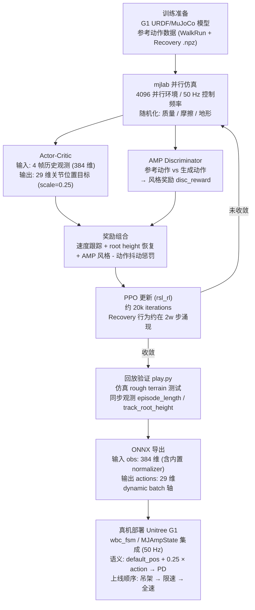

# AMP_mjlab (G1 统一 AMP 策略)

**AMP_mjlab** 是一个针对 **Unitree G1** 人形机器人的强化学习训练框架，建立在 **mjlab**（MuJoCo 并行仿真）和 **rsl_rl**（RSL PPO 训练库）之上，核心贡献在于用一个统一策略同时学习正常行走（locomotion）与跌倒恢复（fall-recovery）。

## 为什么重要？

传统做法需要维护独立的 "locomotion 策略" 和 "recovery 策略"，并在运行时检测跌倒再触发切换，模式切换时易产生动作撕裂（behavioral discontinuity）。AMP_mjlab 的统一策略消除了这个切换逻辑，同时 AMP 判别器保证了动作的自然风格。

## 训练到部署流程图



## 从零理解 AMP_mjlab

下面用**从零理解**的方式讲解这个项目。

### 1. 这个项目一句话是什么？

`AMP_mjlab` 是一个基于 **mjlab + rsl_rl + AMP** 的 Unitree G1 人形机器人强化学习项目。目标是训练一个 policy，让 G1 同时学会：
1. **走路 / 跑步 / 跟踪速度指令**
2. **跌倒后的恢复 / 起身**
3. **动作风格尽量接近参考动作数据**

它不是单独训练“走路策略”和“起身策略”，而是把两种能力放进**同一个 policy** 里训练，减少策略切换带来的不连续问题。([GitHub][1])

### 2. AMP 是什么？先用直觉理解

AMP = **Adversarial Motion Priors**，可以简单理解成：**让机器人一边完成任务，一边模仿人类/参考动作的风格。**

它有两个网络：
- **Policy / Actor-Critic**：负责真正控制机器人。输入机器人状态 + 速度指令，输出关节动作。
- **AMP Discriminator**：像一个“动作裁判”。它会看真实参考动作数据（如走、跑、起身）和 policy 生成的动作，判断“像不像真实动作”。如果像，Policy 就会得到额外奖励。

### 3. 仓库核心结构

```text
AMP_mjlab/
├── scripts/
│   ├── train.py          # 训练入口
│   ├── play.py           # 回放 / 测试 / 导出 ONNX
│   ├── list_envs.py      # 查看可用任务
│   └── csv_to_npz.py     # 动作数据 CSV 转 NPZ
├── src/
│   ├── assets/
│   │   ├── robots/       # G1 机器人模型配置
│   │   └── motions/g1/amp/
│   │       ├── WalkandRun # 走/跑参考动作
│   │       └── Recovery   # 起身/恢复参考动作
│   └── tasks/
│       └── amp_loco/
│           ├── amp_env_cfg.py       # 环境、观测、动作、奖励配置
│           ├── ampmotion_loader.py  # 加载参考动作数据
│           ├── config/g1/
│           │   ├── env_cfgs.py      # G1 Flat / Rough 环境配置
│           │   ├── rl_cfg.py        # PPO + AMP 训练参数
│           └── mdp/
│               ├── observations.py  # 观测项
│               ├── rewards.py       # 奖励项
│               ├── events.py        # reset / 推扰 / 随机化
│               └── terminations.py  # 终止条件
```

### 4. 模型输入与输出

#### 输入 (Actor Observation)
Policy 真正用的输入包含 4 帧历史，单帧约 96 维（384 维合计）：
- 机身角速度、重力方向、速度指令
- 关节位置、关节速度（G1 共 29 个关节）
- 上一次输出动作

#### 输出 (Action)
输出是 29 维的**关节位置控制目标**（`JointPositionActionCfg`），经 scale 后转换为目标位置偏移，由底层 PD 负责跟踪。([GitHub][2])

### 5. 奖励函数与判别器

- **AMP 判别器**：观察 Pelvis、髋、膝、踝、肩、肘、腕等关键部位的相对位置、姿态和速度，判断是否符合参考动作风格。([GitHub][4])
- **奖励组合**：
    - 速度跟踪：`track_anchor_linear_velocity` / `angular_velocity`
    - 恢复奖励：`track_root_height`（鼓励回到正常高度）
    - 惩罚项：身体乱晃、关节加速度、打滑、自碰撞、撞限位等。

### 6. 训练与回放

- **开始训练**：`python scripts/train.py Unitree-G1-AMP-Flat --env.scene.num-envs=4096`
- **收敛特征**：约 20k iterations 附近，recovery 行为可能突然涌现，指标跳变属正常。([GitHub][1])
- **回放测试**：`python scripts/play.py Unitree-G1-AMP-Flat --checkpoint-file logs/rsl_rl/.../model_<iter>.pt`
- **ONNX 导出**：训练和回放默认启用导出。ONNX 输入名为 `obs`，输出名为 `actions`，且内置了 normalizer。([GitHub][8])

### 7. 源码阅读建议顺序

1. `README.md`
2. `src/tasks/amp_loco/config/g1/__init__.py`
3. `src/tasks/amp_loco/config/g1/env_cfgs.py`
4. `src/tasks/amp_loco/amp_env_cfg.py`
5. `src/tasks/amp_loco/config/g1/rl_cfg.py`
6. `scripts/train.py` & `play.py`
## 操作指南

### 1. 训练启动命令

该项目基于 `rsl_rl` 框架，使用 `mjlab` 进行并行仿真。

```bash
# 安装后先确认任务已注册
python scripts/list_envs.py --keyword AMP

# 基础训练（G1 在平地上练习 AMP 风格行走与起身）
python scripts/train.py Unitree-G1-AMP-Flat --env.scene.num-envs=4096

# 崎岖地形训练（推荐用于鲁棒性测试）
python scripts/train.py Unitree-G1-AMP-Rough --env.scene.num-envs=4096

# 多卡机器上可显式选择 GPU；脚本会通过 torchrunx 启动多进程
python scripts/train.py Unitree-G1-AMP-Flat --env.scene.num-envs=8192 --gpu-ids 0 1
```

- `--env.scene.num-envs`：指定并行环境数量。单卡常用 4096；显存和仿真吞吐足够时可提高到 8192。
- `--gpu-ids`：训练脚本会根据该参数设置 `CUDA_VISIBLE_DEVICES`；多卡时用 `torchrunx` 分布式启动。
- `--video`、`--video-interval`、`--video-length`：训练中录制 rollouts，用于排查“奖励上升但动作异常”的情况。
- 任务列表可通过 `python scripts/list_envs.py --keyword AMP` 查看。
- 日志默认写入 `logs/rsl_rl/g1_amp_locomotion/<time_stamp_run>/`，同时保存 `params/env.yaml` 与 `params/agent.yaml` 以便复现实验配置。

### 2. 训练监控与曲线分析

使用 `tensorboard --logdir logs/rsl_rl` 监控训练过程。下表所列 tag 均来自 AMP_mjlab 自带 `rsl_rl/runners/amp_on_policy_runner.py` 与 mjlab `reward_manager` 写入 TensorBoard 的实际命名空间（参考 README 中的 `logs.png` 截图）。

#### 2.1 训练总览（`Train/`）

| Scalar | 含义 | 好走势 | 异常信号 |
| :--- | :--- | :--- | :--- |
| `Train/mean_reward` | 滚动 reward buffer 的均值，混合速度跟踪、root 高度、AMP 风格、惩罚项。 | 前期 25 上下震荡，约 20k iterations 附近阶跃式跳到 ~40，之后窄幅在 41 附近震荡（README 配图实测 100k iter ≈ 41.36 平滑值）。 | 长时间横盘在低位或不能跨越 ~30 的台阶，多半是 recovery 行为没被诱导出来。 |
| `Train/mean_episode_length` | 滚动 episode 长度均值，单位是控制步数（max 通常约 1000）。 | 与 `mean_reward` 同步阶跃；100k iter 时实测达到 ~1000（即长期不被终止，README 配图平滑值 999.99）。 | 25k iter 后仍 < 900，意味着 bad orientation / bad base height 终止仍频繁触发。 |
| `Train/mean_reward/time`、`Train/mean_episode_length/time` | 同上，但横轴为累计训练时间。 | 用于估算 wall-clock 进度（README 配图 100k iter 约耗时 2 天）。 | — |

> README 配图（`logs.png`）即上述两条曲线，可用作"什么样算训练成功"的官方基准；`Train/mean_reward` 阶跃发生在约 20k iter，对应 fall-recovery 行为涌现（"Recovery Jump"）。

#### 2.2 单项奖励（`Episode_Reward/`）

mjlab 的 `RewardManager` 把每个 reward term 以 `Episode_Reward/<term_name>` 写入 TensorBoard（注意：是 `Episode_Reward/` 前缀，**不是** rsl_rl 默认的 `Episode/rew_*`）。下面所列 term 名称取自 `src/tasks/amp_loco/amp_env_cfg.py` 的 `RewardTermCfg` 注册：

| Scalar | 含义 | 好走势 | 异常信号 |
| :--- | :--- | :--- | :--- |
| `Episode_Reward/track_anchor_linear_velocity` | 躯干/anchor 线速度跟踪奖励，对应 x/y 速度指令。 | 跟随 `mean_reward` 上升并稳定。 | 高度恢复好但该项低 → 策略只会"站稳"不会走。 |
| `Episode_Reward/track_anchor_angular_velocity` | yaw 角速度跟踪奖励。 | 不应长期接近 0；随线速度跟踪一同改善。 | 转向时摔倒或该项长期低 → 检查 command range、摩擦随机化和足端打滑。 |
| `Episode_Reward/track_root_height` | root 高度恢复奖励，判断起身是否成功的关键。 | recovery 涌现阶段会明显跳升。 | 高度奖励低且 episode length 短 → 起身失败或 reset 太早。 |
| `Episode_Reward/body_ang_vel_xy_l2` | 躯干 roll/pitch 角速度 L2 惩罚。 | 训练后期收敛到接近 0 的小负值。 | 长期大幅负值 → 躯干乱晃。 |
| `Episode_Reward/is_terminated` | 终止惩罚（weight = -200）。 | 绝对惩罚占比下降。 | 长期巨负 → 策略反复摔倒或 delayed reset 窗口不足。 |
| `Episode_Reward/joint_acc_l2`、`Episode_Reward/action_rate_l2` | 关节加速度与动作变化惩罚。 | 数值低且平稳，反映动作平滑。 | 总奖励高但这俩同步变大 → 部署易出现电机发热、高频震荡。 |
| `Episode_Reward/foot_slip` | 足端打滑惩罚（mdp.foot_slip_l2，scaled by site velocities）。 | 偶发尖峰可接受。 | 持续大负值 → gait 不物理或摩擦随机化范围不合理。 |
| `Episode_Reward/self_collisions`、`Episode_Reward/joint_pos_limits` | 自碰撞、关节限位惩罚。 | 负项逐步减小。 | 长期大幅负值 → 姿态解空间被关节限位卡住或动作幅度过大。 |

#### 2.3 PPO + AMP 训练损失（`Loss/`）

`amp_ppo` 在每个 update 后把以下 7 个 loss 按 key 写到 `Loss/<key>`（来自 `loss_dict` 字段）：

| Scalar | 含义 | 好走势 | 异常信号 |
| :--- | :--- | :--- | :--- |
| `Loss/value_function` | PPO critic value loss。 | 有波动但不持续发散。 | 持续爆炸 → 优先降低 learning rate / num_envs，或检查 reward scale。 |
| `Loss/surrogate` | PPO policy surrogate loss。 | 在 0 附近小幅震荡。 | 大幅震荡 → KL 失控，检查 desired_kl 和 schedule。 |
| `Loss/entropy` | 策略熵均值。 | 训练前期较高，随收敛缓慢下降。 | 早期就贴近下限 → 探索不足。 |
| `Loss/amp` | AMP 判别器对 policy 样本与 expert 样本的 LSGAN loss。 | 初期快速变化，进入对抗平衡。 | 单调下降到 0 → 判别器过强，policy 拿不到风格奖励。 |
| `Loss/amp_grad_pen` | 判别器对 expert 样本的梯度惩罚（gradient penalty）。 | 数值小且稳定。 | 持续上涨 → 判别器在 expert 样本周围斜率过大，可能要降低 grad pen 系数。 |
| `Loss/amp_policy_pred` | 判别器对 policy 样本的输出均值。 | 通常 < 0，训练后期向 0 靠拢但不应反超 expert pred。 | 持续 ≈ expert pred → 判别器分不开，policy 只是骗过判别器但风格不自然。 |
| `Loss/amp_expert_pred` | 判别器对 expert 样本的输出均值。 | 通常 > 0，与 `amp_policy_pred` 保持稳定间距。 | 间距快速收敛到 0 → 同上；若反向（policy > expert）则判别器训练异常。 |
| `Loss/learning_rate` | 当前 PPO learning rate（adaptive KL 自适应后会变化）。 | 在 1e-3 ~ 1e-5 之间随 KL 调整。 | 长期被钳到上限/下限 → 检查 desired_kl 和 schedule 配置。 |

> AMP 判别器给 policy 的"风格奖励"会被加到 step reward 里，最终融入 `Train/mean_reward`，所以 TensorBoard 没有独立的 `disc_reward` scalar；想直接观察判别器平衡，应看 `Loss/amp_policy_pred` 与 `Loss/amp_expert_pred` 的差。

#### 2.4 策略与性能（`Policy/`、`Perf/`）

| Scalar | 含义 | 好走势 | 异常信号 |
| :--- | :--- | :--- | :--- |
| `Policy/mean_noise_std` | 高斯策略的平均探索标准差（actor 的 `action_std.mean()`）。 | 从初始值逐步下降但保留一定噪声。 | 过早塌到接近 0 → 探索不足，recovery 很难涌现。 |
| `Perf/total_fps` | 每秒采样 + 学习的总样本数。 | 4096 envs 单卡通常稳定（>5w），随机化多时略低。 | 抖动剧烈 → IO/仿真存在间歇瓶颈。 |
| `Perf/collection time`（注意带空格）、`Perf/learning_time` | 单次 iteration 的采样和学习耗时（秒）。 | learning_time 占比远小于 collection。 | learning_time 飙升 → 检查 batch size 与 GPU 利用率。 |

#### 2.5 自定义指标（`Metrics/`）

| Scalar | 含义 | 好走势 | 异常信号 |
| :--- | :--- | :--- | :--- |
| `Metrics/mean_action_acc` | `MetricsTermCfg("mean_action_acc")` 注册的动作加速度指标，反映动作抖动程度。 | 越低越适合部署，但不能以牺牲速度跟踪为代价。 | 回放中抖腿/膝关节抽动时会同步升高。 |

#### 2.6 关键判断标准

README 明确提示约 `2w`（20k）iterations 附近会出现多个指标突变，这是 recovery 行为突然涌现的正常现象（README 配图直接展示了 `Train/mean_reward` 与 `Train/mean_episode_length` 的阶跃式跳变）。判断训练好坏时不要只看 `Train/mean_reward`，至少同时看：

1. `Train/mean_episode_length` 是否接近 max（≈1000）；
2. `Episode_Reward/track_root_height` 在 Recovery Jump 之后是否抬升；
3. `Episode_Reward/track_anchor_linear_velocity` / `track_anchor_angular_velocity` 是否同步上升；
4. `Episode_Reward/is_terminated` 的负值是否衰减；
5. `Episode_Reward/joint_acc_l2`、`action_rate_l2`、`foot_slip` 等动作平滑/物理性惩罚是否在收敛；
6. `Loss/amp_policy_pred` 与 `Loss/amp_expert_pred` 是否保持稳定的对抗距离。

只有"能站起、能跟踪速度、动作不抖、终止减少、判别器仍在工作"同时成立，才适合进入部署验证。

### 3. 模型导出

- **训练自动导出**：AMP runner 覆盖了 `save()`；每次保存 `model_<ITER>.pt` 后，会在同一 run 目录导出 `policy.onnx`，并附加环境 metadata。
- **回放验证并导出**：`play.py` 的 `export_onnx=True` 默认开启，会把指定 checkpoint 导出为 `export/<task>_<checkpoint>.onnx`。
  ```bash
  python scripts/play.py Unitree-G1-AMP-Flat \
    --checkpoint-file logs/rsl_rl/g1_amp_locomotion/<RUN_DIR>/model_<ITER>.pt
  ```
- **导出模型接口**：ONNX 输入名为 `obs`，输出名为 `actions`；batch 维是动态轴；导出 wrapper 已包含 empirical observation normalizer，因此部署端应输入训练同分布的 raw observation，而不是再手动做一遍同样的归一化。
- **选择 checkpoint**：优先选择 `episode_length`、速度跟踪、root height 和动作平滑指标同时稳定后的 checkpoint，不要只选总奖励最高的瞬间点。

### 4. 部署注意事项

在真机部署（如 Unitree G1）或集成到 `wbc_fsm` 时，需注意以下一致性问题：

- **mjlab 补丁**：训练端使用 `history_ordering="time"`；必须确保 `mjlab_patch/mjlab/managers/observation_manager.py` 已覆盖到当前环境。如果不打补丁，则需要从代码里移除 `history_ordering` 配置，否则训练/部署观测顺序会不一致。
- **观测历史（History）**：actor 输入是 4 帧历史，单帧包含 base angular velocity、projected gravity、velocity command、joint position、joint velocity、last action。部署端缓存顺序必须是按时间展开，且 last action 要使用上一控制周期真正下发的动作。
- **归一化边界**：ONNX 已包含 obs normalizer；C++/部署端不要重复套训练时的 normalizer，但要保证传入的物理量单位、关节顺序、符号方向与训练配置一致。
- **动作语义**：policy 输出 `actions`，训练环境中由 `JointPositionActionCfg(scale=0.25, use_default_offset=True)` 转成关节位置目标偏移；部署端必须复现“默认关节位置 + 0.25 * action”的语义，再交给底层 PD / WBC。
- **控制频率**：仿真 `timestep=0.005`、`decimation=4`，策略控制周期约 20 ms（50 Hz）。真机部署时推理频率、状态估计延迟和低层控制频率要与这一节奏匹配。
- **安全壳**：统一策略减少了 locomotion/recovery 的模式切换，但真机仍应放在 `wbc_fsm` 的 `MJAmpState` 之类状态内，外层保留急停、限幅、姿态保护、接触异常处理和低电量/过热保护。
- **上线顺序**：先用 `play.py` 回放目标 checkpoint，再做仿真扰动和 rough terrain 验证；上真机时先限速、限幅、吊挂或保护架测试，逐步开放速度 command 与 recovery 场景。

## 关联页面

- [AMP & HumanX 方法](../methods/amp-reward.md) — AMP 方法本体
- [mjlab](./mjlab.md) — 底层仿真框架（Isaac Lab API + MuJoCo Warp）
- [Unitree G1](./unitree-g1.md) — 目标硬件
- [legged_gym](./legged-gym.md) — 同为 rsl_rl + 并行仿真，基于 IsaacGym
- [Imitation Learning](../methods/imitation-learning.md) — AMP 属于模仿学习范式
- [Locomotion](../tasks/locomotion.md) — 任务方向

## 参考来源

- [sources/repos/amp_mjlab.md](../../sources/repos/amp_mjlab.md)
- [ccrpRepo/AMP_mjlab GitHub Repo](https://github.com/ccrpRepo/AMP_mjlab)

## 源码阅读建议顺序

按以下顺序阅读源码，可以最快理解项目结构与训练逻辑：

1. [README_zh.md](https://github.com/ccrpRepo/AMP_mjlab/blob/main/README_zh.md) — 中文 README，整体动机与命令一览
2. [src/tasks/amp_loco/config/g1/__init__.py](https://github.com/ccrpRepo/AMP_mjlab/blob/main/src/tasks/amp_loco/config/g1/__init__.py) — 任务注册，看清 `Unitree-G1-AMP-Flat/Rough` 怎么被注册到 gym
3. [src/tasks/amp_loco/config/g1/env_cfgs.py](https://github.com/ccrpRepo/AMP_mjlab/blob/main/src/tasks/amp_loco/config/g1/env_cfgs.py) — Flat / Rough 环境配置，含 reset、随机化、speed command range
4. [src/tasks/amp_loco/amp_env_cfg.py](https://github.com/ccrpRepo/AMP_mjlab/blob/main/src/tasks/amp_loco/amp_env_cfg.py) — 环境基类：观测/动作/奖励/终止条件的定义入口
5. [src/tasks/amp_loco/config/g1/rl_cfg.py](https://github.com/ccrpRepo/AMP_mjlab/blob/main/src/tasks/amp_loco/config/g1/rl_cfg.py) — PPO + AMP discriminator 训练超参与判别器观测
6. [src/tasks/amp_loco/ampmotion_loader.py](https://github.com/ccrpRepo/AMP_mjlab/blob/main/src/tasks/amp_loco/ampmotion_loader.py) — 参考动作加载逻辑（NPZ 格式）
7. [src/tasks/amp_loco/rl/runner.py](https://github.com/ccrpRepo/AMP_mjlab/blob/main/src/tasks/amp_loco/rl/runner.py) — AMP runner，覆盖 `save()` 实现自动 ONNX 导出
8. [scripts/train.py](https://github.com/ccrpRepo/AMP_mjlab/blob/main/scripts/train.py) & [scripts/play.py](https://github.com/ccrpRepo/AMP_mjlab/blob/main/scripts/play.py) — 训练 / 回放 / 导出入口
9. [scripts/csv_to_npz.py](https://github.com/ccrpRepo/AMP_mjlab/blob/main/scripts/csv_to_npz.py) — 自定义参考动作时的 CSV → NPZ 转换工具

[1]: https://github.com/ccrpRepo/AMP_mjlab "GitHub - ccrpRepo/AMP_mjlab · GitHub"
[2]: https://raw.githubusercontent.com/ccrpRepo/AMP_mjlab/main/src/tasks/amp_loco/amp_env_cfg.py "amp_env_cfg.py"
[3]: https://raw.githubusercontent.com/ccrpRepo/AMP_mjlab/main/scripts/csv_to_npz.py "csv_to_npz.py"
[4]: https://raw.githubusercontent.com/ccrpRepo/AMP_mjlab/main/src/tasks/amp_loco/config/g1/rl_cfg.py "rl_cfg.py"
[5]: https://raw.githubusercontent.com/ccrpRepo/AMP_mjlab/main/src/tasks/amp_loco/ampmotion_loader.py "ampmotion_loader.py"
[6]: https://raw.githubusercontent.com/ccrpRepo/AMP_mjlab/main/README_zh.md "README_zh.md"
[7]: https://raw.githubusercontent.com/ccrpRepo/AMP_mjlab/main/scripts/train.py "train.py"
[8]: https://raw.githubusercontent.com/ccrpRepo/AMP_mjlab/main/src/tasks/amp_loco/rl/runner.py "runner.py"
[9]: https://raw.githubusercontent.com/ccrpRepo/AMP_mjlab/main/src/tasks/amp_loco/config/g1/__init__.py "__init__.py"
[10]: https://raw.githubusercontent.com/ccrpRepo/AMP_mjlab/main/src/tasks/amp_loco/config/g1/env_cfgs.py "env_cfgs.py"
