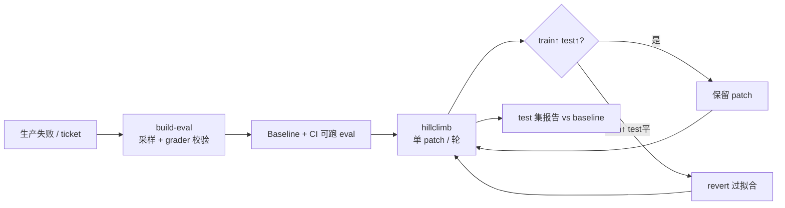

# claude-api（Anthropic 官方 Skill）

**claude-api** 是 [anthropics/skills](https://github.com/anthropics/skills) 仓库中面向 **Claude Platform 应用开发** 的官方 Agent Skill（路径 `skills/claude-api/`）。它把 **模型 ID、定价、流式、工具/MCP、缓存、API 漂移表** 与 **评测/ hillclimb / 成本优化** 写进 `SKILL.md` 及 `shared/` 长指南，供 Claude Code 等 harness 在检测到 Anthropic 相关任务时自动加载。

## 一句话定义

用 **单一官方技能入口 + 子命令工作流**，让 coding agent 在写 Claude 集成代码时 **不凭训练记忆猜 API**，并能在仓库内 **构建 eval、迭代 prompt/skills、审计陈旧指令与 prompt cache**。

## 英文缩写速查

| 缩写 | 英文全称 | 简要说明 |
|------|----------|----------|
| API | Application Programming Interface | 本技能覆盖的 Claude Messages / 工具 / 流式等接口 |
| MCP | Model Context Protocol | 技能文档中的 agent 工具互操作协议 |
| SDK | Software Development Kit | 各语言官方 `anthropic` 客户端，优先于裸 HTTP |
| KV | Key-Value cache | Prompt caching 中预 fill 状态的缓存对象 |
| TTL | Time To Live | 默认 5 分钟 prompt cache 有效期 |

## 为什么重要（对本知识库读者）

- **与 agent 评测主线对齐：** [AI Agent 评测](../concepts/ai-agent-evaluation.md) 讲「测什么、怎么 grader」；本技能的 **`build-eval` / `hillclimb`** 把 Anthropic 博文原则落成 **仓库内可运行 eval + train/test 防过拟合**（见 [Automating eval design](../../sources/blogs/claude_dev_automating_eval_hillclimbing_2026-09-28.md)）。
- **与 embodied / coding benchmark 互补：** [RLE-Bench](rle-bench.md) 测 **机器人学习工程师式全栈**；本技能偏 **Claude 应用与 skills 文档质量**——二者共用「harness + hidden test + 读 transcript」思维，但任务域不同。
- **与 ENPIRE / ASPIRE 的 harness 层：** [ENPIRE](../methods/enpire.md)、[ASPIRE](../methods/aspire.md) 依赖 frontier coding agent；迁移 Opus、调 effort、清 prompt ritual 直接影响 **token 成本与 pass@k**，本技能 **`prompt-audit` / `cost-optimize`** 是平台侧对照。
- **技能生态位：** 相对 [Agent Skills（Addy Osmani）](agent-skills-addyosmani.md) 的 **全 SDLC 25 技能** 与 [mattpocock/skills](mattpocock-skills.md) 的 **工程习惯片**，claude-api 是 **Anthropic 官方 API + 平台运维** 专用包，宜与 SDLC 技能 **叠加** 而非互替。

## 核心结构

| 层次 | 内容 |
|------|------|
| **触发** | 任务含 Claude/Anthropic、agent 工具、LLM judge、缓存/流式等；非 Anthropic 项目应先 grep 确认再加载 |
| **默认推理** | `claude-opus-5-5` + adaptive thinking + 长任务 streaming |
| **实现面** | 官方 SDK（Python/TS/Java/Go/Ruby/C#/PHP）或用户明确要求时的 cURL |
| **子命令** | `migrate`、`prompt-audit`、`upgrade`、`cost-optimize`、`build-eval`、`hillclimb`、`preserved-thinking-migration` |
| **语言包** | `python/`、`typescript/`、`java/`、`go/`、`ruby/`、`csharp/`、`php/`、`curl/` |

### 子命令与典型场景

| 子命令 | 何时用 |
|--------|--------|
| `build-eval` | 尚无 eval；需访谈采样、选 grader、baseline 成本审批 |
| `hillclimb` | 已有 runnable eval；优化 prompt/skills/effort/model，train/test 拆分 |
| `prompt-audit` | 升级 Opus 5.5 等 frontier 模型后扫 CLAUDE.md / skills 反模式 |
| `cost-optimize` | 有 Admin API 或 `usage` 日志；可选 eval 测降本是否伤质量 |
| `migrate` | 模型代际切换 + API 字段漂移（thinking、web tools 等） |

### 流程总览（eval + hillclimb 闭环）

## 工程实践

| 主题 | 结论 |
|------|------|
| 开源状态 | **已开源**（GitHub `anthropics/skills`；技能文本即规约，无单独权重） |
| API 漂移 | 技能内表格优先于模型训练记忆（如 `budget_tokens` 在新 Opus 上 400） |
| 成本 | Prompt cache 前缀稳定、`defer_loading` 稀有工具、effort 与模型档位需 **eval 或 hillclimb 实测** |
| 与 Opus 5.5 提示 | 见 [Addy Osmani Opus 5.5 指南](../../sources/blogs/claude_dev_opus_5_5_guide_2026-09-22.md)：删 think-hard ritual、CLAUDE.md 停/继续规则 |

## 源码运行时序图

**不适用** — 本实体为 Agent Skill 规约与文档包，无可执行「训练/推理/部署」单一入口；子命令由 Claude Code 读 `shared/*.md` 后在用户仓库 orchestrate。

## 局限与风险

- **Spend 风险：** `build-eval`、`hillclimb`、`preserved-thinking-migration` 会消耗真实 API；技能要求先获用户预算批准。
- **域偏 Web/API 工程：** 示例与 cost-optimize 基准含 LegalBench、SWE-bench 等；迁移到 Isaac/MuJoCo 脚本时需 **重写 eval task 与 outcome 检查**。
- **许可：** 技能包许可见仓库 `LICENSE.txt`；与 Remotion 等第三方框架许可无关。

## 与其他页面的关系

- [AI Agent 评测](../concepts/ai-agent-evaluation.md) — 理论框架与 agent 类型 grader 选型  
- [RLE-Bench](rle-bench.md) — 具身/RL 向 coding agent 资格考  
- [Agentic Coding 时代的软件工程基础](../concepts/agentic-coding-software-fundamentals.md) — 有 agent 仍要工程取舍语言  
- [具身大模型评测基准选型闭环](../queries/embodied-eval-benchmark-selection-loop.md) — 本技能覆盖的 **Claude 应用 eval** 与其中 ③ 策略/agentic 工程层 **互补**（任务域不同，共用 harness 思维）

## 推荐继续阅读

- Anthropic Engineering：[Demystifying evals for AI agents](https://www.anthropic.com/engineering/demystifying-evals-for-ai-agents)  
- claude.dev：[Automating eval design and hillclimbing](https://claude.dev/blog/automating-eval-design-and-hillclimbing/)  

## 参考来源

- [claude-api 技能归档](../../sources/repos/anthropics-claude-api-skill.md)
- [Claude Platform 降本与性能博文](../../sources/blogs/anthropic_claude_platform_cost_performance_2026-09-08.md)
- [Eval 自动化与 hillclimb 博文](../../sources/blogs/claude_dev_automating_eval_hillclimbing_2026-09-28.md)
