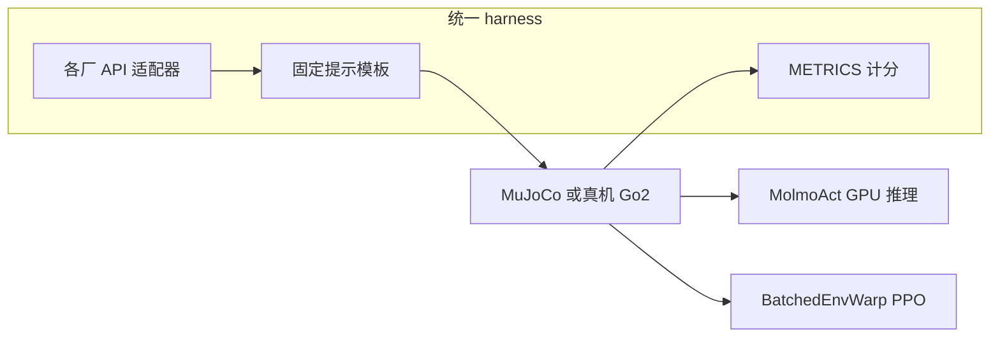

# Embody（Anthropic）

## 一句话定义

**Embody** 是 Anthropic Frontier Red Team 用来量「通用语言模型接到机器人之后能做什么」的评测套件：分数按 **具身 × 控制接口** 堆叠，而不是只报一个聊天模型的机器人 IQ。

## 英文缩写速查

| 缩写 | 英文全称 | 简要说明 |
|------|----------|----------|
| Embody | Embody | 本评测套件名；复合分不含高层 locomotion |
| LIBERO | Lifelong Robot Learning | 固定基座臂厨房操作基准；Embody 操作主床 |
| SDK | Software Development Kit | Claude 评测走 Anthropic Agent SDK，关掉内置工具 |
| PPO | Proximal Policy Optimization | RL 接口默认算法（batched MuJoCo） |
| VLA | Vision-Language-Action | 高层操作里被监督的 MolmoAct 策略 |

## 为什么重要

- **把「接口」写成一等评测轴：** 机器人学习社区习惯比 VLA 成功率；Embody 证明同一模型在力矩环与 VLA 监督上几乎是两种系统。选型见 [LLM 机器人控制接口](../concepts/llm-robotics-control-interfaces.md)。
- **安全红队口径：** 关注的是「给了哪些工具之后物理影响力跳多少」，不是排行榜刷分。
- **与本库其它基准正交：** [LIBERO](./libero-benchmark.md) 评 VLA/IL；Embody 评 **LLM 如何使用或不使用** 那些策略。选基准时不要混读，见 [评测选型闭环](../queries/embodied-eval-benchmark-selection-loop.md)。

## 核心信息

| 字段 | 内容 |
|------|------|
| 机构 | 人类智能（Anthropic），Frontier Red Team |
| 报告 | 2026-07-09 [Claude plays robotics](https://www.anthropic.com/research/claude-plays-robotics) |
| 作者 | Shmuel Berman, Michael Ilie, Jia Deng, Daniel Freeman |
| 仿真 | MuJoCo；RL/VLA cell 用 GPU；`MUJOCO_GL=osmesa` |
| 真机 | Unitree Go2（Project Fetch）；N 小，定性为主 |
| 代码 | 宣称 `github.com/safety-research/embody`；**2026-08-28 404** |
| 源码运行时序图 | **不适用**（官方仓尚未公开，无可运行入口） |

## 核心原理

### 覆盖矩阵

| 任务族 | 身体 | 接口 |
|--------|------|------|
| 经典控制 | 倒立摆、Hopper、新任务 TwinFlipper | 直接 / 代码 / RL（仿真暂停） |
| 低层 locomotion | Go2 12-DoF、G1 29-DoF | 直接 / 代码 / RL（仿真暂停） |
| 高层 locomotion | Go2 + 预训练摇杆步态 | 速度命令 + 前视 RGB；11 任务复合分 |
| 低层操作 | Franka Panda，LIBERO 式厨房 | 7 维末端 + 夹爪力；**不**暂停仿真 |
| 高层操作 | 同上 + MolmoAct | LLM 接受/改/替换提案；含 VLA 不会的新场景 |

复合分（文内 stacked bar）对除高层 locomotion 外的身体与任务做归一平均。

### 流程总览

附录默认：多数 cell 35 trials；LIBERO-40 相关 200（40 任务 × 5 seed）；高层 locomotion 100。提示不按模型微调。Claude 禁用 SDK 内置工具，只暴露机器人动作服务。

### RL 默认值（附录）

`n_steps=256`，`batch_size=64`，`n_epochs=4`，`gamma=0.99`，`clip_range=0.2`，`lr=3e-4`；策略 ≤20 万参数；默认最多 32 并行环境。经典控制 RL 会话 1.5 h，G1/Go2 4 h。

## 工程实践

| 步骤 | 说明 |
|------|------|
| 复现 | 等仓公开后按 `EXPERIMENTS.md` 跑 cell；入库日 **不能** 复现 |
| 读数 | 直接控制分数含「暂停世界」；臂操作不含 |
| 对比 VLA 榜 | LIBERO-40 上 LLM+MolmoAct **低于** MolmoAct 单独跑；不要把 Embody 高层分当成 VLA SOTA |
| 真机 | 办公室回路、find_x、视觉辅助均为 vignette，不是高 N 基准 |

## 局限与风险

- **代码未发布：** 命令与计分文档承诺在仓内，当前 404。
- **共享集群延迟未做正式研究：** 附录只给粗范围（2–8 s 文本到 60–180 s 高推理尾部）。
- **真机 N 小、串行。** 失败模式有信息量，但不能当成功率点估计。
- **MolmoAct 绑定：** 高层操作结论依赖这一 VLA；换 π₀ / OpenVLA 未必同形状。
- **预培训泄露：** 文内用 TwinFlipper 缓解经典 RL 任务出现在语料里的问题；Go2/G1/LIBERO 仍可能部分泄漏。

## 关联页面

- [LLM 机器人控制接口](../concepts/llm-robotics-control-interfaces.md) — 四接口的知识编译
- [LIBERO](./libero-benchmark.md) — 操作任务床
- [Unitree G1](./unitree-g1.md) — 最难低层具身
- [VLA](../methods/vla.md) — 被监督的预训练策略族
- [ASPIRE](../methods/aspire.md) — 同属「LLM 写控制器」，但有技能库复利
- [仿真评测基础设施](../concepts/simulation-evaluation-infrastructure.md)
- [具身评测选型闭环](../queries/embodied-eval-benchmark-selection-loop.md)

## 参考来源

- [Claude plays robotics 归档](../../sources/sites/anthropic-claude-plays-robotics.md)
- [embody 仓占位（404）](../../sources/repos/safety-research-embody.md)

## 推荐继续阅读

- 研究原文：<https://www.anthropic.com/research/claude-plays-robotics>
- 宣称镜像：<https://github.com/safety-research/embody>
- LIBERO：<https://github.com/Lifelong-Robot-Learning/LIBERO>
