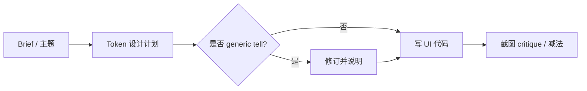

# frontend-design（Anthropic 官方 Skill）

**frontend-design** 是 [anthropics/skills](https://github.com/anthropics/skills) 中 `skills/frontend-design/` 的官方 Agent Skill，通过 [skills.sh](https://skills.sh/anthropics/skills/frontend-design) 分发。它把 **设计 lead 级审美判断**（字体、布局、动效、文案、自 critique）写成 harness 可加载规约，核心目标是 **避免生成页默认美学**。

## 一句话定义

先为 **当前 brief** 写 compact 设计 token 计划并对照 **AI 集群审美 tell** 修订，再写代码；单点 bold、其余克制，并满足响应式/键盘焦点/reduced-motion 等底线。

## 英文缩写速查

| 缩写 | 英文全称 | 简要说明 |
|------|----------|----------|
| UX | User Experience | 技能覆盖文案、空态、错误态等信息设计 |
| UI | User Interface | 视觉 token、排版与布局 |
| CTA | Call To Action | 技能要求 CTA 动词与结果 toast 词汇一致 |
| LLM | Large Language Model | 执行设计计划的 coding agent |

## 为什么重要（对本知识库读者）

- **本站 `docs/` 展示层：** 知识库主体在 `wiki/`，但读者首触往往是 **静态站**；代理改 `docs/*.html` / CSS 时易产出 cream/terracotta、统一圆角卡片等指纹（见仓库 [`docs/frontend-redesign-plan.md`](../../docs/frontend-redesign-plan.md) 对本 skill 的引用）。
- **与 claude-api 互补：** [claude-api](anthropic-claude-api-skill.md) 管 **API/评测**；frontend-design 管 **视觉与 UX 文案** — 同属 Anthropic 官方包，宜叠加。
- **与 GSAP skill：** [GSAP AI Skills](gsap-skills.md) 管 **动效 API**；本 skill 管 **何时动、动多少**（反对每卡片 hover + 段段 fade-up）。

## 核心结构

| 阶段 | 内容 |
|------|------|
| Grounding | 明确产品/受众/页面主任务；无 brief 时先提案再确认 |
| 计划 | 4–6 色、字体角色、布局概念（可 ASCII wireframe）、设计原则 |
| 反 default 审查 | 对照 skill 内列出的 AI 常见 tell（cream 底、SaaS 卡片 kit、→ 链等） |
| 实现 | 注意 CSS 特异性；截图自评（若环境支持） |
| 文案 | 用户视角命名、主动语态 CTA、错误/空态可行动 |

### 流程总览

## 工程实践

| 主题 | 结论 |
|------|------|
| 开源状态 | **已开源**（`anthropics/skills` monorepo） |
| 安装 | `npx skills add anthropics/skills --skill frontend-design`（或经 find-skills 推荐） |
| 与 wiki ingest | **不替代** `make ci-preflight`；只改善展示层 diff 质量 |

## 源码运行时序图

**不适用**（技能为 Markdown 规约，无运行时仓库入口）。

## 常见误区或局限

- **误区：禁止一切流行 aesthetic。** skill 明确：brief 若要求某 look 则 **brief 优先**；反对的是 **未选择的 default**。
- **局限：** 英文 skill；中文站需自行在 brief 中约束字体与文案风格。

## 关联页面

- [claude-api（Anthropic）](anthropic-claude-api-skill.md) — 同仓官方技能
- [find-skills](find-skills-skill.md) — 发现安装路径
- [GSAP AI Skills](gsap-skills.md) — 动效垂直 skill
- [Skills For Real Engineers（mattpocock）](mattpocock-skills.md) — 工程对齐/TDD 技能
- [前端体验优化清单](../../docs/checklists/frontend-optimization-v1.md) — 本站工程清单

## 参考来源

- [frontend-design 源归档（本站）](../../sources/repos/anthropics-frontend-design-skill.md)
- [skills.sh 页核查](../../sources/sites/skills-sh-frontend-design.md)
- [SKILL.md（GitHub）](https://github.com/anthropics/skills/tree/main/skills/frontend-design)

## 推荐继续阅读

- [skills.sh frontend-design](https://skills.sh/anthropics/skills/frontend-design)
- [The Elements of Typographic Style](https://en.wikipedia.org/wiki/The_Elements_of_Typographic_Style) — skill 引用的排版尺度参考
