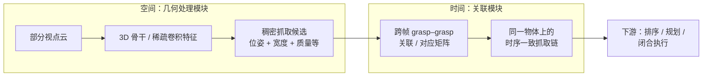

# AnyGrasp（抓取感知 SDK）

**AnyGrasp** 是上海交通大学 MVIG 团队提出的 **通用抓取感知** 系统：在 **平行夹爪** 设定下，从 **单目深度得到的场景点云** 中 **一次性** 预测 **稠密 7-DoF 抓取位姿**，并可在 **时间维** 上保持对同一抓取目标的 **连续跟踪**，用于静态 bin picking 与动态抓取等场景。工程上通过 **[AnyGrasp SDK](https://github.com/graspnet/anygrasp_sdk)** 分发检测与跟踪能力；完整网络权重以 **License 注册** 的二进制库形式提供，研究复现还可对照 **GraspNet baseline** 等公开代码。

## 一句话定义

**「稠密抓取检测 + 跨观测关联」**：把抓取感知从「少量候选 + 慢速采样评估」推向 **全场景稠密预测**，并用 **时序关联模块** 在物体坐标系下对齐跨帧抓取，以支持动态场景与连续机械臂伺服。

## 为什么重要？

- **系统边界完整**：同时覆盖 **空间覆盖（稠密）**、**时间连续（跟踪）** 与 **执行可行性（障碍与开度）**，是连接 **感知** 与 **运动规划 / 夹爪闭合** 的常用中间层。
- **真实数据论点**：论文明确对比「大规模仿真物体训练」路径，展示在 **约百级真实物体** 数据上训练仍可在多种挑战设置下取得 **与人类受试者可比的 bin clearing 成功率** 与 **高 MPPH（mean picks per hour）** 叙事（具体数字以论文与项目页为准）。
- **生态位清晰**：与 **端到端连续动作抓取学习**（直接回归控制量）相比，AnyGrasp 属于 **检测式 grasp pose 生成**，便于与现有 **规划器、抓取排序启发式、仿真验证** 组合。

## 核心结构 / 机制

从算法上可拆成 **几何处理（空间稠密）** 与 **时序关联（时间连续）** 两块；几何模块建立在 **GSNet / Graspness** 一脉的 **端到端 6D/7DoF 抓取预测** 上，并扩展 **稳定度（COG）** 等监督；时序模块对相邻帧的 **大量抓取对** 预测关联，使跟踪目标在 **物体坐标系** 下连续，而非仅在图像平面邻近。

**训练侧要点（概念级）**：在缺乏大规模真实动态抓取标注的前提下，利用 **静态场景的密集多视点图像**，把相邻视点之间的几何变化当作 **弱动态** 来构造 **抓取对应监督**；辅以 **解析 grasp 分数** 生成稠密标签，并与 **物体 6D 位姿标注** 投影组合成场景级监督（细节以论文 §IV 为准）。

## 工程/SDK 要点

- **依赖链**：官方 README 要求 **PyTorch**、**MinkowskiEngine**（维护者 fork 的安装说明）、以及 **`pointnet2` 编译扩展**；CUDA / Python 版本矩阵以仓库 **Update** 为准（例如近年条目中的 CUDA 12.x 与 Python 3.11+ 支持）。
- **推理开关（面向集成方）**：`dense_grasp` 可输出更稠密候选但 **显存与速度代价大、质量可能下降**；`apply_object_mask`、`collision_detection` 等可在特殊场景关闭，**默认配置仍被官方推荐用于常见场景**。
- **License**：因 **IP** 限制，**核心库为预编译二进制**，需按说明获取机器特征并填表申请；若需 **白盒网络结构**，可转向 **graspnet-baseline**、**graspness_unofficial** 等公开实现，但与 SDK 性能/权重不一定一致。

## 常见误区或局限

- **不是全开源权重**：与「GitHub 即模型权重」预期不同，生产常用路径是 **二进制 + License**；论文级结果需以 **官方 SDK + 合规授权** 复现。
- **末端执行器设定**：论文与 SDK 叙事默认 **平行夹爪**；多指灵巧手、带 palm 约束的抓取需 **不同表示与学习目标**。
- **质心与障碍**：COG 监督在数据侧采用 **均匀刚体近似**；障碍感知由网络隐式打分，**不能等价于** 完整几何碰撞证明，关键安全场景仍应保留 **显式碰撞检查 / 裕度设计**。

## 与其他页面的关系

- 任务层：作为 **[Manipulation](../tasks/manipulation.md)** 中「视觉 → 抓取位姿」的 **感知模块** 选项之一。
- 数据与先验：与 **GraspNet-1Billion**、**Graspness** 等工作构成 **同团队方法链**；更广泛的 6-DoF 抓取综述应以独立论文为准（AnyGrasp 正文 Related Work 中有线索）。

## 参考来源

- [AnyGrasp SDK 原始资料索引](../../sources/repos/anygrasp-sdk.md)
- Fang et al., *AnyGrasp: Robust and Efficient Grasp Perception in Spatial and Temporal Domains*, arXiv:2212.08333 — 方法、训练与实验叙述
- 项目页与 Demo 汇总：https://graspnet.net/anygrasp.html

## 关联页面

- [Manipulation（操作任务）](../tasks/manipulation.md)
- [WiLoR](../methods/wilor.md) — 另一路「视觉 → 手部几何」感知栈，可与抓取模块串联讨论人机操作数据
- [AprilTag](../entities/april-tag.md) — 工作台标定与低层几何对齐，常与手眼抓取管线同现

## 推荐继续阅读

- AnyGrasp SDK 仓库：https://github.com/graspnet/anygrasp_sdk
- GraspNet 数据集与 API：https://graspnet.net/datasets.html · https://github.com/graspnet/graspnetAPI
- arXiv 论文页面：https://arxiv.org/abs/2212.08333
