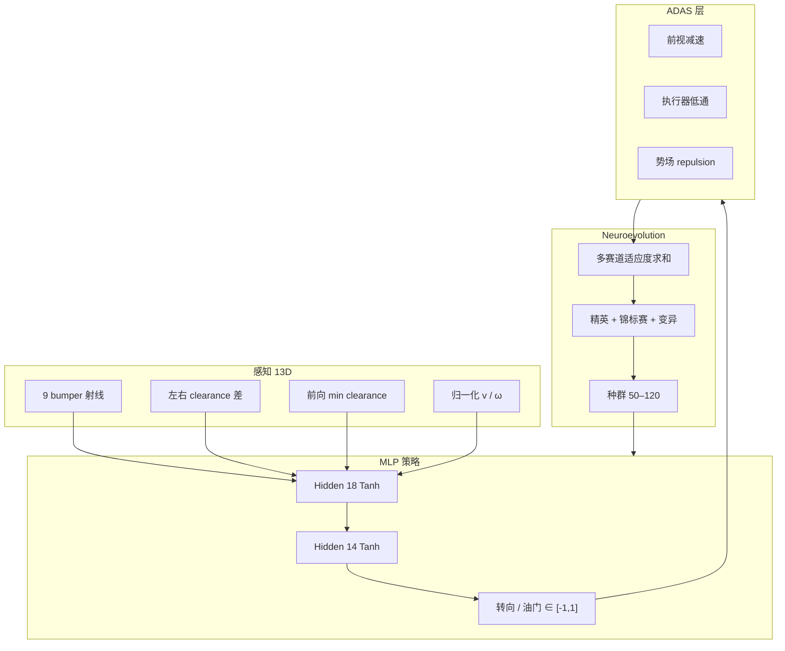
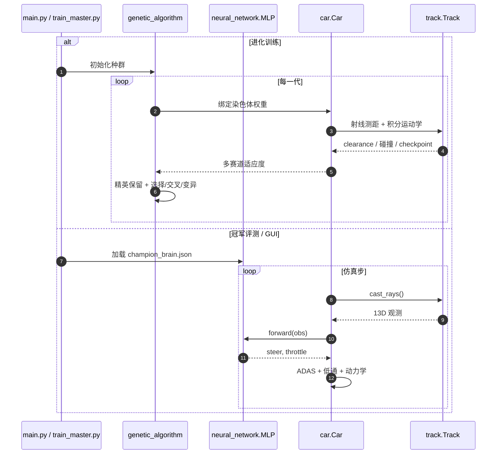

# ApexDrive AI（selfdriving-car）

**ApexDrive AI**（[poojithinavolu/selfdriving-car](https://github.com/poojithinavolu/selfdriving-car)）是从数学与几何第一性原理搭建的 **2D 自动驾驶教学仿真**：感知用 bumper 射线，控制用 **纯 NumPy MLP**，策略参数由 **Neuroevolution（遗传算法）** 在多赛道并行评估中进化，不依赖 PyTorch / TensorFlow。

## 一句话定义

> 若要在 **零 ML 框架** 前提下理解「感知 → 连续控制 → 进化优化 → 多赛道泛化」闭环，ApexDrive AI 把 13 维射线状态、Tanh MLP 与 GA 训练/评测脚本拆成可读模块，并附带 Pygame GUI 与 champion 权重 benchmark。

## 英文缩写速查

| 缩写 | 英文全称 | 简要说明 |
|------|----------|----------|
| MLP | Multi-Layer Perceptron | 两层隐层全连接网络，输出转向与油门 |
| GA | Genetic Algorithm | 锦标赛选择 + 交叉 + 高斯变异进化权重 |
| ADAS | Advanced Driver-Assistance Systems | 前视减速、低通滤波、势场 repulsion 等安全层 |
| RL | Reinforcement Learning | 对照范式；本仓用进化适应度而非梯度 RL |
| GUI | Graphical User Interface | Pygame 交互、Human vs AI、实时脑活动 HUD |

## 为什么重要

1. **教学可读性：** 感知（`car.py`/`track.py`）、网络（`neural_network.py`）、进化（`genetic_algorithm.py`）与渲染（`visualizer.py`）边界清晰，适合对照 [强化学习](../methods/reinforcement-learning.md) 与演化计算路线差异。
2. **多赛道泛化设计：** 每代同时在 7 条风格赛道评估适应度，显式对抗「单图过拟合」。
3. **轻量可跑：** 仅 `pygame` + `numpy`；`train_master.py` 可无头批量进化，`evaluate_champion.py` 一键验证 `saved_models/champion_brain.json`。
4. **与科研栈互补：** 非 CARLA / F1TENTH 级高保真，但射线 + 连续控制的抽象与 [f1tenth-gym](./f1tenth-gym.md) 等 **低维竞速策略** 问题同构，便于先练手再上大栈。

## 流程总览

## 核心结构/机制

| 模块 | 要点 |
|------|------|
| **射线感知** | 角度 `[-90°…+90°]` 共 9 条，自 bumper 角点发射，消除近场盲区 |
| **MLP** | 13→18→14→2；He/Xavier 初始化；输出连续转向与电机需求 |
| **适应度** | 各赛道：checkpoint×1000 + 均速×100 + 里程；撞墙惩罚；跨赛道求和 |
| **GA** | 精英 6–8、锦标赛 k=4、算术交叉、μ=0.12 / σ=0.30 高斯变异 |
| **动力学** | lookahead 目标速度、δ 低通 0.7/0.3、15px 内势场修正 |
| **模式** | Evolution / Champion Race / Human vs AI；Turbo 1×–60× |

## 源码运行时序图

典型复现：`pip install pygame numpy` → `python train_master.py`（进化）或 `python evaluate_champion.py`（benchmark）。

## 工程实践

| 步骤 | 命令 / 注意 |
|------|-------------|
| 依赖 | `pip install pygame numpy` |
| GUI 冠军跑 | `python main.py --mode race --track 7` |
| 人机对战 | `python main.py --mode human --track 7` |
| 无头进化 | `python train_master.py` 或 `python main.py --headless --gens 50 --track 1` |
| 单元测试 | `python tests/test_simulation.py`（10 项） |
| 保存/加载 | GUI `[S]`/`[L]` 或 `saved_models/champion_brain.json` |

## 局限与风险

- **2D 拓扑仿真：** 无 3D 感知、无真实轮胎侧偏；与 [CARLA](./carla.md) / [f1tenth-gym](./f1tenth-gym.md) 圈速或 Sim2Real **不可直接对比**。
- **Neuroevolution 样本效率：** 适应度黑盒搜索，高维问题扩展性弱于现代 RL；教学价值大于量产 AD 栈。
- **License 未声明：** 仓内无 LICENSE 文件（截至 2026-09-23），商用前需自行联系作者。
- **Stars 规模小：** 社区维护与 issue 响应有限，以 README 与 `tests/` 自证为主。

## 关联页面

- [赛车漂移 RL 开源景观](../overview/racing-drift-rl-open-source-landscape.md) — 高保真训练栈与本教学仿真的层级对照
- [F1TENTH Gym](./f1tenth-gym.md) — 1/10 轻量动力学 + RL 生态入口
- [强化学习](../methods/reinforcement-learning.md) — 与 GA/Neuroevolution 的策略优化对照
- [仿真评测基础设施](../concepts/simulation-evaluation-infrastructure.md) — 闭环 benchmark 设计背景

## 参考来源

- [sources/repos/selfdriving-car.md](../../sources/repos/selfdriving-car.md)

## 推荐继续阅读

- [仓库 README](https://github.com/poojithinavolu/selfdriving-car/blob/main/README.md) — 架构图、7 赛道 benchmark 表与键盘快捷键
- [F1TENTH 文档](https://f1tenth-gym.readthedocs.io) — 从 2D 教学仿真过渡到标准竞速 RL 环境
