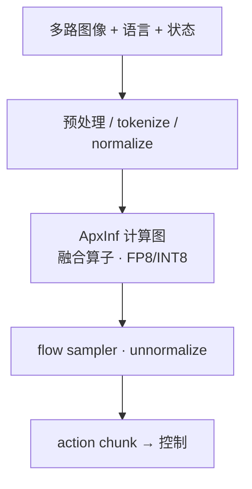
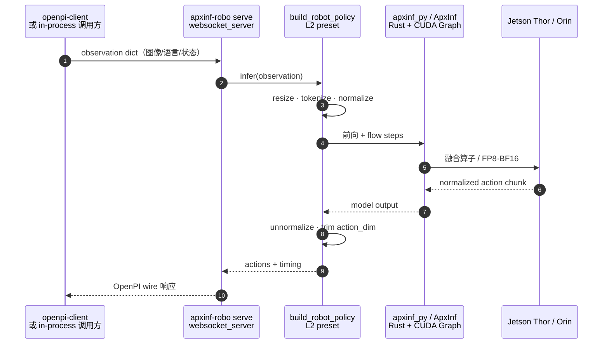

# APXInf（VLA 端侧推理引擎）

**APXInf**（[`RLinf/APXinf-robo`](https://github.com/RLinf/APXinf-robo)，引擎核心 [`infinigence/ApxInf`](https://github.com/infinigence/ApxInf)）是 **无问芯穹（Infinigence AI）** 联合 **清华大学、上海交通大学** 在 **[RLinf](https://github.com/RLinf/RLinf)** 生态内推出的 **面向机器人本体的 VLA 高性能推理引擎**：优化目标不是云端 **大 batch 吞吐**，而是 **小 batch、多视角、强实时** 的单次响应及其 **抖动**。首发完整支持 **π₀.₅**（BF16 / FP8 / INT8），提供 **OpenPI 兼容 websocket 服务** 与 **LIBERO-10** 官方协议评测。

## 一句话定义

**把 π₀.₅ 等 VLA 在 Jetson Thor/Orin 上从「百毫秒级 OpenPI 端侧基线」压到「数十毫秒稳态推理」，且尽量不牺牲 LIBERO 任务成功率——专用引擎而非通用 LLM serving 框架。**

## 英文缩写速查

| 缩写 | 英文全称 | 简要说明 |
|------|----------|----------|
| VLA | Vision-Language-Action | APXInf 首要服务的策略族 |
| WAM | World Action Model | 引擎路线亦覆盖联合世界–动作模型 |
| FP8 | 8-bit Floating Point | Thor Tensor Core 最快精度路径（需 calibration） |
| RLinf | Reinforcement Learning Infrastructure | 训练/评测基建；APXInf 为其端侧延伸 |
| OpenPI | Physical Intelligence openpi | π 系官方栈；APXInf serve 兼容其 websocket 协议 |

## 为什么重要

- **补齐 RLinf「训练 → 本体」最后一环：** [RLinf](../../sources/repos/rlinf.md) 解决 **STEAM/RECAP/Harness** 等后训练与 agentic 运行时；APXInf 把 **已验证 checkpoint** 接到 **机载低抖动推理**，避免团队在 Thor 上从零适配 vLLM/TensorRT-LLM。
- **端侧约束与云端框架错位：** Continuous Batching、Paged Attention 等 **吞吐优化** 在 **batch=1、多相机、硬实时** 的操纵环上常成额外开销；APXInf 从 **算子融合、固定内存、Rust 运行时** 出发服务 **延迟 + 抖动**。
- **OpenPI 迁移友好：** `apxinf-robo serve` + 未改 **`openpi-client`** 即可替换推理端点——降低已有 openpi 机器人栈的集成成本。
- **Agent 辅助扩展：** `/model-port-workflow` skill 与 porting 文档把 **新模型接入** 从纯人工排查转向 **可复用 Workflow**（README 路线）。

## 核心原理

### 训练–部署链路（RLinf 生态）

### 端侧推理栈（相对 OpenPI 基线）

**文内营销对照（双视角 π₀.₅ + FP8 + Thor）：** OpenPI 端侧 **~278 ms** → APXInf **~26 ms**（约 **10.7×**）。**官方 README 稳态 P50（224×224，10 flow steps）：** Thor FP8 **41.16 ms**；加 **onestep** 剪枝 **26.32 ms**——与文内 **26 ms** 量级一致。

### 源码运行时序图

对齐 [`APXinf-robo` README](https://github.com/RLinf/APXinf-robo) **L2 policy + OpenPI serve** 路径：

## 工程实践

| 步骤 | 做法 |
|------|------|
| **构建** | `git clone --recursive` APXinf-robo；`maturin` 编译 `apxinf_py`（`--features cuda`）；**在部署目标 GPU 上编译**（`APXINF_CUDA_ARCH`：`sm_87` Orin / `sm_110` Thor） |
| **权重** | `hf download lerobot/pi05_libero_base` + OpenPI **`norm_stats.json`** 单独下载（README 说明 LeRobot 仓曾丢归一化统计） |
| **快速压测** | `python scripts/bench_pi05.py --random-weights --precision fp8 --layer l1 --autotune` |
| **任务成功率** | `apxinf-robo eval-libero --backend in-process --suite libero_10 --trials-per-task 50` |
| **真机接入** | `apxinf-robo serve --robot franka_libero --model-dir … --precision bf16 --port 8000`；客户端换 endpoint |
| **FP8** | 仅 **Thor**；需 `calibration.json`（`capture-libero` + `calibrate_pi05.py`） |
| **新模型** | 安装 `apxinf/skills/model-port-workflow`；按 porting 文档 + Agent 验收 bar |

### 官方基准摘录（2026-09-16 README）

| 硬件 | 精度 | P50 延迟 | LIBERO-10 成功率 |
|------|------|---------|-----------------|
| Jetson AGX Thor | FP8 | **41.16 ms**（26.32 ms + onestep） | **92.2%**（461/500） |
| Jetson AGX Thor | BF16 | 72.45 ms | **92.8%** |
| Jetson AGX Orin | BF16 | 165.67 ms | **92.0%** |
| RTX 4090 | BF16 | 31.38 ms | — |

π₀.₅ reference baseline：**92.4%**——APXInf **未明显牺牲任务效果**（文内与 README 一致）。

## 局限与风险

- **首发模型覆盖窄：** v1 以 **π₀.₅** 最完整；GR00T 等需走 Agent porting workflow，成熟度以文档为准。
- **FP8 平台限制：** **Orin 无 FP8 Tensor Core**；FP8 路径 **Thor only**。
- **构建绑定目标 GPU：** 内核按 **本机 compute capability** 编译，交叉编译需显式 `APXINF_CUDA_ARCH`。
- **权重与归一化：** checkpoint **不随 APXinf-robo 分发**；LIBERO 复现必须对齐 **OpenPI norm_stats**。
- **与 FluxVLA 分工不同：** [FluxVLA Engine](./fluxvla-engine.md) 偏 **LimX 人形训练 DevOps**；APXInf 偏 **RLinf + Thor/Orin 推理延迟**，勿混为同一产品。

## 关联页面

- [RLinf 训练系统](../../sources/repos/rlinf.md) — 上游基建
- [Harness VLA / RPent](./paper-harness-vla.md) — 同 RLinf 生态 agentic 运行时
- [π₀.₅](./paper-pi05-open-world-vla.md) — 默认 benchmark 模型
- [π₀ Policy](../methods/π0-policy.md) — OpenPI 官方栈
- [VLA](../methods/vla.md) — 方法总览与部署经验
- [VLA 真机部署指南](../queries/vla-deployment-guide.md) — 延迟/异步对照
- [VLA 开源复现景观](../overview/vla-open-source-repro-landscape-2025.md) — RLinf 栈索引
- [NVIDIA Jetson](./nvidia-jetson.md) — Thor/Orin 硬件
- [Jetson AI Lab](./jetson-ai-lab.md) — OpenPi on Thor 官方教程（互补）
- [TensorRT](./tensorrt.md) — 通用 NVIDIA 优化运行时对照
- [FluxVLA Engine](./fluxvla-engine.md) — 另一开源 VLA 工程底座

## 参考来源

- [具身智能之心：APXInf π₀.₅ Thor 26ms 报道](../../sources/blogs/wechat_embodied_heart_apxinf_pi05_thor_2026-09-16.md)
- [APXinf-robo 源码归档](../../sources/repos/apxinf-robo.md)
- [ApxInf 引擎核心归档](../../sources/repos/apxinf.md)
- [RLinf 仓库归档](../../sources/repos/rlinf.md)

## 推荐继续阅读

- [APXinf-robo GitHub](https://github.com/RLinf/APXinf-robo)
- [ApxInf 引擎与 porting 文档](https://github.com/infinigence/ApxInf)
- [RLinf 文档](https://rlinf.readthedocs.io/)
- [OpenPI / π₀.₅](https://github.com/Physical-Intelligence/openpi)
