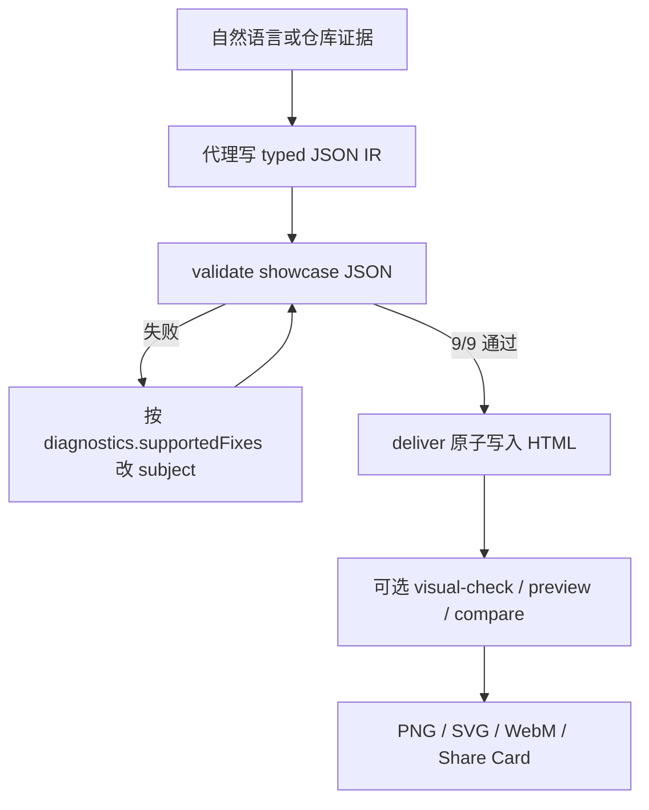
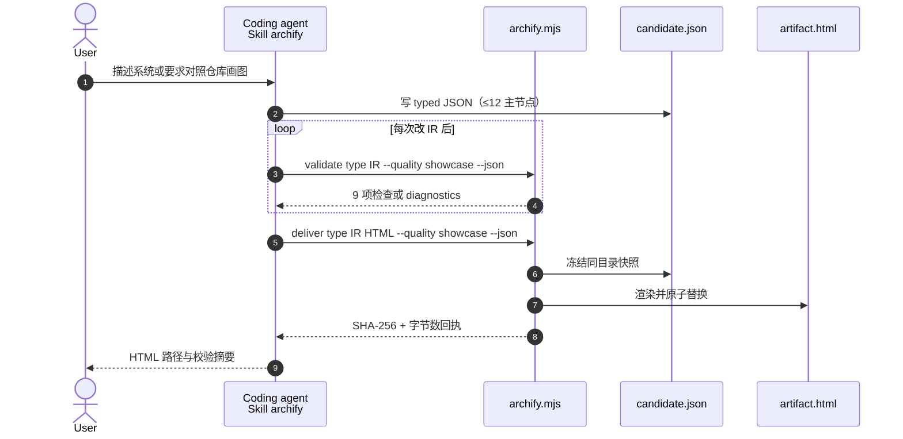

# Archify

**Archify**（[tt-a1i/archify](https://github.com/tt-a1i/archify)，MIT）是面向 Cursor、Claude Code、Codex CLI、OpenCode 的 **Agent Skill + Node 渲染器**：代理根据系统描述或仓库证据写出 **类型化 JSON IR**，CLI 做 schema / 布局 / 路由 / 标签净空检查后，原子交付 **自包含 HTML**（内嵌 SVG），并导出 PNG / SVG / WebM。项目页：[tt-a1i.github.io/archify](https://tt-a1i.github.io/archify/)。

## 一句话定义

把「系统长什么样」编译成 **可校验、可打开、可导出** 的独立系统图——代理负责语义与层次，Archify 负责确定性渲染；它不是通用画板，也不是 Mermaid 换皮。

## 英文缩写速查

| 缩写 | 英文全称 | 简要说明 |
|------|----------|----------|
| IR | Intermediate Representation | 本页核心：五种图各自的类型化 JSON 源，渲染器只吃这份契约 |
| CLI | Command-Line Interface | `archify/bin/archify.mjs`：`validate` / `deliver` / `compare` 等门禁入口 |
| SVG | Scalable Vector Graphics | HTML 内嵌矢量图；导出可带深浅双主题 |
| PNG | Portable Network Graphics | 4× 原生栅格导出与剪贴板分享的默认位图 |
| SKILL.md | Agent Skill Manifest | `archify/SKILL.md`：作者路径、两次纠错上限与交付契约 |
| DSH | DeepSeek Harness | 社区可选插件面，不是 DeepSeek 官方产品 |

## 为什么重要

1. **本站知识页用 Mermaid，对外沟通常需要独立工件。** wiki 结构图适合进 git；组会、PR、README、赞助页需要 **可检索节点、可播一条故事、可复制分享图** 的 HTML。Archify 补这一层，不替代页内 Mermaid。
2. **机器人栈正好有五类要讲清的图。** 仿真集群 / 策略服务 / 真机安全边界（architecture）、训练 CI 与发布门（workflow）、感知→策略→执行时序（sequence）、遥操作到数据集到评测（dataflow）、训练作业或任务状态机（lifecycle）。
3. **校验先于好看。** showcase 质量档要求 9 项工件检查全过才替换上次成功产物；失败回执给出稳定 rule code 与 `supportedFixes`，避免「再让模型盲改坐标」。
4. **Architecture Delta 服务审阅，不服务合并决策。** 两份已校验 snapshot 的 added / removed / changed / moved / rerouted 是机器事实；风险与能不能合仍由人判断。

## 核心原理

| 步骤 | 做什么 |
|------|--------|
| **Generate** | 代理选图类型，对照 `schemas/` + 一个 JSON 示例写新 IR；新 workflow 用 `schema_version: 2` |
| **Validate** | `validate <type> <file> --quality showcase --json`；showcase 必须 9/9 且 0 warning |
| **Preview（可选）** | 本机 `127.0.0.1` 监视单个 JSON，只在最新候选过门后刷新；失败保留 last-good |
| **Deliver** | 同目录快照 → 渲染检查 → 原子替换 HTML；回执含 spec/artifact 的 SHA-256 |
| **Iterate** | 只改被诊断的 `subject`，最多两轮纠错；两轮误差不下降则如实停 |

组件语义类型只有七种：`frontend` / `backend` / `database` / `cloud` / `security` / `messagebus` / `external`。关系标签是语义数据：几何冲突时先挪标签或改路由，**删有含义的标签不算几何修复**。

### 流程总览

## 源码运行时序图

主仓 **已开源**（MIT）。稳定标签 **v2.15.0**；入库时默认分支开发号 **v2.16.0-dev.0**。下列时序对齐 README 与 `archify/SKILL.md` 的 `validate` → `deliver` 路径。

关键复现路径：`npx skills add tt-a1i/archify -g` → 在对话里点名 Archify → 代理写 JSON 并 `validate` / `deliver`。无仓库也可先口述拓扑。对照官方 CLI：`node archify/bin/archify.mjs doctor` 与 `demo /tmp/archify-demo`。

## 工程实践

| 项 | 要点 |
|----|------|
| **安装** | `npx skills add tt-a1i/archify -g`；Cursor 非交互：`npx -y skills add tt-a1i/archify --skill archify --agent cursor --global --copy --yes` |
| **选型提示** | 先说图类型、范围、主路径、边界；需要源码证据时再要求「对照某 commit」 |
| **密度** | 默认 `meta.quality_profile: showcase`、主路径清晰、至多约 12 个主节点；细节进卡片而不是加边 |
| **Mermaid 输入** | 可读拓扑，但必须重写成 Archify JSON；`flowchart`→workflow/architecture，`sequenceDiagram`→sequence，`stateDiagram`→lifecycle |
| **Delta 审阅** | `node archify/bin/archify.mjs compare architecture base.json head.json out.html --json` |
| **更新检查** | 可选 GET 固定 manifest，不上传项目/prompt；`ARCHIFY_UPDATE_CHECK_DISABLED=1` 关闭 |
| **开源状态** | **已开源**（截至 2026-08-30）：项目页链到 GitHub；CLI、schema、示例与 Proof Lab 均可运行 |

机器人栈常用写法：把 Isaac / MuJoCo、策略服务、机载安全层画进 architecture；把「采集 → 标注 → 训练 → sim 评测 → 真机门」画进 dataflow 或 workflow，而不是一张图塞进全部细节。

## 局限与风险

- **误区：Archify = 更好看的 Mermaid。** 本站页内结构图继续用 Mermaid。Archify 是 **独立 HTML 工件**；Skill 明确拒绝「自动解析 Mermaid 并原样渲染」。
- **误区：交互等于运行时分析。** focus / reach / route / story 只遍历作者写过的边，不探测真实流量，也不证明合并安全。
- **误区：deployment-ownership 会扫你的云账号。** 该 profile 只校验 IR 里已写的 owner / 区域 / 私有库范围；缺字段即失败关闭，从不探活基础设施。
- **不是科研插图编辑器。** 需要可编辑图元、投稿矢量、人眼逐步审图，走 [Draw.io Scientific Illustrator](./drawio-scientific-illustrator.md)。
- **不是知识编译。** [graphify](./graphify.md) 解决「刚 clone 陌生仓如何查询」；本仓库 [ingest](../../schema/ingest-workflow.md) 解决「判断写进 wiki」。Archify 不产生 `## 参考来源`。
- **作者负担在代理侧。** 层次、间距、强调由代理选择；校验能挡交叉与标签遮挡，挡不住「节点选错、边界说假话」。

## 与相近方案的对照

| 方案 | 产物 | 代理接口 | 强项 |
|------|------|----------|------|
| **Archify** | 自包含 HTML + 导出图 | Agent Skill + Node CLI | 可校验系统图、Delta 审阅、分享卡 |
| [Draw.io Scientific Illustrator](./drawio-scientific-illustrator.md) | 可编辑 `.drawio` | Codex Skill + MCP | 可见步进、论文插图 |
| [Manim](./manim.md) | 讲解视频 | Python Scene | 公式与时间线叙事 |
| [GSAP Skills](./gsap-skills.md) | Web UI 动效 | 官方 `SKILL.md` | DOM / Scroll 交互，不是系统拓扑 |
| [graphify](./graphify.md) | `graph.json` + 查询 | Skill + CLI / MCP | 探索期知识图，不是演示图 |
| 本库 Mermaid | Markdown 内流程图 | 无（静态编译） | wiki 结构、版本友好 |

## 关联页面

- [Draw.io Scientific Illustrator](./drawio-scientific-illustrator.md) — **可编辑科研框图**；同属「代理出图」，交付物不同
- [Manim](./manim.md) — **程序化讲解动画**，不是交互系统图
- [GSAP Skills](./gsap-skills.md) — **Web 动效** 官方技能，沟通层但非架构拓扑
- [graphify](./graphify.md) — **自动构图 + 图查询**；探索仓，不演示仓
- [Skills For Real Engineers（mattpocock）](./mattpocock-skills.md) — 通用工程技能对照
- [Agentic Coding 时代的软件工程基础](../concepts/agentic-coding-software-fundamentals.md) — 架构取舍仍要人转向；本工具只把已决定的边界画清楚
- [LLM Wiki（Karpathy 模式）](../references/llm-wiki-karpathy.md) — 知识编译进 wiki；Archify 编译的是沟通工件
- [ingest 工作流](../../schema/ingest-workflow.md) — 本站资料入库规范

## 参考来源

- [archify 仓库源归档（本站）](../../sources/repos/archify.md)
- [Archify 项目页归档（本站）](../../sources/sites/archify-github-io.md)
- [tt-a1i/archify（GitHub README）](https://github.com/tt-a1i/archify)
- [archify/SKILL.md](https://github.com/tt-a1i/archify/blob/main/archify/SKILL.md)

## 推荐继续阅读

- [Archify 项目页](https://tt-a1i.github.io/archify/) — 安装、五类图与导出演示
- [Proof Lab](https://tt-a1i.github.io/archify/gallery.html) — 11 个已校验场景与 JSON 源
- [Scenario guide](https://tt-a1i.github.io/archify/guide.html) — 选图类型
- [Agent Skills](https://agentskills.io/) — `SKILL.md` 约定
