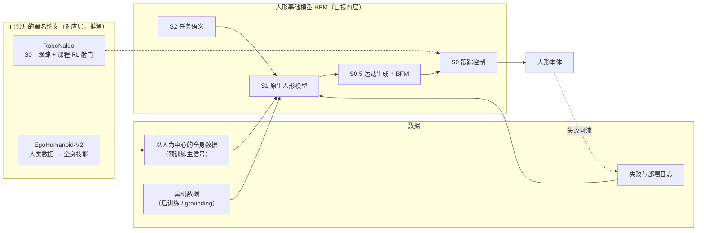

# 源策未来（Archon Robotics）

## 一句话定义

**源策未来（Archon Robotics，官网 archon.tech）** 是 2026 年 4 月成立（媒体口径）、研发总部在上海的人形机器人基础模型公司，由香港大学助理教授、OpenDriveLab 负责人 **李弘扬** 创办。公司不造本体，主攻 **全身智能（Whole-Body Intelligence, WBI）**：用以人为中心的全身数据预训练一个原生 **人形基础模型（HFM）**，再用真机数据后训练，让人形同时完成移动与操作。官网自称目标是做中国的「OpenAI for Humanoid Robotics」。

## 英文缩写速查

| 缩写 | 英文全称 | 简要说明 |
|------|----------|----------|
| WBI | Whole-Body Intelligence | 全身智能；公司技术路线名，见 [WBI 详情页](./archon-whole-body-intelligence.md) |
| HFM | Humanoid Foundation Model | 人形基础模型；官网 Mission 中的产品目标 |
| CRO | Chief Robot Officer | 首席机器人官；李弘扬在公司的职位 |
| BFM | Behavior Foundation Model | 行为基础模型；官网称在做「情境感知 BFM」 |
| HKU | The University of Hong Kong | 香港大学；创始人任职单位，官网列为机构支持方 |
| SII | Shanghai Innovation Institute | 上海创智学院；种子轮投资方之一，李弘扬任导师 |
| ADS | Advanced Driving System | 华为乾崑智驾系统；CEO 李天羽曾参与 ADS 4.0 |
| RSS | Robotics: Science and Systems | 机器人顶会；2026 年公司与 OpenDriveLab 联合参会 |

## 为什么重要

- **自动驾驶团队整体转向人形的样本：** 三位创始人都来自端到端自动驾驶（UniAD 负责人、UniAD 第一作者、华为 ADS 4.0 核心开发者）。投资方评论直接把 UniAD「planning-oriented」类比为公司的「Human Body Learning」，可以观察智驾方法论能否迁移到人形。
- **路线选择鲜明：** 只做完整人形、不做轮式底盘 + 双臂；把人类全身数据当主训练信号；在 Figure 式 S2/S1/S0 分层中单列「S0.5 运动生成 + BFM」层（见 [WBI](./archon-whole-body-intelligence.md)）。
- **学术实验室与公司边界的观察点：** 公司与港大 OpenDriveLab 共用人员、项目页和会议品牌（「Archon & OpenDriveLab at RSS 2026」），但 arXiv 上明确署名公司的论文目前只有 2 篇。读者需要区分实验室成果和公司成果。
- **开源承诺可追踪：** 媒体称公司计划 2026 年内（下旬）发布首个开源人形基座模型；截至 2026-10-10 尚未发布。

## 公司概况

| 项 | 内容 | 来源 |
|----|------|------|
| 名称 | 源策未来；英文 Archon Robotics；标语「以源为始 · 以策为径 · 通向未来」 | 官网 |
| 成立 | **2026 年 4 月**（官网未写；工商全称未找到） | 硬氪 2026-06-29、投中网 2026-06-29、港大 TEC 讲者页（**媒体口径**）；Gasgoo 写「2024 年 4 月」，判为笔误（推测） |
| 总部 | 研发总部 **上海市徐汇区漕河泾开发区** | 硬氪 2026-06-29（**媒体口径**）；港大 TEC 页「Shanghai-based」 |
| 团队规模 | 约 20 名研究员与工程师，来自港大、清华、上海交大及科技公司 | 官网 |
| 使命 | 为全身智能构建 HFM：让人形在真实世界中移动、感知、推理与行动的基础 AI 层（自报） | 官网 Mission |
| 是否造本体 | 未写；演示中机器人穿公司 T 恤，机型未标注 | 官网、博文海报 |
| 渠道 | X [@archon_robotics](https://x.com/archon_robotics)；YouTube [@archon_robotics](https://www.youtube.com/@archon_robotics)；LinkedIn；招聘站 careers.archonrobotics.tech（「源策新星计划 / Archon Star Program」） | 官网页脚 |

### 创始团队

| 人物 | 职位 | 背景 | 来源 |
|------|------|------|------|
| **李弘扬**（Hongyang Li） | Founder & Chief Robot Officer (CRO) | 港大计算与数据科学学院助理教授、助理院长（AI Research & Tech Transfer），领导 OpenDriveLab；上海创智学院导师；UniAD（CVPR 2023 Best Paper）负责人，BEVFormer、AgiBot World；2026 RSS Early Career Spotlight | 官网；港大 TEC；硬氪 |
| **李天羽**（Tianyu Li） | Co-Founder & CEO | 华为 ADS 4.0 核心架构师（官网）/「世界引擎」方案核心开发者（硬氪）；WAIC Rising Star 2026；复旦大学博士、上海创智学院首批毕业生 | 官网；硬氪 |
| **陈立**（Li Chen） | Co-Founder & Head of AI | UniAD 第一作者；具身智能与世界模型；ECCV 2026 Area Chair；上海交大致远荣誉工程本科、港大校长博士奖学金 | 官网；硬氪 |

### 融资（媒体报道，官网只列机构 logo）

| 公布日期 | 轮次 | 金额 | 投资方 | 领投 | 财务顾问 | 来源 |
|----------|------|------|--------|------|----------|------|
| 2026-06-29 | 种子轮（投中网称「首轮」） | **数亿元人民币**（港大 TEC："nine-figure RMB"）；估值未披露 | 真格基金、高榕创投、IDG 资本、五源资本；戈壁创投与香港大学联名基金、奇绩创坛、上海创智学院 | **未披露** | 光源资本（独家） | 硬氪独家、36 氪英文快讯、投中网、Gasgoo |

- 官网 Investors 区 logo：ZhenFund、Gaorong、IDG Capital、5Y Capital、Gobi、HKU、MiraclePlus、SII，与媒体名单一致；官网不写轮次和金额。
- 资金用途（媒体）：全身人形基础模型研发、多模态全身动作数据采集、人才扩充、多地研发中心与产业合作生态。
- 截至 2026-10-10 未检索到其他轮次。完整链接见 [新闻归档](../../sources/blogs/archon_robotics_press.md)。

## 时间线

| 日期 | 事件 | 来源 |
|------|------|------|
| 2026-04 | 公司成立（媒体口径） | 硬氪、投中网、港大 TEC |
| 2026-05-23 | Hugging Face 组织 `ArchonRobotics` 创建（由组织 ID 时间戳折算，推测） | HF API |
| 2026-06-09 | **RoboNaldo** arXiv v1（2606.11092），署名含 Archon Robotics | arXiv |
| 2026-06-29 | 公布数亿元种子轮；称 2026 年下旬发布首个开源人形原生基座模型 | 硬氪、投中网 |
| **2026-07-13** | 官网唯一博文 **《Whole-Body Intelligence: The Pretraining Path to Large Humanoid Models》** 发布 | 官网 |
| 2026-07-13 至 17 | RSS 2026（悉尼）：「Archon & OpenDriveLab」联合参会；李天羽、李弘扬、陈立分别演讲；RoboNaldo 现场人形足球演示 | [opendrivelab.com/rss2026](https://opendrivelab.com/rss2026) |
| 2026-09-29 | **EgoHumanoid-V2** arXiv v1（2609.37181），署名含 Archon Robotics | arXiv |
| 约 2026-09-30 | 官网首屏视频更新（资源路径含 `20260930`，推测） | 官网 HTML |
| 2026-10-10 | 本库核查：开源模型尚未发布；GitHub / HF 组织为空 | 本页 |

## 署名 Archon Robotics 的论文（arXiv，截至 2026-10-10）

检索方法：arXiv API 按三位创始人姓名检索 2026-03 之后的论文（共约 40 篇），逐篇读取 arXiv HTML 搜索 "Archon"；另检索 `all:"Archon Robotics"` 与网页搜索。只有下列两篇在作者单位中列出 Archon Robotics。

| arXiv | 标题 | v1 日期 | Archon 署名作者 | 代码 | 本库页面 |
|-------|------|---------|-----------------|------|----------|
| [2606.11092](https://arxiv.org/abs/2606.11092) | RoboNaldo: Accurate, Stable and Powerful Humanoid Soccer Shooting via Motion-Guided Curriculum Reinforcement Learning | 2026-06-09 | Yixuan Pan、李天羽、李弘扬（李弘扬同时署港大） | ✅ `OpenDriveLab/RoboNaldo` + `RoboNaldo_Deploy`（在实验室组织下） | [RoboNaldo](./paper-robonaldo-humanoid-soccer-shooting.md) |
| [2609.37181](https://arxiv.org/abs/2609.37181) | EgoHumanoid-V2: Human-to-Humanoid Transfer of Coordinated Whole-Body Skills for Loco-Manipulation | 2026-09-29 | Modi Shi、Shijia Peng、陈立、李天羽（李弘扬署 OpenDriveLab@HKU） | ❌ 项目页标「Coming soon」 | [EgoHumanoid-V2](./paper-egohumanoid-v2.md) |

**已核查但未署名公司的相关论文**（作者有创始人，单位是港大 / OpenDriveLab 等）：AMS（2511.17373）、EgoHumanoid（2602.10106）、RISE（2602.11075）、SparseVideoNav（2602.05827）、GuidedVLA（2605.12369）、NativeMEM（2607.06678）、World Engine（2606.19836）等。其中 RISE、EgoHumanoid、GuidedVLA、NativeMEM、SparseVideoNav 出现在「Archon & OpenDriveLab at RSS 2026」页面，但论文本身没有 Archon 署名。

## 核心原理：全身智能路线（摘要）

详见 [WBI 详情页](./archon-whole-body-intelligence.md)。

- **首页四要点（自报）：** WBI 框架；面向带地形交互的移动操作的情境感知 BFM；大规模人类全身数据预训练；真机数据高效后训练。
- **媒体访谈三层（自报）：** 大脑（任务理解、长程规划）/ 中脑（跨本体全身运动表征，输出全身轨迹而非特定机型关节角）/ 小脑（实时跟踪与平衡）。与博文 S2 / S1+S0.5 / S0 大致对应（推测）。
- **Human Body Learning：** 学人类全身位姿与协调方式，而非只跟踪末端轨迹；访谈称「一条覆盖重心移动、躯干角度变化的全身数据，信息密度远高于一百条只有手部轨迹的桌面数据」（自报）。

## 开源与开放状态（2026-10-10）

| 渠道 / 项目 | 状态 | 依据 |
|-------------|------|------|
| GitHub 组织 [`ArchonRobotics`](https://github.com/ArchonRobotics) | 存在，**0 个公开仓库** | GitHub 用户搜索 + 组织页 |
| Hugging Face 组织 [`ArchonRobotics`](https://huggingface.co/ArchonRobotics) | 存在，**0 模型 / 0 数据集 / 0 Space** | HF API |
| WBI 博文 | 无论文、代码、权重、数据 | [博文归档](../../sources/blogs/archon_whole_body_intelligence.md) |
| RoboNaldo | ✅ 训练 + 部署代码已开源，但在 **OpenDriveLab** 组织 | [RoboNaldo](./paper-robonaldo-humanoid-soccer-shooting.md) |
| EgoHumanoid-V2 | ❌ 代码「Coming soon」 | 项目页 |
| 「开源人形基座模型」 | 媒体称 2026 年下旬发布；**尚未发布** | 硬氪 2026-06-29 |

**结论：** 公司自身目前没有可运行的开源代码或模型；可用的只有署名论文中实验室组织托管的 RoboNaldo 代码。

## 与港大 OpenDriveLab 的关系

- **人员重叠：** 李弘扬领导 OpenDriveLab；陈立是 UniAD 第一作者、实验室出身；李天羽、陈立是自动驾驶后训练论文 World Engine（arXiv 2606.19836，2026-06-18，含华为 ADS 实验，即硬氪所说「世界引擎」）的第一、第二作者，该论文单位中没有 Archon。真格基金评论称 OpenDriveLab「成为人才山谷」，两位联合创始人「正是其中的杰出代表」。
- **品牌并列：** OpenDriveLab 官网有「Archon & OpenDriveLab at RSS 2026」页面，三位创始人以 Archon 职位演讲。
- **论文归属以 arXiv 署名为准：** UniAD、BEVFormer、[AgiBot World](./agibot-world-2026.md)、[AMS](../methods/ams.md)、[EgoHumanoid](./paper-loco-manip-161-060-egohumanoid.md)、[RISE](./paper-sa-2602-11075-rise-self-improving-robot-policy-with-compositio.md) 等是实验室或合作方的学术成果，多数早于公司成立。高榕创投的投资方评论把 UniAD、WorldEngine、Agibot、WholeBodyVLA、Ego-humanoid 都算作「源策团队」成果；WBI 中文博文把 AMS 称为「Archon 方案原型」。这些都是公司 / 投资方叙事，本库只把 arXiv 列出 Archon 单位的论文计为公司成果。
- **项目页托管：** 两篇署名公司的论文，项目页都在 opendrivelab.com，代码（如有）也在 OpenDriveLab GitHub 组织下。

## 工程实践

| 场景 | 建议 |
|------|------|
| 想用公司的模型 | 目前无可下载模型；关注 GitHub / HF `ArchonRobotics` 组织与官网博客是否发布开源基座模型 |
| 复现署名工作 | [RoboNaldo](./paper-robonaldo-humanoid-soccer-shooting.md) 有完整训练 + G1 部署代码，可直接上手；EgoHumanoid-V2 等代码发布 |
| 借鉴路线做自己的栈 | 用 [WBI 页](./archon-whole-body-intelligence.md) 的四层接口和 7 条评测问题；S0 可用开源跟踪器，人类数据路线参考 [EgoHumanoid](./paper-loco-manip-161-060-egohumanoid.md) |
| 写行业 / 融资综述 | 成立日期写「2026-04（媒体口径）」；种子轮写「数亿元、未披露领投」；论文成果只计 arXiv 署名公司的两篇 |
| 同类公司对照 | 对照 [西湖机器人](./westlake-robotics.md)（同为高校实验室孵化、主打全身动作模型，但有自研本体与闭源商用软件）与 [Figure Helix 02](./helix-02.md)（S2/S1/S0 分层） |

## 局限与风险

- **成立时间短，公开证据少：** 只有 1 篇愿景博文、4 段短视频和 1 条完整视频，没有模型规格、数据规模或评测数字。
- **成立日期与总部只有媒体来源：** 官网未写，工商全称未找到；Gasgoo 的「2024 年 4 月」与其他来源冲突。
- **实验室 / 公司边界模糊：** 会议品牌、项目页和代码组织都与 OpenDriveLab 共用，媒体和投资方常把实验室成果算给公司。
- **开源承诺未兑现（截至 2026-10-10）：** 「2026 年下旬开源人形基座模型」仍待观察。
- **本体未知：** 公司是否自研或采购人形本体、演示所用机型均未公开。
- **自报荣誉：** 「首位华人学者」等表述来自媒体稿，未独立核实。

## 关联页面

- [全身智能 WBI（博文详情）](./archon-whole-body-intelligence.md)
- [RoboNaldo 人形射门](./paper-robonaldo-humanoid-soccer-shooting.md) · [EgoHumanoid-V2](./paper-egohumanoid-v2.md) — 署名公司的两篇论文
- [EgoHumanoid](./paper-loco-manip-161-060-egohumanoid.md) · [RISE](./paper-sa-2602-11075-rise-self-improving-robot-policy-with-compositio.md) · [AMS](../methods/ams.md) — OpenDriveLab 相关学术工作
- [UniAD](./paper-uniad.md) · [AgiBot World 2026](./agibot-world-2026.md) — 创始人的代表性学术成果
- [Helix 02](./helix-02.md) · [西湖机器人](./westlake-robotics.md) — 产业对照
- [行为基础模型](../concepts/behavior-foundation-model.md) · [Loco-Manipulation](../tasks/loco-manipulation.md) · [人形足球](../tasks/humanoid-soccer.md)
- [国内具身智能实验室三层地图 2026](../overview/china-embodied-ai-labs-landscape-2026.md)

## 参考来源

- [源策未来官网核查（2026-10-10）](../../sources/sites/archon-tech.md)
- [WBI 博文来源归档](../../sources/blogs/archon_whole_body_intelligence.md)
- [成立与融资报道归档](../../sources/blogs/archon_robotics_press.md)
- [RoboNaldo 论文归档](../../sources/papers/robonaldo_arxiv_2606_11092.md)
- 硬氪独家（2026-06-29）<https://www.36kr.com/p/3868055841641476>
- 投中网（2026-06-29）<https://www.chinaventure.com.cn/news/114-20260629-392047.html>
- 港大 TEC 讲者页 <https://tec.hku.hk/?p=903871>
- Archon & OpenDriveLab at RSS 2026 <https://opendrivelab.com/rss2026>
- arXiv：[2606.11092](https://arxiv.org/abs/2606.11092)、[2609.37181](https://arxiv.org/abs/2609.37181)

## 推荐继续阅读

- [源策未来官网](https://www.archon.tech/) — Mission、团队与投资方
- [Whole-Body Intelligence 博文](https://www.archon.tech/blog/whole-body-intelligence) — 公司技术路线全文
- [硬氪独家融资报道与访谈](https://www.36kr.com/p/3868055841641476) — 三层架构与数据路线的创始人原话
