# 全身智能 WBI：Archon 的人形基础模型预训练路线

| 字段 | 内容 |
|------|------|
| **机构** | [源策未来（Archon Robotics）](./archon-robotics.md) |
| **类型** | **公司官方愿景 / 技术路线博文**（非论文、非技术报告，未经同行评审） |
| **标题** | *Whole-Body Intelligence: The Pretraining Path to Large Humanoid Models*；中文版《全身智能：迈向人形基础模型》 |
| **发布** | 2026-07-13（同日 RSS 2026 开幕，公司与 OpenDriveLab 在会上做了三场演讲） |
| **作者** | 署名 "Archon Robotics"，无个人作者 |
| **开源** | **无**：没有论文、代码、权重或数据（2026-10-10 核查官网、GitHub、Hugging Face） |
| **演示** | 4 段短视频（环境借力操作 / 大范围可达 / 全身协同重物操作 / 窄距通行）+ 首页完整视频；未写机型、自主程度和成功率 |

## 一句话定义

**全身智能（Whole-Body Intelligence, WBI）** 是源策未来提出的人形机器人预训练路线：用人类全身数据、机器人数据、仿真、失败和部署反馈做 **异构预训练**，训练一个 **原生人形基础模型**（官网称 HFM，中文博文称 LHM），再经 **S2 / S1 / S0.5 / S0** 四层执行栈输出可执行、可恢复的全身行为。博文原文定义："the ability of a humanoid model to learn reusable full-body priors from heterogeneous human and robot experience, then use those priors to produce safe, adaptive, executable behavior in the real world."

## 英文缩写速查

| 缩写 | 英文全称 | 简要说明 |
|------|----------|----------|
| WBI | Whole-Body Intelligence | 全身智能；本页主题，公司对人形预训练范式的命名 |
| HFM | Humanoid Foundation Model | 人形基础模型；官网 Mission 中的产品目标 |
| LHM | Large Humanoid Model | 中文版博文对同一模型的称呼（「人形基础模型」） |
| BFM | Behavior Foundation Model | 行为基础模型；在 WBI 栈中位于 S0.5，提供可复用运动先验 |
| WBC | Whole-Body Control | 全身控制；WBI 不取代它，而是把它放进 S0 |
| VLA | Vision-Language-Action | 视觉-语言-动作策略；博文认为「机械臂 VLA + 人形底盘」不够 |
| VLM | Vision-Language Model | 视觉语言模型；S2 层接近 VLM agent |
| S2 / S1 / S0.5 / S0 | System 2 / 1 / 0.5 / 0 | 四层模型栈：任务语义 / 原生人形模型 / 运动生成 + BFM / 跟踪控制 |
| DoF | Degrees of Freedom | 自由度；博文把手部自由度列为影响学习接口的硬件因素 |

## 为什么重要

- **把人形的「scaling 问题」说清楚：** 桌面操作的 scaling 建立在固定工作区、短任务、稳定视角上。博文指出人形里脚决定手能够到哪、躯干决定操作空间、头部决定可见性、手会遮挡接触，因此问题从「能否控制身体」变成「能否预训练身体」。这是理解 2026 年人形基础模型公司路线差异的一个清晰表述。
- **在 Figure 的 S2/S1/S0 之间多插了一层 S0.5：** [Helix 02](./helix-02.md) 用 System 2 / 1 / 0 三层；WBI 把 **运动生成 + BFM** 单列为 S0.5，夹在原生人形模型与跟踪控制器之间，等于给 [行为基础模型](../concepts/behavior-foundation-model.md) 在大模型栈里找了一个明确位置。
- **把人类数据当主信号而非替代品：** 博文和融资访谈都主张以人为中心的全身数据（egocentric 视频、全身位姿、手部动作、IMU、语音、任务上下文）是预训练的主要来源，真机数据负责 grounding。这与 [EgoScale](./paper-sa-2602-16710-egoscale-scaling-dexterous-manipulation-with-div.md)、[EgoHumanoid](./paper-loco-manip-161-060-egohumanoid.md) 一脉相承。
- **提出了可操作的评测清单：** 换场景、换物体、局部恢复、无复位连续子任务、换硬件的适配成本、新任务真机数据量、是否会拒绝不安全动作。这些比「最好看的一条视频」更适合做产业对比。
- **引用纪律：** 这是一篇成立约三个月的公司发布的路线文，**没有任何实验数字或公开实现**。它的价值在于问题拆分与术语，不在于证据。

## 核心原理

### 四层模型栈（博文 §04）

```mermaid
flowchart TB
  subgraph DATA["异构数据（贯穿各层，复利循环）"]
    H["以人为中心的全身数据<br/>egocentric 视频 · 全身位姿 · 手部 · IMU · 语音"]
    R["真机数据（grounding）<br/>遥操作 · 部署日志"]
    SIM["仿真"]
    F["失败 / 干预 / 恢复"]
  end
  G["目标 + 语言"] --> S2
  S2["S2 任务 · 语义 · 世界理解<br/>语言 · 记忆 · 长程规划 · 安全规则 · 重规划"]
  S2 -- "子目标" --> S1
  V["视觉 + 本体 + 触觉 + 历史"] --> S1
  S1["S1 原生人形基础模型（核心）<br/>输出全身动作意图 / action chunk / motion token"]
  S1 -- "身体先验 · 意图 + 约束" --> S05
  S05["S0.5 运动生成 + BFM<br/>紧凑意图 → 可跟踪、可恢复的全身运动"]
  S05 -- "参考运动" --> S0
  RS["机器人状态 · 局部高程 · 接触"] --> S0
  S0["S0 全身跟踪器 / 控制器<br/>平衡 · 接触 · 力与关节限制 · 延迟 · 保护"]
  S0 -- "控制目标" --> ROBOT["实体机器人执行"]
  DATA -. 预训练 .-> S1
  DATA -. 预训练 .-> S05
  ROBOT -. "失败与日志回流 → 后训练" .-> DATA
```

| 层 | 职责（博文） | 输入 / 输出 | 博文点名的同类工作 |
|----|--------------|-------------|--------------------|
| **S2** 任务与世界 | 语言、目标、场景理解、记忆、长程规划、任务分解、安全规则、重规划；何时停止或求助 | 目标 + 语言 → 子目标 | VLM agent、语义地图、mission controller（对照 [Flexion Reflect v1.0](./flexion-reflect-v1.md)） |
| **S1** 原生人形模型 | 学视线、脚、躯干、臂、手、接触与平衡如何在一个身体内权衡；「不是加大动作头的机械臂 VLA」 | 视觉、语言、本体、触觉、历史、任务上下文 → 全身动作意图 / action chunk / motion token | 无点名（这是公司要做的核心） |
| **S0.5** 运动生成 + BFM | 把高层意图变成可跟踪、可恢复的全身运动；通常不吃丰富视觉语言输入 | 紧凑目标、约束、motion token → 参考运动 | 闭环 BFM、运动生成框架 |
| **S0** 跟踪与控制 | 跟踪参考运动；平衡、接触、关节与力限制、延迟、硬件保护；不负责全局任务 | 本体 + 参考运动 + 可选局部高程 / 接触 → 控制目标 | [SONIC](../methods/sonic-motion-tracking.md)、BFM 类控制器；中文版还点名 [AMS](../methods/ams.md)，称其为「Archon 方案原型」 |

博文强调「名字不重要，职责分离重要」，并说人形基础模型「不是一个 checkpoint，而是一个复利循环」。

**与媒体访谈的三层说法对照（推测对应）：** 2026-06 融资访谈中 CEO 李天羽描述「大脑（任务理解、长程规划）/ 中脑（跨本体全身运动表征，输出全身轨迹而非特定机型关节角）/ 小脑（实时位姿跟踪与平衡）」。按职责看，大脑 ≈ S2，中脑 ≈ S1 + S0.5，小脑 ≈ S0。公司没有给出逐层对应。

### 数据：人类给规模，真机给边界，失败教恢复（§05）

1. **遥操作数据：** 贴合硬件、控制栈和真实任务，记录时序、接触、延迟、成败；但贵、窄、绑定本体。
2. **人类全身数据：** 日常中的弯腰、下蹲、搬运、转身、开门、绕障、用工具、物体打滑后的恢复，含有视线、平衡、可供性、身体间隙、接触和长程流程的密集先验。博文明确说它「不是廉价替代品」。
3. **不走脆弱的重定向管线：** 人与机器人在形态、力量、传感器、关节限位、手和安全边界上都不同。博文主张把人类、机器人、仿真、失败和部署数据放进同一训练，让模型自己学哪些模式可迁移、哪些需重塑、哪些应拒绝。
4. **媒体补充（自报）：** 数据路线从真机遥操作 → 手持设备与第一人称视角 → 「带全身动作标签的 Human-Centric 全人形数据」；将引入触觉与更高精度全身 / 手部捕捉设备。

### 预训练与后训练

- **首页四条要点（自报）：** ① WBI 框架用于构建通用人形基础模型；② 面向带地形交互的精确、稳定移动操作的 **情境感知行为基础模型**（context-aware BFM）；③ 在大规模人类全身数据上 **预训练**，形成交互先验；④ 用真机数据做 **高效后训练**，把先验变成技能。
- **四个扩展维度（§06）：** 模态（头部 / 腕部 / 掌心相机、深度、触觉、力、音频、局部接触）；身体（单臂 → 双臂 → 全身，蹲、侧步、跪、边走边操作）；任务（开柜、整理房间、用工具、操作机器、可变形物、多分钟流程）；失败（抓空、打滑、门卡、遮挡、落脚不良、人为打断、硬件漂移）。
- **数据飞轮：** 预训练 → 部署 → 观察失败 → 改数据集 → 后训练 → 评测 → 再部署。
- **硬件感知预训练（§07）：** 电机精度、刚度、力控、手部自由度、触觉、相机位置、算力、延迟、电池、散热都是学习接口。过度耦合难迁移，完全硬件无关又学不到让行为可靠的物理细节；目标是学可迁移的身体先验，同时尊重每台机器人的关节、触觉、支撑与安全接触力边界。

### 揭示问题的任务（§08）与演示视频

博文认为最好的任务「不一定最炫，而是能打破旧模块边界」：

| 任务 | 为什么难 | 博文引用 |
|------|----------|----------|
| 走到垃圾桶、踩踏板、扔垃圾 | 脚、手、视线、平衡、时序必须协同 | 引 GR00T（他人工作） |
| 蹲下取桌下纸团；看不见时先换视角或用脚拨出 | 低空间、遮挡、姿态变化、手脚协同 | 无 |
| 打开低柜、弯腰取物、起身放桌上 | 铰链理解、身体间隙、手部接触、重心变化、后续放置 | 引 HELIX（他人工作） |

页首 4 段演示的标签是 **环境借力操作、大范围可达、全身协同重物操作、窄距通行**（海报可见：用脚处理地面物体、双臂大幅外展、扶起倒地共享单车、在人与台面间穿行）。页面没有说明这些演示是否自主、用了哪一层模型或成功率。

### 如何衡量进展（§09）

博文列出 7 个问题，可直接当作人形基础模型的评测维度：

1. 换房间、光照、布局还能否完成？
2. 新物体上能否认出同一可供性？
3. 失败后能否局部恢复而非停机？
4. 多个子任务能否无人工复位连续执行？
5. 换手、换传感器、换机器人版本的适配成本多高？
6. 新任务需要多少真机数据？
7. 是否知道哪些动作不安全、何时拒绝或求助？

## 工程实践

| 场景 | 建议 |
|------|------|
| 设计自己的人形分层栈 | 可按 S2 / S1 / S0.5 / S0 先写清每层的输入输出接口，再决定哪些层用学习、哪些用规则；对照 [Helix 02](./helix-02.md) 的 S2 / S1 / S0 与 [Flexion Reflect v1.0](./flexion-reflect-v1.md) 的 mission controller + 运动层 + Reflex |
| 选 S0 / S0.5 组件 | S0 可从开源跟踪器起步（[SONIC](../methods/sonic-motion-tracking.md)、[AMS](../methods/ams.md)）；S0.5 参考 [BFM 概念页](../concepts/behavior-foundation-model.md) 中闭环 BFM 与运动生成路线 |
| 用人类数据 | 先读同一实验室的 [EgoHumanoid](./paper-loco-manip-161-060-egohumanoid.md) 与公司署名的 [EgoHumanoid-V2](./paper-egohumanoid-v2.md)，后者在四个真机任务上用对齐后的人类数据训练 VLA，零样本迁移（论文自报） |
| 搭评测 | 直接用 §09 的 7 个问题做表头，记录每个新任务所需真机数据量与换硬件后的适配时长 |
| 复现 WBI 本身 | **不适用**：没有论文、代码、权重、数据或模型规格；只能复现思路 |

## 局限与风险

- **没有证据层：** 无论文、无代码、无模型参数、无数据规模、无成功率、无基线。四段演示未说明机型、遥操作还是自主、是否剪辑。
- **框架多于实现：** S1「原生人形基础模型」是全栈核心，但博文没有给出架构、动作表示（action chunk 还是 motion token）或训练目标。
- **任务例子引用他人：** §08 的垃圾桶和低柜例子分别引用 NVIDIA GR00T 与 Figure Helix，不能读成 Archon 已完成的结果。
- **「方案原型」的归属：** 中文版称 AMS 是「Archon 方案原型」，但 AMS（arXiv 2511.17373，2025-11）早于公司成立，论文中没有 Archon 署名，是港大 OpenDriveLab 等机构的学术工作。
- **术语不统一：** 首页 HFM、中文版 LHM、媒体「人形原生基座模型」「全身具身大脑」，指的应是同一目标（推测）。
- **开源承诺待验证：** 媒体称 2026 年下旬发布首个开源人形基座模型；截至 2026-10-10 公司 GitHub 与 Hugging Face 组织均为空。

## 关联页面

- [源策未来（Archon Robotics）](./archon-robotics.md) — 公司、团队、融资与时间线
- [RoboNaldo 人形射门](./paper-robonaldo-humanoid-soccer-shooting.md) — 公司署名论文（S0 层运动跟踪 + 课程 RL）
- [EgoHumanoid-V2](./paper-egohumanoid-v2.md) — 公司署名论文（人类数据 → 人形全身技能）
- [EgoHumanoid](./paper-loco-manip-161-060-egohumanoid.md) · [EgoScale](./paper-sa-2602-16710-egoscale-scaling-dexterous-manipulation-with-div.md) — 博文引用的人类数据工作
- [RISE](./paper-sa-2602-11075-rise-self-improving-robot-policy-with-compositio.md) · [DreamDojo](./paper-hrl-stack-35-dreamdojo.md) — 博文引用的世界模型工作
- [Helix 02](./helix-02.md) · [Flexion Reflect v1.0](./flexion-reflect-v1.md) · [Isaac GR00T](./isaac-gr00t.md) — 博文引用的产业分层系统
- [SONIC](../methods/sonic-motion-tracking.md) · [AMS](../methods/ams.md) — S0 层代表
- [行为基础模型](../concepts/behavior-foundation-model.md) · [全身控制](../concepts/whole-body-control.md) · [全身协调](../concepts/whole-body-coordination.md)
- [VLA](../methods/vla.md) · [Loco-Manipulation](../tasks/loco-manipulation.md)

## 参考来源

- [WBI 博文来源归档](../../sources/blogs/archon_whole_body_intelligence.md)
- [源策未来官网核查（2026-10-10）](../../sources/sites/archon-tech.md)
- [源策未来成立与融资报道归档](../../sources/blogs/archon_robotics_press.md)
- 英文原文：<https://www.archon.tech/blog/whole-body-intelligence>
- 中文原文：<https://www.archon.tech/blog/whole-body-intelligence-cn>
- 首页完整视频：<https://youtu.be/b0h9oC8FhpU>

## 推荐继续阅读

- [Whole-Body Intelligence 英文原文](https://www.archon.tech/blog/whole-body-intelligence) — 含 S2/S1/S0.5/S0 架构图与 11 条参考
- [Archon & OpenDriveLab at RSS 2026](https://opendrivelab.com/rss2026) — 三位创始人的 RSS 演讲摘要
- [Figure Helix 02](https://www.figure.ai/helix) — S2/S1/S0 分层的产业对照
