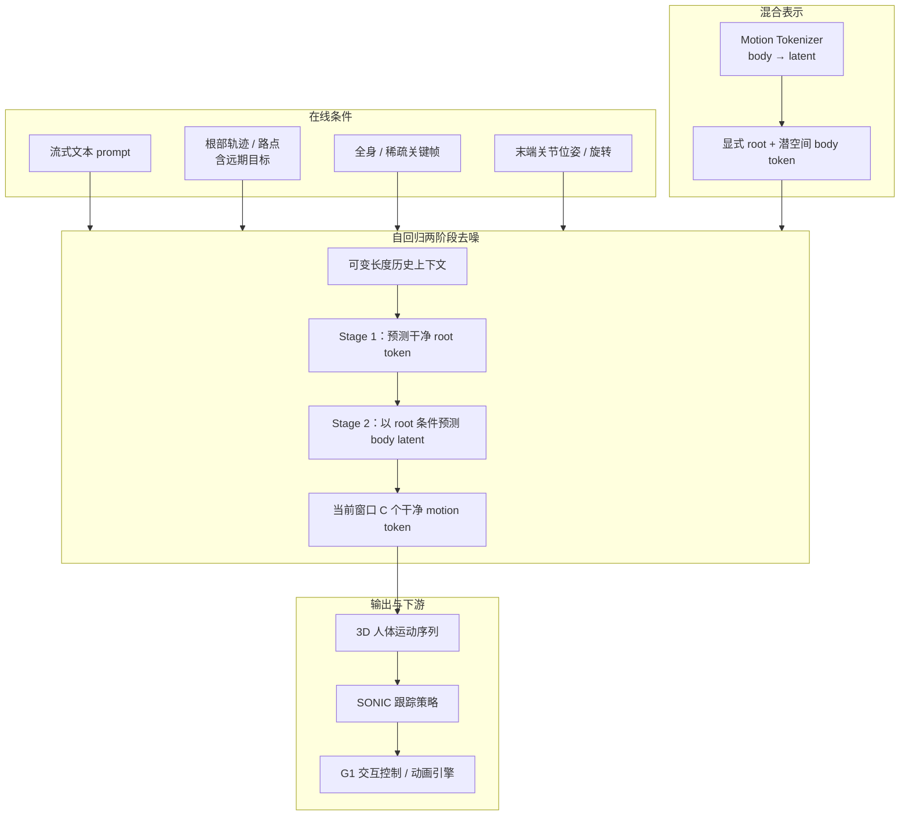

# ARDY：交互式可控 3D 人体运动生成

**ARDY**（*Autoregressive Diffusion with Hybrid Representation for Interactive Human Motion Generation*，ACM TOG · **SIGGRAPH 2026**）是 NVIDIA Research 与 ETH Zürich 提出的 **流式、实时** 人体运动生成框架：在 **交互速度** 下同时支持 **在线文本提示** 与 **灵活长时域运动学约束**——根部路径/路点、全身关键帧、稀疏关节位置/旋转及其任意组合。

## 英文缩写速查

| 缩写 | 英文全称 | 简要说明 |
|------|----------|----------|
| ARDY | Autoregressive Diffusion with Hybrid Representation | 本文方法：混合表示 + 自回归扩散去噪 |
| TOG | ACM Transactions on Graphics | 发表期刊；SIGGRAPH 论文常收录于此 |
| G1 | Unitree G1 Humanoid | 演示用人形平台（ARDY + SONIC 闭环） |
| MoCap | Motion Capture | 大规模光学动捕，训练数据主要来源 |
| RL | Reinforcement Learning | 生成轨迹常作为物理跟踪/策略训练的参考上游 |
| WBC | Whole-Body Control | 全身控制；跟踪策略将运动学参考转为力矩指令 |

## 为什么重要

- **填平「离线可控」与「在线实时」鸿沟**：[Kimodo](./kimodo.md) 等离线扩散可在文本与运动学约束下做高质量导演式编辑，但推理延迟阻碍交互；既有在线方法虽快，却常牺牲约束精度、复杂语义或 **长时域目标**（受限于短上下文）。ARDY 把 **高保真 + 强约束 + 流式 prompt** 推到 **交互帧率**。
- **长时域约束原生支持**：约束可在时间/关节上稀疏，且可指定在 **当前生成窗口之外** 的远期路点/关键帧，适合游戏角色导航、仿真与遥操作式编辑。
- **人形栈闭环示范**：项目页演示 **ARDY 实时生成 + [SONIC](../methods/sonic-motion-tracking.md) 物理跟踪** → [Unitree G1](./unitree-g1.md)，与 Kimodo→SONIC 离线管线形成 **同生态、不同延迟档位** 的对照。

## 流程总览

## 核心结构 / 机制

### 1）混合运动表示（Hybrid Representation）

- **显式 root**：patch 化全局根部运动，便于场景空间路径/路点等 **可解释轨迹控制**。
- **潜空间 body**：patch 化身体运动经编码器压缩为 **低维 latent embedding**，降低生成难度并提升效率。
- **Motion Tokenizer** 负责编解码上述 hybrid token，在重建保真与生成效率间折中。

### 2）自回归两阶段 Transformer 去噪器

- **流式生成**：在 **可变长度历史上下文** 下，于当前窗口自回归预测 **C 个干净 motion token**（扩散去噪框架）。
- **交错两阶段**：**先 root、后 body**——Stage 1 预测干净全局 root，Stage 2 以 root 为条件预测 body latent，再拼成完整 hybrid 预测。
- **设计动机**：分解 root/body 有助于在满足 **在线文本** 与 **多样空间控制** 的同时维持运动保真（项目页强调对脚滑/漂浮类伪影的抑制与 Kimodo 一脉相承）。

### 3）灵活运动学约束

| 约束类型 | 能力要点 |
|----------|----------|
| 根部 | 稠密轨迹、稀疏路点、**超出当前窗口** 的远期目标 |
| 全身 | 全身关键帧、in-betweening 式补全 |
| 末端 | 关节位置、位置+朝向；可链式组合 |
| 文本 | 单提示与 **prompt streaming**（边输入边生成） |

约束以 **mask 化** 形式注入去噪器，可在时间与关节维度上稀疏；训练时从真值姿态采样约束，与文本标签一并条件化。

### 4）训练与评测（归纳）

- 在 **大规模动捕** 上训练，直接学习 **在线 prompting + 长时域目标** 的可控生成。
- 项目页报告强 **运动质量** 与 **约束跟随**；提供交互 Demo（动态文本、关键帧、路径跟随、实时 locomotion：鼠标路点 + 键盘速度）。

## 工程实践（速览）

- **交互 Demo**：项目页提供在线演示（SIGGRAPH 2026 展示）；适合作为「文本/约束 → 实时骨架」的上游原型。
- **机器人路径**：人体运动生成 → [SONIC](../methods/sonic-motion-tracking.md) 跟踪 → G1；与 [ProtoMotions](./protomotions.md) / 仿真栈衔接思路同 Kimodo 生态。
- **选型提示**：要 **导演式离线高质量 + Benchmark** → [Kimodo](./kimodo.md)；要 **游戏/仿真/遥操作式实时编辑 + 长时域路点** → ARDY；要 **极低延迟模块化 API** → [MotionBricks](../methods/motionbricks.md)。

## 常见误区或局限

- **ARDY ≠ Kimodo 升级版**：二者共享 NVIDIA 人形运动栈与约束叙事，但 ARDY 押 **自回归流式 + 交互延迟**，Kimodo 押 **离线 scaling + 多骨架 Benchmark**；质量–速度–可控三角上各有取舍。
- **运动学输出 ≠ 物理可行**：与所有生成式人体运动一样，真机仍需 SONIC 类跟踪/WBC；勿把窗口 token 直接当真机力矩。
- **与 GEM/GENMO 分工不同**：[GENMO](../methods/genmo.md) 主攻 **视频→SMPL 估计/多模态统一**；ARDY 主攻 **交互式文本+约束合成**。

## 关联页面

- [Kimodo](./kimodo.md) — 离线高质量两阶段运动学扩散姊妹
- [Diffusion-based Motion Generation](../methods/diffusion-motion-generation.md) — 扩散/自回归生成范式总览
- [SONIC](../methods/sonic-motion-tracking.md) — ARDY→G1 物理跟踪下游
- [MotionBricks](../methods/motionbricks.md) — 同生态实时潜空间生成
- [HY-Motion vs GENMO vs Kimodo](../comparisons/hy-motion-vs-genmo-vs-kimodo.md) — 规模化离线生成三线对比（ARDY 补交互档）
- [RigMo](./rigmo.md) — 无标注 mesh 联合学 rig+motion（结构发现档对照）
- [Generative Motion Rig（Disney）](./generative-motion-rig.md) — DCC generative keyframing（制片工作流对照）
- [Unitree G1](./unitree-g1.md) — 演示人形平台

## 参考来源

- [sources/papers/ardy_siggraph_2026.md](../../sources/papers/ardy_siggraph_2026.md)
- [sources/sites/ardy-project.md](../../sources/sites/ardy-project.md)

## 推荐继续阅读

- [ARDY 项目页](https://research.nvidia.com/labs/sil/projects/ardy/) — 论文 PDF、代码/模型入口与交互 Demo
- [Kimodo 项目页](https://research.nvidia.com/labs/sil/projects/kimodo/) — 离线可控扩散对照
- [GEAR-SONIC Demo](https://nvlabs.github.io/GEAR-SONIC/demo.html) — 生成→跟踪闭环生态
- DOI：[10.1145/3811284](https://doi.org/10.1145/3811284)
