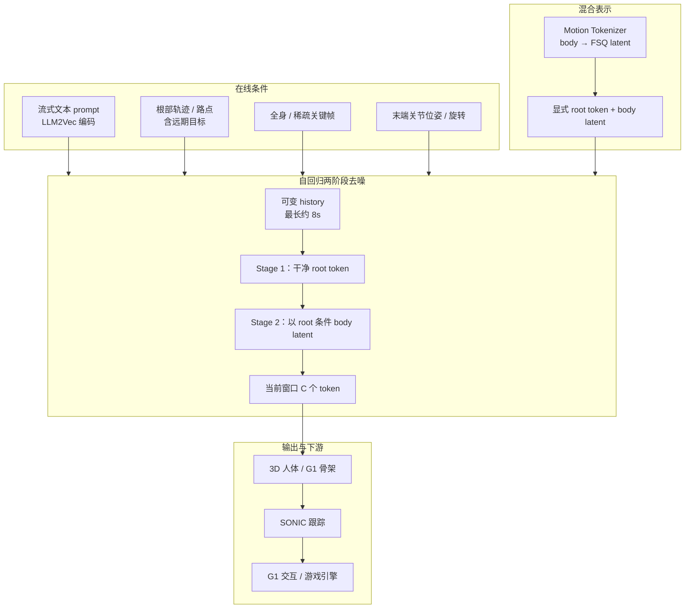
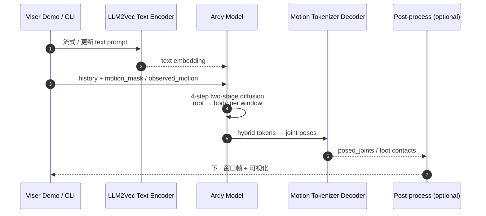

# ARDY：交互式可控 3D 人体运动生成

**ARDY**（*Autoregressive Diffusion with Hybrid Representation for Interactive Human Motion Generation*，ACM TOG · **SIGGRAPH 2026**，[arXiv:2607.08741](https://arxiv.org/abs/2607.08741)）是 NVIDIA Research 与 ETH Zürich 提出的 **流式、实时** 人体运动生成框架：在 **交互速度** 下同时支持 **在线文本提示** 与 **灵活长时域运动学约束**——根部路径/路点、全身关键帧、稀疏关节位置/旋转及其任意组合。官方实现 **[nv-tlabs/ardy](https://github.com/nv-tlabs/ardy)**（Apache-2.0）与 [Hugging Face 模型集合](https://huggingface.co/collections/nvidia/ardy) 已发布。

## 一句话定义

**用「显式 root + 潜空间 body」的自回归两阶段扩散，在 ~33 ms 内流式生成可跟文本、跟远期路点、跟关键帧的 3D 人体运动——把 Kimodo 级约束搬到在线帧率。**

## 英文缩写速查

| 缩写 | 英文全称 | 简要说明 |
|------|----------|----------|
| ARDY | Autoregressive Diffusion with Hybrid Representation | 本文方法：混合表示 + 自回归扩散去噪 |
| TOG | ACM Transactions on Graphics | 发表期刊；SIGGRAPH 论文常收录于此 |
| FSQ | Finite Scalar Quantization | Motion Tokenizer 默认量化（如 64-128） |
| G1 | Unitree G1 Humanoid | HF 上 ARDY-G1-* 权重与 SONIC 演示平台 |
| HIL | Hardware-in-the-Loop | 生成运动经跟踪策略上真机的闭环语境 |
| MoCap | Motion Capture | Bones Rigplay ~700h 主训练数据 |

## 为什么重要

- **填平「离线可控」与「在线实时」鸿沟**：[Kimodo](./kimodo.md) 等离线扩散可在文本与运动学约束下做高质量导演式编辑，但 **推理延迟阻碍交互**；MotionStreamer、DiP 等在线方法虽快，却常 **缺关节旋转约束**、**短 history/future 窗口** 或依赖 test-time optimization / RL control（论文 Table 1）。ARDY 在 **同一框架** 内同时做到 **实时 + 在线文本 + 长时域稀疏约束**。
- **工程可复现：** 不仅是项目页 Demo — **GitHub + HF checkpoint + `run_demo.py` / `generate.py`**；4-step 模型在 RTX 4090 上 **平均 ~33 ms/步**（G=40 @ 20fps）。
- **人形栈闭环：** **ARDY 规划 + [SONIC](../methods/sonic-motion-tracking.md) 跟踪** → [Unitree G1](./unitree-g1.md)，与 Kimodo→SONIC **离线管线** 形成 **同生态、不同延迟档位**。

## 方法栈与流程

### 架构总览

```mermaid
flowchart TB
  subgraph cond [在线条件]
    text["流式文本 prompt<br/>LLM2Vec 编码"]
    rootC["根部轨迹 / 路点<br/>含远期目标"]
    kf["全身 / 稀疏关键帧"]
    ee["末端关节位姿 / 旋转"]
  end
  subgraph tok [混合表示]
    enc["Motion Tokenizer<br/>body → FSQ latent"]
    hybrid["显式 root token + body latent"]
    enc --> hybrid
  end
  subgraph denoise [自回归两阶段去噪]
    hist["可变 history<br/>最长约 8s"]
    rootD["Stage 1：干净 root token"]
    bodyD["Stage 2：以 root 条件 body latent"]
    win["当前窗口 C 个 token"]
    hist --> rootD --> bodyD --> win
  end
  subgraph out [输出与下游]
    motion["3D 人体 / G1 骨架"]
    sonic["SONIC 跟踪"]
    g1["G1 交互 / 游戏引擎"]
    win --> motion --> sonic --> g1
  end
  text --> denoise
  rootC --> denoise
  kf --> denoise
  ee --> denoise
  hybrid --> denoise
```

### 核心机制（归纳）

| 模块 | 要点 |
|------|------|
| **Hybrid representation** | Root 显式可覆写 → 路点/轨迹；Body 进 **低维 latent** → 高效 AR 扩散 |
| **Motion Tokenizer** | Patch 化 body；默认 **FSQ 64-128**；patch size 影响细节 vs 稳定性 |
| **Two-stage AR denoiser** | 在 **denoise 循环内** 先 root 后 body；约束以 **masked motion** 注入 |
| **长时域约束** | Future context **~10s**；约束可落在 **当前 generation window 外** |
| **训练条件** | 大规模动捕 **文本 + 从 GT 采样约束**；无需额外 RL/optimization 控制模块 |

### 源码运行时序图

对齐 [nv-tlabs/ardy](https://github.com/nv-tlabs/ardy) 交互 Demo 的 `autoregressive_step` 路径：

```mermaid
sequenceDiagram
  autonumber
  participant UI as Viser Demo / CLI
  participant TE as LLM2Vec Text Encoder
  participant AR as Ardy Model
  participant Dec as Motion Tokenizer Decoder
  participant PP as Post-process (optional)

  UI->>TE: 流式 / 更新 text prompt
  TE-->>AR: text embedding
  UI->>AR: history + motion_mask / observed_motion
  AR->>AR: 4-step two-stage diffusion<br/>root → body per window
  AR->>Dec: hybrid tokens → joint poses
  Dec-->>PP: posed_joints / foot contacts
  PP-->>UI: 下一窗口帧 + 可视化
```

复现：`pip install -e ".[all]"` → `hf auth login`（Llama-3-8B-Instruct）→ `python scripts/run_demo.py`（`:2333`）或 `python scripts/generate.py "..."`.

## 实验与评测

| 基准 / 设置 | 结论要点 |
|-------------|----------|
| **Bones Rigplay 消融**（~700h，TMR evaluator，~5k 检索池） | 两阶段 hybrid **优于** 单阶段/纯 latent；**8-frame horizon** 训练更快、prompt 切换更灵敏；**40-frame** FID/R-prec 更高 |
| **扩散步数** | 4-step **~33 ms** 已具强约束跟随；10-step ~63 ms 略增精度 |
| **HumanML3D**（Table 4–5，40-frame · 10-step） | 相对 MaskControl / Kimodo（离线）与 DiP / DartControl / MotionStreamer（在线）：**更低 latency** 且 **约束误差 competitive**；自回归设定下 **FID / R-prec / joint error** 达 SOTA 档 |
| **交互 Demo**（RTX 4090） | 动态文本、关键帧、路径、键鼠 locomotion；**分钟级** 连续流式 |

**读法：** Rigplay 消融验证 **架构选择**；HumanML3D 在 **公开小数据** 上隔离 proprietary 数据优势，仍显示 **在线+约束** 组合罕见。

## 与其他工作对比

论文 Table 1 能力矩阵（简化）：

| 方法 | 实时 | 在线文本 | root 轨迹 | 关节位置 | 关节旋转 | 无 optimization | 无 RL control | history | future |
|------|:----:|:--------:|:---------:|:--------:|:--------:|:---------------:|:-------------:|:-------:|:------:|
| Kimodo | ✗ | ✗ | ✓ | ✓ | ✓ | ✓ | ✓ | N/A | 10s |
| MotionStreamer | ✓ | ✓ | ✗ | ✗ | ✗ | — | — | 10s | 10s |
| DiP | ✓ | ✓ | ✓ | ✓ | ✗ | ✓ | ✓ | 1s | 2s |
| DartControl | ✓ | ✓ | ✓ | ✓ | ✗ | ✗ | ✗ | 0.07s | 0.27s |
| **ARDY** | ✓ | ✓ | ✓ | ✓ | ✓ | ✓ | ✓ | **8s** | **10s** |

**选型：** 要 **离线导演 + Benchmark** → [Kimodo](./kimodo.md)；要 **游戏/遥操作式实时 + 远期路点 + 关节旋转** → ARDY；要 **极低延迟 in-between API** → [MotionBricks](../methods/motionbricks.md)。

## 结论

ARDY 把 **离线扩散的可控性** 与 **自回归在线推理** 合成到同一 SIGGRAPH 2026 框架：**hybrid root/body 表示 + 交错两阶段 denoiser** 是同时满足文本、多样运动学约束与 **~33 ms** 延迟的关键；Bones Rigplay 大规模消融与 HumanML3D 公开对比共同支撑其 **质量–控制–延迟** 权衡。

- **优先 ARDY 当：** 需要 **浏览器/键鼠交互 Demo**、**prompt streaming**、**10s 级远期 waypoints** 或 **G1 骨架实时生成** 再送 SONIC。
- **仍用 Kimodo 当：** 需要 **离线时间线编辑**、**SOMA/SMPL-X 多骨架 Benchmark** 或 **17GB 级单次高质量采样** 而非流式 replan。
- **真机必读：** 输出为 **运动学参考**；上 G1 仍经 **SONIC / WBC**；Llama 文本编码器与 **~14GB VRAM**（默认 bfloat16 CUDA）是部署门槛。
- **许可分层：** 代码 Apache-2.0；权重 **NVIDIA Open Model**；文本 encoder 另需 Meta Llama 许可。

## 工程实践

| 步骤 | 做法 |
|------|------|
| **快速体验** | `git clone` → `pip install -e ".[all]"` → `python scripts/run_demo.py` → 浏览器 `:2333` |
| **批量生成** | `python scripts/generate.py "A person walks in a circle." --model g1 --duration 8` → `outputs/*.npz` |
| **模型选择** | **Horizon8** — 更快换 prompt；**Horizon40/52** — 更稳长语义；G1 权重对接 [ProtoMotions](./protomotions.md) / MuJoCo CSV |
| **约束 Demo** | 下载 [Bones SEED](https://huggingface.co/datasets/bones-studio/seed) 至 `datasets/bones-seed/`；按 `z` 采样 G1 约束 |
| **加速** | Demo 可选 **TensorRT** / `torch.compile`；`run_text_encoder_server.py` 避免重复加载 Llama |
| **机器人链** | ARDY-G1 实时输出 → SONIC 跟踪 → G1；与 [Kimodo G1 分支](./kimodo.md) 离线 NPZ 路径对照 |

开源结论（2026-09-06）：**代码与权重均已发布**；SOMA-skeleton ARDY 标注 **coming soon**。

## 局限与风险

- **ARDY ≠ Kimodo 升级版：** 共享 NVIDIA 人形栈，但优化目标分别是 **交互延迟 vs 离线 scaling**。
- **运动学 ≠ 物理可行：** 真机仍需 SONIC 类跟踪；可选 post-process 减脚滑但增延迟。
- **与 GEM/GENMO 分工不同**：[GENMO](../methods/genmo.md) 主攻 **视频→SMPL**；ARDY 主攻 **交互式文本+约束合成**。
- **HumanML3D 指标：** 作者保留 SMPL 旋转的处理与原版 evaluator 不完全一致，跨论文比 FID 需读脚注。

## 关联页面

- [Kimodo](./kimodo.md) — 离线高质量两阶段运动学扩散姊妹
- [Diffusion-based Motion Generation](../methods/diffusion-motion-generation.md)
- [SONIC](../methods/sonic-motion-tracking.md) — ARDY→G1 物理跟踪下游
- [MotionBricks](../methods/motionbricks.md) — 同生态实时潜空间生成
- [HY-Motion vs GENMO vs Kimodo](../comparisons/hy-motion-vs-genmo-vs-kimodo.md)
- [Unitree G1](./unitree-g1.md)
- [NVIDIA Physical AI 工具链技术地图](../overview/nvidia-physical-ai-toolchain-technology-map.md)

## 参考来源

- [ARDY 论文摘录（SIGGRAPH 2026 / arXiv）](../../sources/papers/ardy_siggraph_2026.md)
- [ARDY 项目页摘录](../../sources/sites/ardy-project.md)
- [nv-tlabs/ardy 仓库归档](../../sources/repos/nv_tlabs_ardy.md)

## 推荐继续阅读

- [ARDY 项目页](https://research.nvidia.com/labs/sil/projects/ardy/) — PDF、Demo、方法图
- [论文 PDF](https://research.nvidia.com/labs/sil/projects/ardy/assets/ardy_paper.pdf)
- [GitHub — nv-tlabs/ardy](https://github.com/nv-tlabs/ardy)
- [Hugging Face — nvidia/ardy 集合](https://huggingface.co/collections/nvidia/ardy)
- [Kimodo 项目页](https://research.nvidia.com/labs/sil/projects/kimodo/) — 离线对照
- DOI：[10.1145/3811284](https://doi.org/10.1145/3811284)
