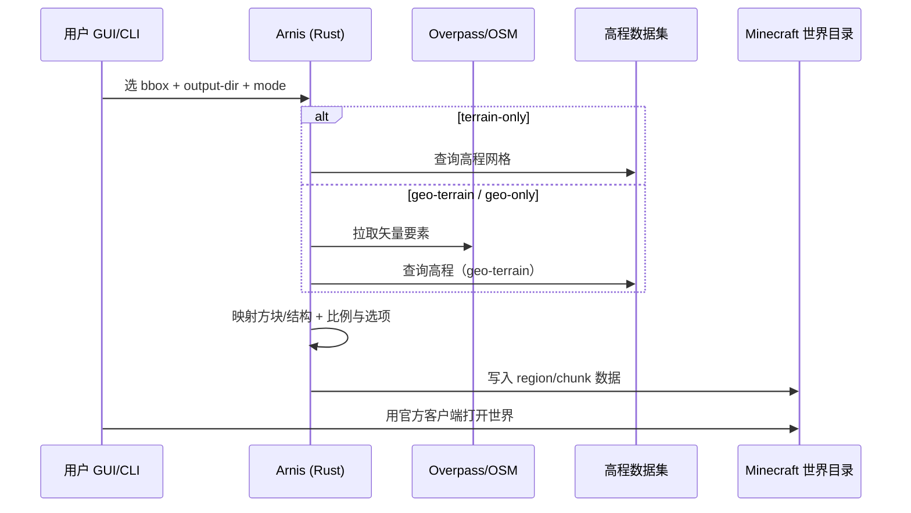

# Arnis

**Arnis**（[`louis-e/arnis`](https://github.com/louis-e/arnis)，Apache-2.0，~17.7k★）把 **真实世界地理** 编译进 **Minecraft 系体素世界**：从 **OpenStreetMap** 拉取道路与建筑矢量，结合 **公开高程数据** 生成地形与结构，输出到 **Java Edition（1.17+）**、**Bedrock** 或 **Luanti（Minetest）** 存档。官方站点：[arnismc.com](https://arnismc.com/)。

## 一句话定义

**测绘级 open data → 可游玩的方块世界**——用 GUI 地图框选或 CLI `--bbox`，把家乡、城市或自然地貌一键写入已有 Minecraft 世界目录。

## 英文缩写速查

| 缩写 | 英文全称 | 简要说明 |
|------|----------|----------|
| OSM | OpenStreetMap | 道路、建筑等矢量数据源 |
| DEM | Digital Elevation Model | 数字高程，塑造真实地形起伏 |
| GUI | Graphical User Interface | Tauri 桌面端地图选区界面 |
| CLI | Command Line Interface | `cargo run --release` + `--bbox` 批处理 |
| API | Application Programming Interface | Overpass 等 OSM 查询接口 |
| LGPL | GNU Lesser General Public License | Luanti 方块映射文件含 MC2MT 衍生段 |

## 为什么重要

- **真实地理 → 游戏世界的工程化样板：** 与 [drive-game](./drive-game.md)（OSM+DEM **纽北赛道** Web 驾驶）同属 **开放测绘数据落地 3D** 路线，但 Arnis 面向 **体素建造/探索** 而非轮胎物理。
- **Minecraft 生态的「Real2World」对照：** 站内 [InfiniteDiffusion / Terrain Diffusion](./paper-infinite-diffusion-terrain-diffusion.md) 提供 **学习式无限地形 mod**；Arnis 提供 **一次性 faithful 复刻**——二者可组合（先 Arnis 导入真实街区，再在周边接无限地形），但 **都不含机器人接触动力学**。
- **开放世界 agent 与教育场景：** README 列举学术/媒体引用（含 AWS 高程规模博客、灾害教育 Floodcraft）；对 **地理锚定 RL/IL 沙盒**（如 Dreamer 系 Minecraft agent）是 **低成本关卡源**，而非训练框架本身（对照 [Open Dreamer](./open-dreamer.md)）。
- **开源边界清晰：** 核心 **Apache-2.0 已开源**；[MapSmith](https://arnismc.com/mapsmith/) 为官方 **浏览器/移动端** 增值服务，源码不在本仓。

## 核心信息

| 项 | 内容 |
|----|------|
| **作者** | Louis Erbkamm（louis-e） |
| **许可** | Apache-2.0（部分 Luanti 映射 LGPL-2.1+） |
| **实现** | Rust + Tauri GUI；模块化「抓取 → 处理 → 写世界」 |
| **平台** | Windows / macOS / Linux 发行版 + `cargo` 自编译 |
| **输出格式** | Minecraft Java 1.17+、Bedrock、Luanti 世界目录 |

## 生成模式

| `--mode` | 行为 |
|----------|------|
| `geo-terrain`（默认） | OSM 建筑/道路 + 真实高程 |
| `geo-only` | OSM 对象，平地 |
| `terrain-only` | 仅高程；跳过 OSM/Overture 查询 |

## 源码运行时序图

## 工程实践

| 项 | 说明 |
|----|------|
| **GUI** | Releases 安装包 → 地图矩形工具 → 选择 `.minecraft/saves/...` → Start Generation |
| **CLI** | `cargo run --release --no-default-features -- --output-dir=... --bbox="min_lat,min_lng,max_lat,max_lng"` |
| **Nix** | `nix run github:louis-e/arnis -- ...` |
| **安全** | **仅从** [arnismc.com](https://arnismc.com/) 或 GitHub 下载（README 警告第三方站） |
| **文档** | [GitHub Wiki](https://github.com/louis-e/arnis/wiki/) |

## 实验与评测

仓库为 **内容生成工具**，无统一 ML benchmark；质量以 **地理忠实度、生成速度与可玩性** 为社区评价维度（star 规模与媒体引用为主信号）。

## 局限与风险

- **非物理仿真器** — 方块碰撞与真实机器人动力学无关；接入腿式/导航研究须另建 sim 或做碰撞简化。
- **数据覆盖与许可** — OSM 完整度因地区而异；高程分辨率影响陡坡与建筑贴合。
- **一次性生成** — 不同于 [程序化地形](../concepts/procedural-terrain-generation.md) 的每 reset 随机；扩区需重新跑生成或接 mod。
- **Luanti 映射** — 含第三方 LGPL 片段，分发时注意许可证叠加。

## 关联页面

- [Procedural Terrain Generation](../concepts/procedural-terrain-generation.md) — 仿真侧程序化地形 vs 真实 GIS 导入
- [drive-game](./drive-game.md) — 同为 OSM+DEM 真实地理管线（赛车域）
- [natural-disasters（ABYSSAL）](./natural-disasters-abyssal.md) — 浏览器程序化环境场（海洋/天气）
- [InfiniteDiffusion / Terrain Diffusion](./paper-infinite-diffusion-terrain-diffusion.md) — 学习式无限 Minecraft 地形 mod
- [Open Dreamer](./open-dreamer.md) — Minecraft 域世界模型/agent 沙盒
- [Generative World Models](../methods/generative-world-models.md) — 户外几何与游戏域 WM 索引

## 参考来源

- [Arnis 仓库摘录](../../sources/repos/arnis.md)
- [arnismc.com 官方站点摘录](../../sources/sites/arnismc.md)
- [GitHub README](https://github.com/louis-e/arnis/blob/main/README.md)

## 推荐继续阅读

- [Arnis 官方下载](https://arnismc.com/)
- [AWS：Arnis 大规模高程数据博客](https://aws.amazon.com/de/blogs/publicsector/building-realistic-minecraft-worlds-with-open-data-on-aws-how-arnis-uses-elevation-datasets-at-scale/)
- [Hackaday：Bringing OpenStreetMap Data into Minecraft](https://hackaday.com/2024/12/30/bringing-openstreetmap-data-into-minecraft/)
