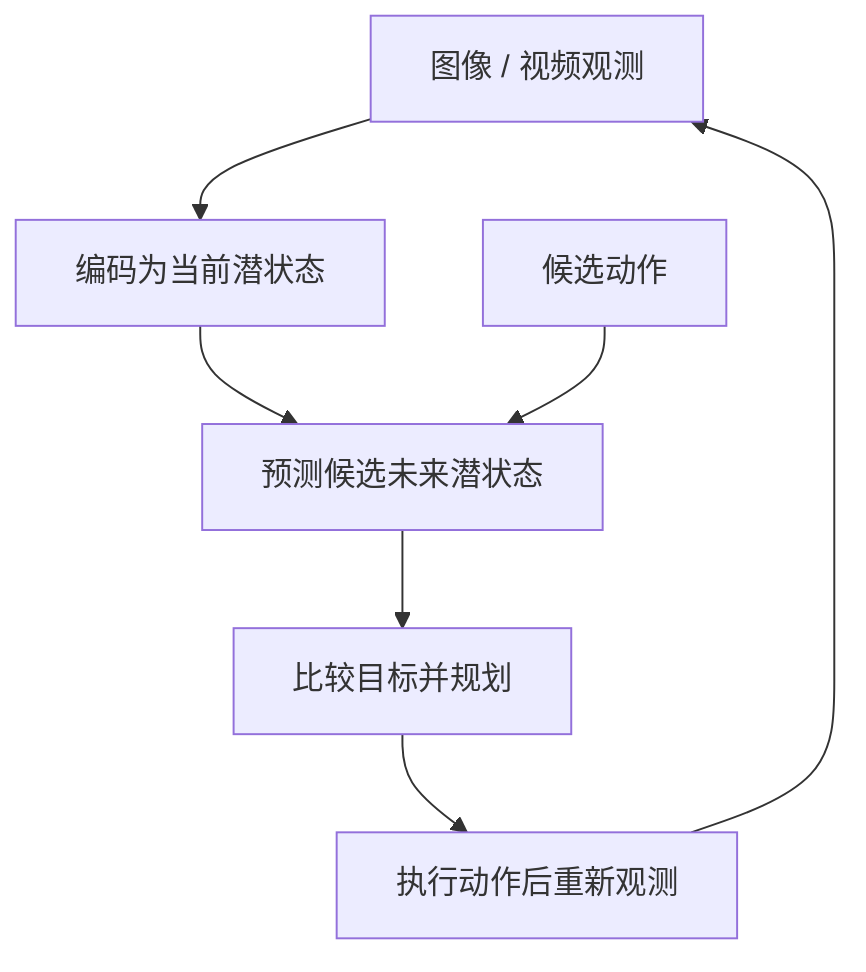

# JEPA, from language models to world models（VideoDB）

VideoDB Labs 于 2026-07-07 发布的技术长文，从 next-token prediction 与 latent prediction 的差异讨论 JEPA 如何进入 VLM、VLA 和具身智能议题。本文是对长文的结构化阅读入口；实证数字和方法细节以被引用论文为准。

## 一句话结论

JEPA 的核心区别在于训练模型预测目标表征，而不一定重建目标像素或生成目标文字。要成为可用于机器人规划的 world model，还需要 latent state 保留任务相关结构、预测器接收动作条件，并通过规划器闭环验证后果预测。

## 英文缩写速查

| 缩写 | 英文全称 | 本页含义 |
|------|----------|----------|
| JEPA | Joint-Embedding Predictive Architecture | 在联合 embedding 空间预测目标表征的一类架构思路 |
| VLM | Vision-Language Model | 视觉与文本联合处理模型 |
| VLA | Vision-Language-Action | 将视觉、语言与动作连接的模型或策略 |
| MPC | Model Predictive Control | 反复预测候选动作、执行一段并重新规划 |
| SIGReg | Sketched Isotropic Gaussian Regularizer | LeJEPA 用于约束 embedding 分布的正则项 |

## 文章提出的路线

| 层次 | 需要解决的问题 | 站内代表工作 |
|------|----------------|--------------|
| 潜变量预测 | 如何让 embedding 带有可预测结构并避免坍塌？ | [LeJEPA](./paper-lejepa.md)、[Semantic Tube Prediction](./paper-semantic-tube-prediction.md) |
| 视觉/语言目标 | 是否能先预测文本语义 embedding，再按需解码？ | [VL-JEPA](./paper-vl-jepa.md)；视频空间表征见 [V-JEPA 2.1](./paper-sa-2603-14482-v-jepa-2-1-unlocking-dense-features-in-video-sel.md) |
| 动作条件动力学 | 执行不同动作时，未来状态如何变化？ | [LeWorldModel](./paper-lewm.md) |
| 分层规划 | 高层 latent subgoal 怎样交给短时域动作规划器？ | [HWM](./paper-hwm-latent-world-model-planning.md) |

这里的“路线”是文章把多项工作串成的概念脉络，并非同一研究团队提出的统一技术栈。Semantic Tube Prediction 用 JEPA 式轨迹正则研究语言建模；VL-JEPA 预测视觉条件下的文本表征；动作条件 world model 和 planner 则是其他论文中的具体实现。

这张图表达机器人世界模型的闭环抽象。VL-JEPA 与 STP 的原论文并没有实现完整的机器人动作控制回路。

## 重点论文与结果边界

| 工作 | 核心贡献 | 阅读边界 |
|------|----------|----------|
| [Semantic Tube Prediction](./paper-semantic-tube-prediction.md) | 用语义轨迹 tube 正则语言模型隐藏状态；NL-RX-SYNTH 报告约 16 倍数据效率 | 语言模型实验，不是机器人控制证据 |
| [When Does LeJEPA Learn a World Model?](./paper-when-does-lejepa-learn-world-model.md) | 在特定高斯潜变量和状态转移假设下研究线性可辨识性 | 理论假设不可省略，不是对任意 JEPA 的保证 |
| [LeJEPA](./paper-lejepa.md) | 用 SIGReg 约束 latent embedding，减少表示坍塌的启发式依赖 | 重点是表征学习配方，不等同于动作规划 |
| [V-JEPA 2.1](./paper-sa-2603-14482-v-jepa-2-1-unlocking-dense-features-in-video-sel.md) | 视频自监督学习的 dense features | 表征能力本身不能证明动作条件后果预测 |
| [LeWorldModel](./paper-lewm.md) | 从像素端到端训练 latent world model，含未来 latent 预测 | 检查具体 action input、数据覆盖与任务设置 |
| [HWM](./paper-hwm-latent-world-model-planning.md) | 多时间尺度 world model 与层级 MPC 共享 latent subgoal | Franka 70% 对比 0% 是论文特定设定；不外推到人形机器人 |
| [From Tokens to Thoughts](./paper-from-tokens-to-thoughts.md) | 研究语言模型与人类概念表征的压缩—语义保真权衡 | 背景性认知/表示研究，不是 JEPA 或机器人模型 |
| [VL-JEPA](./paper-vl-jepa.md) | 根据视觉与 query 预测目标文本 embedding，支持选择性解码 | 是 vision-language model，不是动作生成 VLA |

## 机器人研发中的检查清单

1. **观测状态：** latent 是否保留物体位置、姿态、接触和可达性等本任务变量？
2. **动作条件：** 状态转移模型是否以可执行动作作为输入，并在数据中见过相关动作？
3. **多步误差：** 开环 rollout 多长开始偏离？采用短 horizon 重规划能否稳定改善？
4. **潜空间几何：** latent 距离是否对应可控状态变化，是否存在 collapse 或 off-manifold 规划？
5. **闭环证据：** 结果是否来自真实执行，任务数量、成功判定和基线是否一致？
6. **迁移对象：** HWM 的 Franka 结果不能直接解释 Unitree G1 全身控制；本体、控制频率、状态和动作接口都不同。

## 来源性质

原文是 VideoDB Labs 的观点型技术文章，提出“从语言模型转向 world model”的架构判断，并串联多篇论文。文中对 LLM/VLA 的强判断属于作者观点；本文保留其问题框架，但不把预测当作研究共识。各论文页面分别记录原始实验、假设和限制。

## 参考来源

- [VideoDB 原文归档](../../sources/blogs/videodb_jepa_from_language_models_to_world_models_2026-07-07.md)
- 新建论文来源见上方关联工作页；LeJEPA、LeWorldModel 与 V-JEPA 2.1 复用站内已有详情页。
