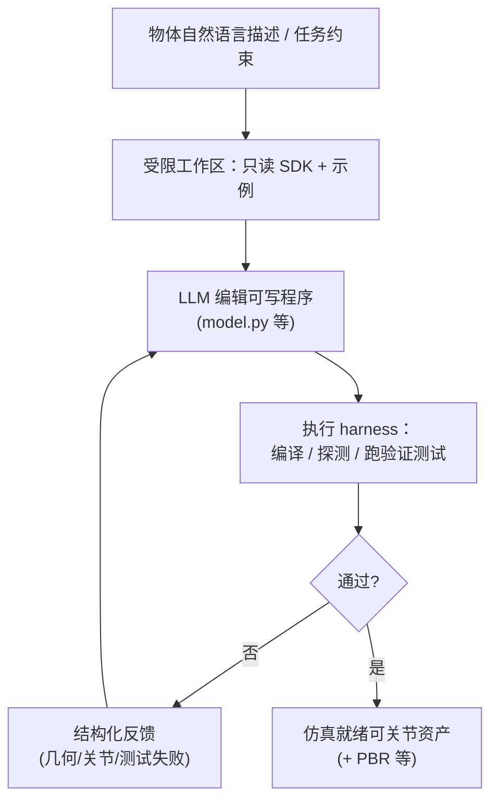

# Articraft

## 一句话定义

**Articraft** 是一套面向 **可扩展可关节 3D 资产生成** 的 **agentic** 管线：在**受限工作区**（如单一可写 `model.py`、只读 SDK 文档与小动作空间）中，由 **LLM 驱动编码代理**调用 **面向 LLM 的 SDK** 描述部件、几何组合、**关节与运动限位**及**验证测试**；**执行 harness** 编译或对中间资产做探测，把 **结构化反馈** 回传给代理以迭代，直至得到项目页所宣称的 **simulation-ready**、带 **PBR** 的可交互对象。论文预印本为 **arXiv:2605.15187**；实现与资源见 [GitHub](https://github.com/mattzh72/articraft)，概览与 Demo 见 [项目主页](https://articraft3d.github.io/)。

## 为什么重要

- **资产瓶颈**：机器人仿真与图形管线长期需要 **带关节与物理语义** 的大量对象；纯「静态网格」往往缺少一致关节与限位信息，Articraft 把问题表述为 **可执行程序 + 验证闭环**，与一次性黑盒生成形成对照。
- **与 CAD / URDF 工位的相邻性**：输出强调 **仿真就绪** 与 **程序化定义**，可与 [文字生成 CAD](../concepts/text-to-cad.md)（B-rep / STEP 取向）、[URDF-Studio](./urdf-studio.md)（机器人描述编辑）在 **「描述 → 可执行资产」** 谱系上对照阅读。
- **数据侧**：公开 **Articraft-10K**（万余级可关节资产）叙事，可作为 **操作与场景仿真** 数据扩充路线的参照样本（许可与字段定义以论文与仓库为准）。

## 核心结构（据项目页与论文条目归纳）

| 模块 | 角色 |
|------|------|
| **受限工作区** | 控制可写文件与动作空间，降低代理漂移；提供精选示例与只读 SDK 文档。 |
| **LLM 友好 SDK** | 供程序定义几何部件、装配、关节/限位与测试，而非直接操作三角网格顶点。 |
| **执行 harness** | 运行生成程序、编译或探测当前资产，返回 **验证信号** 与结构化诊断。 |
| **迭代回路** | 失败驱动修订 `model.py` 类入口，直至满足测试与资源完整性约束。 |

## 流程总览

## 常见误区或局限

- **误区**：把「能生成好看静态模型」等同于 **关节与接触在仿真中开箱可用**。实际仍依赖 **限位、惯性字段、碰撞体与坐标系** 是否与目标引擎一致（参见 [Sim2Real](../concepts/sim2real.md) 中模型一致性讨论）。
- **误区**：忽略 **许可与再分发**：Articraft-10K 与代码的商用边界须以 **仓库 LICENSE 与数据卡** 为准，不宜仅凭项目页截图推断。
- **局限**：公开材料强调 **agent + SDK + harness** 形态；与具体 **URDF/MJCF/USD** 导出字段的对应关系需在论文与代码中逐项核对。

## 关联页面

- [文字生成 CAD（Text-to-CAD）](../concepts/text-to-cad.md) — 自然语言到 **可制造/可编辑几何** 的另一条主流路线，与「程序化可关节网格资产」互补对照。
- [URDF-Studio](./urdf-studio.md) — Web 端机器人描述与导出工作流，可与「仿真就绪关节资产」下游衔接对照。
- [MuJoCo](./mujoco.md) — 常见刚体/关节仿真后端之一；项目页演示强调物理与 VR 交互叙事。
- [Sim2Real](../concepts/sim2real.md) — 资产几何与动力学一致性的总提醒。

## 推荐继续阅读

- [Articraft 项目主页](https://articraft3d.github.io/)（Demo、Articraft-10K 子集、应用集成展示）
- [arXiv:2605.15187](https://arxiv.org/abs/2605.15187)（论文 PDF 与元数据）
- [articraft 代码仓库](https://github.com/mattzh72/articraft)

## 参考来源

- [Articraft 项目主页（原始资料）](../../sources/sites/articraft3d-github-io.md)
- [mattzh72/articraft 仓库（原始资料）](../../sources/repos/mattzh72-articraft.md)
