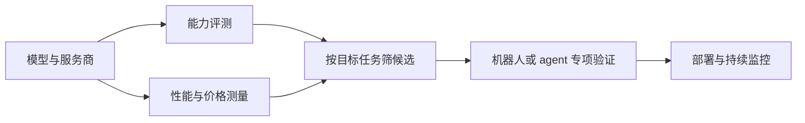

# Artificial Analysis

**Artificial Analysis** 是独立 AI 模型与推理服务评测平台，通过公开榜单、方法说明和结构化 API 汇总模型能力、定价及用户侧推理性能，帮助团队按质量、成本和响应速度选型。

## 英文缩写速查

| 缩写 | 英文全称 | 简要说明 |
|------|----------|----------|
| AA | Artificial Analysis | 本页所述的模型评测与数据平台简称 |
| API | Application Programming Interface | 通过认证请求模型、评测、价格及性能数据 |
| TTFT | Time to First Token | 服务端开始返回生成内容前的等待时间 |
| TPS | Tokens Per Second | 生成速度指标；跨服务商比较需统一 token 口径 |

## 为什么重要

- **模型选型要同时看质量与运行代价：** 同一模型经不同推理服务商托管时，价格、首 token 延迟、输出速度与可用性可能不同。把这些维度并列能缩小候选范围，也有助于确定路由策略。
- **覆盖模型生命周期的不同信号：** 能力榜单回答模型在指定任务集上的相对表现，服务测量则回答用户从某个提供方调用时的体验和成本；二者不能合并成单一“模型强弱”判断。
- **对机器人团队的价值是上游筛选：** 可以比较用于代码、研究、语言规划或视觉语言理解的模型和服务端点；具身策略和机器人任务本身仍需专门评测。站内的 [AI Agent 评测](../concepts/ai-agent-evaluation.md) 讨论 harness、task 与 grader；[具身评测基准选型闭环](../overview/hub-embodied-eval-benchmark.md) 负责从认知能力到策略与真机验证的分层评测。

## 核心结构与方法

### 数据维度

| 维度 | 典型信息 | 选型问题 |
|------|----------|----------|
| 模型身份 | 名称、创建方、发布时间、模态、上下文窗口等 | 比较的是同一模型版本吗？ |
| 能力评测 | 综合指数与单项 benchmark 分数 | 分数覆盖的能力与目标任务是否匹配？ |
| 服务性能 | 输出速度、首 token 延迟、端到端响应时间等分布 | 目标区域、负载和提示长度下是否可用？ |
| 价格 | 输入、输出和混合用量价格 | 实际请求长度与缓存策略下成本是多少？ |
| 多模态产品 | 图像、视频、语音等模型的榜单与元数据 | 评测输入、偏好数据和使用场景是否相近？ |

官网会迭代指数及所含评测。使用综合分时应记录指数名称、版本、评测集合及读取日期；如果任务对某个能力特别敏感，应同时查看组成项，而不要只按总分排序。

### 评测到部署选型的读法

这是一条选型流程，不代表 Artificial Analysis 本身提供完整的机器人验证或部署工具链。

## 工程实践

1. **先定义候选任务。** 把代码生成、长上下文检索、语言规划或视觉理解等需求拆成可观察的质量门槛。
2. **用指数筛选后回看单项。** 确认综合指数版本和组成评测；对关键能力看单项得分及其适用边界。
3. **把服务端点作为独立选项。** 对每个候选模型比较不同提供方的价格、延迟、吞吐与可用性；记录工作负载、统计窗口和请求区域。
4. **按真实调用形态估算成本。** 输入/输出比例、上下文长度、缓存命中和并发都会改变成本与响应时间；不要直接外推榜单上的单点数字。
5. **通过 API 自动化对比。** 使用稳定模型 ID，缓存响应，避免把 API key 放进客户端；遵守当前计划的请求限制与归属要求。
6. **在目标系统上做最终验收。** 对 agent 测完整 harness 和终态；对机器人测任务成功率、恢复能力、安全性、实时性及目标硬件上的端到端效果。

## 局限与风险

- **一般模型评测不等于机器人任务表现。** 语言、多模态或代码 benchmark 不能代替真实机器人策略测试，尤其无法覆盖接触动力学、执行延迟、传感器偏差和安全约束。
- **综合分会压缩能力差异。** 不同 benchmark 的权重、测量方法和版本会影响排名；应保留单项证据并结合任务分布判断。
- **服务性能依赖测量条件。** 提示长度、并发、网络、提供方实现和采样窗口都会影响结果，不能把某次测量视为固定服务 SLA。
- **平台数据不是无限制开放数据。** 官网提供需要 key 的免费 API，文档声明有请求限制及归属/使用条件；更完整数据和再分发权可能需要付费套餐。字段、额度和条款应以最新文档为准。
- **结果随时间变化。** 模型、服务商、价格、评测版本及可用性会持续更新；对外报告应注明抓取日期，不能只保留裸排名。

## 关联页面

- [AI Agent 评测](../concepts/ai-agent-evaluation.md) — task、grader 与完整 agent harness 的评测方法。
- [具身评测基准选型闭环](../overview/hub-embodied-eval-benchmark.md) — 机器人认知、世界模型、策略和真机评测的层次。
- [仿真评测基础设施](../concepts/simulation-evaluation-infrastructure.md) — 具身策略在可复现实验环境中的评估条件。

## 参考来源

- [Artificial Analysis 官方平台与数据 API 归档](../../sources/sites/artificial-analysis.md)
- [Artificial Analysis 方法说明](https://artificialanalysis.ai/methodology)
- [Artificial Analysis 数据 API](https://artificialanalysis.ai/data-api)
- [Artificial Analysis API 文档](https://artificialanalysis.ai/api-reference)

## 推荐继续阅读

- [API Reference](https://artificialanalysis.ai/api-reference) — 字段、认证、请求限制与数据归属要求。
- [Methodology](https://artificialanalysis.ai/methodology) — 指标口径及评测方法。
