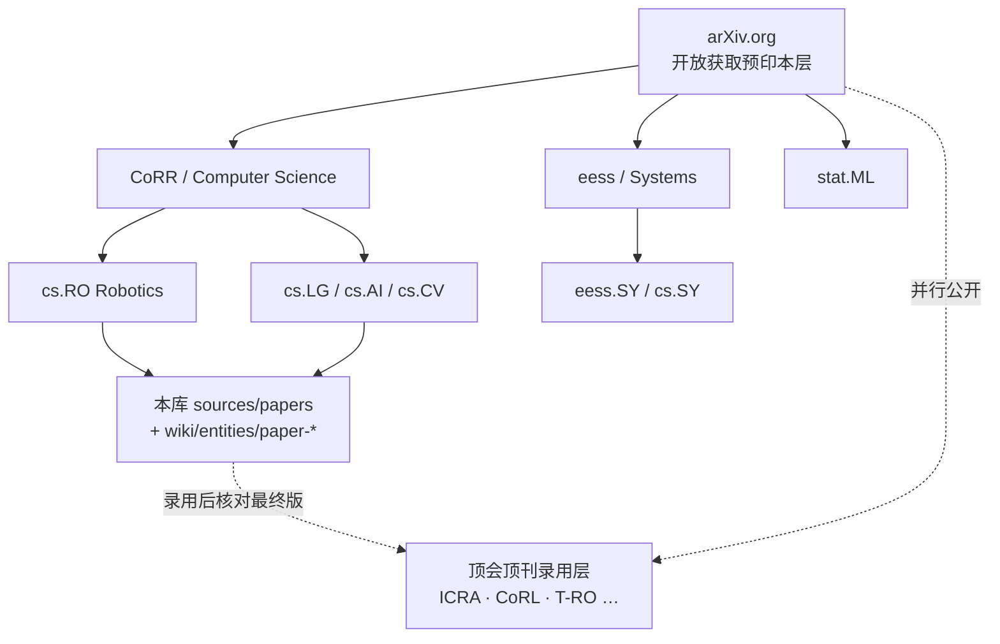

# arXiv（arXiv.org）

**[arXiv.org](https://arxiv.org/)** 是面向多学科的 **开放获取学术预印本档案与分发平台**。对机器人研究与本知识库而言，它是「先公开、可检索、可机器拉取」的 **文献基础设施**，与 ICRA / CoRL / T-RO 等 **同行评审录用渠道** 正交互补。

## 一句话定义

免费托管并分发近百万级规模的学术预印本（含 **cs.RO Robotics** 等分类）：任何人可检索与下载；投稿经主题 moderation，**内容本身不经 arXiv 同行评审**。

## 英文缩写速查

| 缩写 | 英文全称 | 简要说明 |
|------|----------|----------|
| OA | Open Access | 开放获取；读者无需付费墙即可读全文预印本 |
| CoRR | Computing Research Repository | arXiv 计算机科学档案总称，含 cs.RO / cs.LG 等 |
| cs.RO | Computer Science — Robotics | 机器人预印本主分类之一 |
| API | Application Programming Interface | 机器可读检索与元数据接口 |
| OAI | Open Archives Initiative | 批量互操作与收割协议生态 |
| PDF | Portable Document Format | 默认全文下载形态之一 |
| ID | Identifier | 如 `2607.18231`；本库 `sources/papers/*_arxiv_*` 命名依据 |
| HTML | HyperText Markup Language | 部分稿件的浏览器可读全文形态 |

## 为什么重要

- **本库默认文献层**：升格的 `wiki/entities/paper-*.md` 与 `sources/papers/` 绝大多数以 arXiv `abs` 为稳定外链；把 arXiv 建成宏观节点，便于图谱上把「单篇预印本」挂回 **平台实体**，而不是只散落成外链字符串。
- **发表时间线**：学习类工作常先挂 arXiv，再投 CoRL / ICRA / 期刊；读文献时必须分清 **预印本版本** 与 **录用最终版**（见 [顶会顶刊对比](../comparisons/robotics-research-venues.md)）。
- **可工程化检索**：公开 API 与标识符方案支撑自动化 ingest、站外索引与「按 arXiv ID 对账」——比纯手工收藏夹更适合知识库维护。

## 核心结构 / 机制

### 平台角色（官方定位）

| 能力 | 说明 |
|------|------|
| 投稿与生产 | 作者提交；站点侧编译/生产与版本管理 |
| 检索与发现 | 按学科分类浏览（Physics / Math / CS / …）与搜索 |
| 人读分发 | Web 上的 abs / pdf /（部分）html |
| 机读分发 | [公共 API](https://info.arxiv.org/help/api/index.html)、批量数据与 OAI 互操作 |
| 策展与保存 | 志愿 moderator + 长期保存；**不是** peer review |

### 机器人相关分类入口

### 组织与治理（宏观节点必记）

- **创办**：1991，Paul Ginsparg。
- **托管史**：长期与 [康奈尔大学](https://info.arxiv.org/about/) 合作；**2026** 起运行为 **独立非营利组织**（仍保留与学界成员机构、Simons Foundation International 等的资助/顾问结构）。
- **边界一句话**：arXiv **分发与归档**；**不**对论文假设、方法与结论做同行评审背书。

## 工程实践

| 场景 | 建议做法 |
|------|----------|
| 本库 ingest 单篇论文 | 先写 `sources/papers/<slug>_arxiv_<id>.md`，元数据链 `https://arxiv.org/abs/<id>`；再按 [ingest-workflow](../../schema/ingest-workflow.md) 升格 wiki |
| 引用与对账 | 固定 `vN` 或在正文写明「截至入库日最新版」；录用后补 IEEE Xplore / PMLR / proceedings 最终入口 |
| 机器拉取 | 走 [API 文档](https://info.arxiv.org/help/api/index.html) 与 Terms；致谢开放互操作；**勿**冒充官方品牌 |
| 学科筛选 | 机器人主线优先 `cs.RO`，再扩 `cs.LG` / `cs.CV` / `eess.SY`；避免只按关键词在全站噪音检索 |
| 开源判断 | arXiv **只证明有预印本**；代码/数据是否开放必须查项目页（步骤 2.5） |

最小人工核对清单：

1. abs 页标题 / 作者 / 分类是否匹配目标工作。  
2. 是否存在更新版本（`v2+`）或正式出版 DOI。  
3. 项目页是否给出 GitHub / HF（与预印本声明对照）。

## 局限与风险

- **不是同行评审录用**：把 arXiv 链接当成「已发表于顶会」是常见误读；录用渠道见 [机器人顶会顶刊对比](../comparisons/robotics-research-venues.md)。
- **质量方差大**：moderation ≠ 正确性保证；工程选型仍需读方法、复现入口与对比实验。
- **版本漂移**：同一 ID 可多次替换；下游 wiki 若不 bump `updated` / 版本号，容易引用过期结论。
- **规模文案浮动**：首页与 About 对总篇数表述可能不一致；不要把官网营销数字写进 KPI。
- **品牌与 API 合规**：第三方工具不得暗示 arXiv 官方背书；商业用途先读条款。

## 关联页面

- [机器人顶会顶刊发表渠道对比](../comparisons/robotics-research-venues.md) — peer-reviewed 会议/期刊选型；与本页预印本层对照
- [机器人学习总览](../overview/robot-learning-overview.md) — 领域入口；发表与引用小节回链本页
- [Weights & Biases](./weights-and-biases.md) — 另一类「研究基础设施」宏观实体（实验追踪，非文献档案）
- [LeRobot](./lerobot.md) — 开源机器人学习框架；权重/数据常并行出现在 Hugging Face，论文仍多挂 arXiv

## 参考来源

- [sources/sites/arxiv-org.md](../../sources/sites/arxiv-org.md) — 本页主编译来源（官网 / About / API，2026-07-27 核查）
- [sources/sites/robotics-venues-primary-refs.md](../../sources/sites/robotics-venues-primary-refs.md) — 顶会顶刊一手入口索引（与预印本层对照）
- [arXiv 官网](https://arxiv.org/)
- [About arXiv](https://info.arxiv.org/about/)

## 推荐继续阅读

- [arXiv API Access](https://info.arxiv.org/help/api/index.html) — 机器互操作与使用约定
- [How to Submit to arXiv](https://info.arxiv.org/help/submit/index.html) — 作者投稿流程
- [cs.RO 新稿列表](https://arxiv.org/list/cs.RO/recent) — 机器人分类近期预印本浏览
