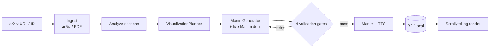
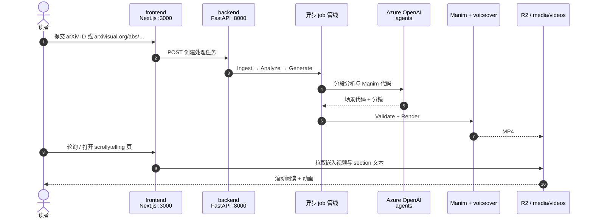

# arXivisual：arXiv 论文可视化阅读器

**arXivisual**（[arxivisual.org](https://arxivisual.org)，[GitHub](https://github.com/rajshah6/arXivisual)）由 Armaan Gupta、Nikhil Hooda、Raj Shah、Ajith Bondili 等构建：接受任意 **arXiv** 论文，经后台多智能体管线生成 **分段摘要 + KaTeX 公式 + 嵌入 Manim 短片（带语音）** 的 **scrollytelling** 页面——把 dense 预印本拆成「能读能看」的 visual story。

## 一句话定义

**在 arXiv 预印本之上加一层 AI 驱动的「3Blue1Brown 式」动画阅读体验——不是替代 PDF，而是快速建立论文结构与核心概念的视觉直觉。**

## 英文缩写速查

| 缩写 | 英文全称 | 简要说明 |
|------|----------|----------|
| arXiv | archive | 开放获取预印本档案（上游数据源） |
| TTS | Text-to-Speech | 动画旁白；默认 Azure OpenAI `gpt-4o-mini-tts` |
| LLM | Large Language Model | 分段分析、分镜与 Manim 代码生成 |
| R2 | Cloudflare R2 | 生产环境视频对象存储（S3 兼容） |
| MCP | Model Context Protocol | ManimGenerator 经 Dedalus + Context7 拉 live API 文档 |

## 为什么重要

- **补 arXiv 人读体验：** [arXiv](./arxiv.md) 提供 abs/pdf/html 分发，但不解释 **哪段该先看、哪些公式值得动画化**；arXivisual 把「读论文」变成 **滚动叙事 + 按需出现的小视频**。
- **与 Manim 生态衔接：** 动画由 agent 写 **Manim Community** 代码并过 validation gate——与 [Manim](./manim.md) 社区版同一引擎，适合组会前 10 分钟扫一篇 cs.RO / cs.LG 预印本。
- **零摩擦 URL：** `arxiv.org/abs/<id>` → `arxivisual.org/abs/<id>`（在 `arxiv` 后插入 `isual`），与本库大量 `paper-*` 节点的 arXiv 外链自然对齐。
- **可观测管线：** Langfuse 追踪每篇 token/成本——对「LLM + 渲染」类工具的可维护性有参考价值。

## 核心信息

| 项 | 内容 |
|----|------|
| **类型** | Web 应用 + 开源全栈（Next.js + FastAPI） |
| **上游** | arXiv Atom API；优先 ar5iv HTML，回退 PDF 解析 |
| **动画** | Manim Community + manim-voiceover |
| **开源** | **已开源**（GitHub 可本地运行）；**截至 2026-09-18 根目录无 LICENSE 文件** |
| **在线** | 免费；`/explore` 浏览已处理论文缓存 |

## 核心原理

### 五阶段异步管线（README / ARCHITECTURE 对齐）

| 阶段 | 进度（约） | 作用 |
|------|------------|------|
| **Ingest** | 0–30% | 拉取论文、解析 section、生成摘要 |
| **Analyze** | 30–50% | `SectionAnalyzer` 找可动画化概念 |
| **Generate** | 50–70% | `VisualizationPlanner` + `ManimGenerator` 写场景代码 |
| **Validate** | 70–75% | 语法 / 空间 / 旁白 / 试渲染 四道门，失败最多 5 轮重试 |
| **Render** | 75–100% | Manim + TTS 出 MP4，上传 R2 或本地 `media/videos/` |

### 流程总览

## 源码运行时序图

节点对齐 [`sources/repos/arxivisual.md`](../../sources/repos/arxivisual.md) 与 README Quick Start。

- **本地复现：** 需 Azure OpenAI（GPT-5 族）与 Manim 系统依赖（FFmpeg、Cairo、Pango、LaTeX）；无 `DATABASE_URL` 时用 SQLite。
- **生产：** Azure Container Apps 双容器（`arxivisual-api` / `arxivisual-web`），非静态导出。

## 工程实践

| 项 | 建议 |
|----|------|
| 快速试用 | 改 URL `arxiv`→`arxivisual` 或首页粘贴 ID |
| 本地开发 | 先起 backend `:8000`，再起 frontend `:3000` |
| 机器人论文 | cs.RO / cs.LG 预印本均可；**动画质量因文而异**，关键公式仍应回 [arXiv abs/pdf](./arxiv.md) 核对 |
| 二次开发 | 读 `docs/ARCHITECTURE.md`；`ManimGenerator` 用 Context7 MCP 拉 live Manim 文档 |
| 合规 | **无 LICENSE 文件**——fork/商用前联系作者或等待许可声明 |

## 局限与风险

- **非 arXiv 官方产品：** 与 Cornell/arXiv 无隶属关系；勿把生成摘要/动画当作 peer-reviewed 结论。
- **LLM + 渲染成本：** 长文多 section 可能慢且耗 token；Langfuse 仅服务运营方，读者不可见。
- **动画正确性：** validation gate 保证 **可运行**，不保证 **物理/数学语义** 与原文一致——工程选型与写 wiki 时仍须读 primary source。
- **许可空白：** 截至入库日 GitHub 无 LICENSE；仅适合个人学习/内部 demo，不宜默认嵌入商业产品。

## 与其他页面的关系

- [arXiv](./arxiv.md) — 上游预印本档案与本库 `paper-*` 默认外链层
- [Manim](./manim.md) — 动画引擎；arXivisual 是其 **LLM 驱动批量应用** 实例
- [机器人学习总览](../overview/robot-learning-overview.md) — 文献阅读与工作流入口

## 参考来源

- [arxivisual-org.md](../../sources/sites/arxivisual-org.md)
- [arxivisual 仓库归档](../../sources/repos/arxivisual.md)
- [arxivisual_org_tool_2026-09-18.md](../../sources/blogs/arxivisual_org_tool_2026-09-18.md)

## 推荐继续阅读

- [arXivisual 官网](https://arxivisual.org)
- [rajshah6/arXivisual](https://github.com/rajshah6/arXivisual)
- [Manim Community](https://www.manim.community/)
