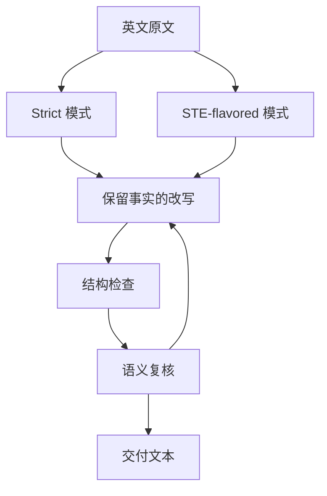

# ASD-STE100 Skill（danyuchn）

**ASD-STE100 Skill** 是一个公开的 Claude Code Skill，用于把模糊、冗长的英文改写成更清楚的受控技术英语。仓库采用 MIT 许可证，源代码、示例和规则摘要公开。

## 一句话定义

**它把 ASD-STE100 的清晰表达原则封装成可复用技能，帮助代理减少说明文字中的歧义。**

## 英文缩写速查

| 缩写 | 英文全称 | 简要说明 |
|------|----------|----------|
| ASD | Aerospace, Security and Defence Industries Association of Europe | ASD-STE100 规范发布组织 |
| STE | Simplified Technical English | Skill 借鉴的受控语言规范 |
| LLM | Large Language Model | 按技能要求分析并改写英文文本的模型 |
| MIT | MIT License | 仓库采用的开源许可证名称 |

## 流程总览

以下按本页已归纳的机制与资料绘制，表示模块或阅读路径关系。

## 核心结构与用法

仓库提供两个模式：

| 模式 | 面向内容 | 处理方式 |
|---|---|---|
| **Strict** | 程序步骤、工具描述、错误消息、代理间指令 | 强调明确主语、短句、主动表达和单句单动作 |
| **STE-flavored** | README、PR 描述、一般解释文字 | 保留句式清晰度，但不锁定固定词汇表 |

工作流程大致是：选择模式 → 读取原文语义 → 按句找出可改进之处 → 重写并保留事实和条件。仓库还提供结构规则检查脚本，可检查长句、被动语态、分号、同义词轮换等选定模式。

## 工程实践

- **先选文本风险等级**：涉及机器人安全、硬件操作或故障恢复的步骤优先用严格模式；一般知识解释用轻量模式。
- **将脚本结果当作提示**：检查结果可帮助发现句式问题，不能替代人工核对含义。
- **给改写加语义审查**：核对数值、前提、异常情况、否定和安全边界都保留。
- **与仓库规约配合**：它能改善文字形式，但不替代项目自己的来源、引用、版本控制和测试规范。

## 局限与风险

- 仓库 README 说明，确定性 linter 只检查结构模式，不比较原文和改写，不证明改写保留意义。
- 它不复刻 ASD 官方批准词典；完整规范受其发布与版权条件约束。
- Skill 面向英文文本。中文技术文档需要按中文习惯另行审校，不能直接照搬英语规则。
- 简明语言不保证信息正确，也不能让内容贫乏的段落变得有实质信息。

## 关联页面

- [ASD-STE100 概念页](../concepts/asd-ste100.md) — 受控语言标准及其边界
- [Karpathy 的文章导读](../overview/karpathy-asd-ste100-llm-outputs.md) — 原文主张和表达形式选择
- [LLM Wiki（Karpathy 模式）](../references/llm-wiki-karpathy.md) — 代理持续维护知识页的方法
- [Skills For Real Engineers](./mattpocock-skills.md) — 可组合编码代理技能的对照入口

## 参考来源

- [项目来源档案](../../sources/repos/danyuchn-asd-ste100-skill.md)
- [ASD-STE100 官方站档案](../../sources/sites/asd-ste100.md)
- [GitHub 仓库](https://github.com/danyuchn/asd-ste100-skill)

## 推荐继续阅读

- [项目 README](https://github.com/danyuchn/asd-ste100-skill#readme) — 当前安装方式、模式与功能说明
- [Writing Rules](https://github.com/danyuchn/asd-ste100-skill/blob/master/references/writing-rules.md) — 项目整理的规则摘要
- [ASD-STE100 官网](https://www.asd-ste100.org/) — 标准官方入口
