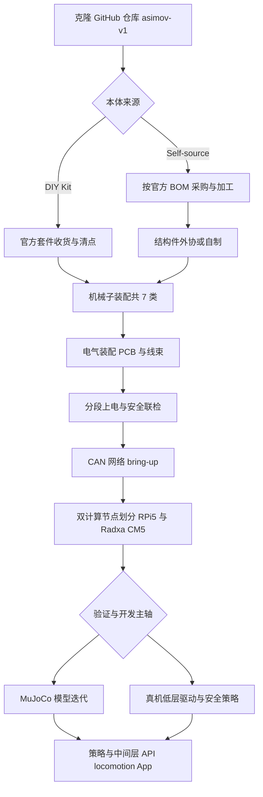

# Asimov v1（开源人形机器人仓库）

## 一句话定义

Asimov v1 由 asimovinc 在单仓内开放机械与电气 CAD、MuJoCo 模型及板载软件，配套 DIY Kit 与自采 BOM，适合作为全栈对齐与 Sim2Real 研究的硬件参考平台。

## 为什么重要

- **单一仓库全栈对齐**：官方入口 [asimovinc/asimov-v1](https://github.com/asimovinc/asimov-v1) 将机械子装配、线束、PCB 与 **MuJoCo** 模型、机载软件放在同一修订流下，减少「CAD 一版、MJCF 另一版」带来的质量与惯性参数漂移，对 **Sim2Real** 讨论更友好。
- **规格与接口公开透明**：README 给出身高约 **1.2 m**、质量约 **35 kg**、**25 个主动自由度 + 2 个被动自由度**、多路 **CAN** 与 **双板计算**（媒体/网络 vs 运动控制）等边界条件，便于与控制、估计、通信专题页交叉引用。
- **许可拆分清晰**：**硬件**采用 **CERN-OHL-S-2.0**，**软件**采用 **GPL-2.0**，便于研究机构评估二次分发与衍生固件/驱动的合规路径。

## 核心结构 / 机制

### 1. 机械与材料

- **腿**：每腿 **6 主动 DOF**，另含 **脚趾**相关被动/辅助结构（README 表述为腿侧配置的一部分）。
- **臂**：每臂 **5 DOF**（肩 pitch/roll/yaw、肘、腕 yaw）。
- **躯干**：**腰 yaw**；集成约 **10 W、4 Ω** 扬声器与 **6 轴 IMU**。
- **头**：**颈 yaw + pitch**；**四麦克风阵列**与 **约 2MP 单目相机**。
- **结构材料**：**7075 铝合金**与 **MJF PA12 尼龙**等组合，偏向在重量与刚度之间取得工程折中。

### 2. 电气与通信

- **CAN 总线**：**5 路 @ 1 Mbps** 与 **1 路 @ 500 kbps**（README 规格表）。典型用途是将关节驱动、电源管理、传感器预处理等模块分区到不同总线段，便于布线、隔离故障域与规划带宽。
- **线束与 PCB**：仓库包含 **线束设计**与 **原理图/PCB** 文件，支持从「原理图 → 板卡 → 线束表」对照装配与维修。

### 3. 计算架构（双节点）

- **Raspberry Pi 5**：偏 **媒体、网络与用户态服务** 一侧（例如相机流、音频、联网工具链）。
- **Radxa CM5**：偏 **运动控制** 一侧（实时性要求更高的回路更适合与多媒体解耦）。

这种 **异构双板** 与 [开源人形机器人“大脑”选型](./open-source-humanoid-brains.md) 中「运控高频 vs 感知/大模型低频」的分工思路一致，只是 Asimov 在 v1 上把角色写死在具体 SKU 上，便于采购与镜像维护。

### 4. 仿真与软件

- **MuJoCo 模型**：已在仓库路线图中标记为可用资产，用于步态、操作臂、接触-rich 行为的 **离线验证** 与 **数据生成** 前置实验。
- **板载软件**：与硬件同仓维护，利于版本锁定（固件/驱动与机械修订号对齐）。

### 5. 落地路径（产品化与自造并存）

| 路径 | 要点 | 适用对象 |
|------|------|----------|
| **DIY Kit（官方套件）** | 预约金 + 目标价位与发货窗口以官网为准；套件含主要 BOM 零件（未组装）、电源与线缆、备件；**不含**工具与手部等（见官方 README 表格） | 希望减少寻源与品控时间、聚焦装配与软件的团队 |
| **自采（Self-source）** | 依据官方 **BOM** 自行采购与加工；跟随 **Assembly Manual** 装配 | 有供应链与加工渠道、希望自定义批次或替换件的研究组 |

> 价格、交期与套件边界以 [asimov.inc](https://asimov.inc/diy-kit) 与 [manual.asimov.inc](https://manual.asimov.inc) 为准；本页只归纳结构，不固化商业承诺。

### 6. 公开路线图中的缺口（研究机会）

README 中的路线项包含：**Asimov API**、**Locomotion policy**、**Mobile app** 等仍为待发布状态。对研究者意味着：硬件与仿真基线相对完整，但 **高层策略与统一 API** 仍可能需自行补齐，或与社区贡献合并。

## 常见误区或局限

- **误区：开源仓库即「开箱即跑的策略 demo」**。当前公开信息强调 **制造与仿真**；全身 **locomotion 策略**仍在路线图中，需自行结合 RL/WBC 等路线设计实验。
- **误区：双板架构下任意进程都可进运控回路**。若不划分 **CPU 隔离、实时中间件与网络负载**，容易出现抖动与延迟尖峰，反而放大 Sim2Real gap。
- **局限：商业套件与完全自采的 BOM 可能存在批次差异**，惯性参数与摩擦标定仍需以本机辨识为准。

## 与其他页面的关系

- 放在 **开源硬件对比** 谱系中，与 **Roboto Origin**、**Atom01** 等并列，但 Asimov 更突出 **单仓全栈 + 官方手册/BOM 外链 + 商业套件** 的闭环。
- 仿真工作流可接到 [MuJoCo](./mujoco.md) 与 [Sim2Real](../concepts/sim2real.md) 概念页；控制频率与 CAN 分段可接到通信/延迟类 query（若你正在做总线调度专题，可从本页规格表跳转到对应笔记）。

## 从仓库到实机/仿真的工程流（Mermaid）

下图概括 **资料获取 → 本体实现 → 电气与计算 bring-up → 仿真/真机分叉 → 与路线图对齐** 的推荐顺序；其中虚线表示「依赖官方后续发布或自建」。

## 关联页面

- [开源人形机器人硬件方案对比](./open-source-humanoid-hardware.md)
- [人形机器人（Humanoid Robot）](./humanoid-robot.md)
- [MuJoCo](./mujoco.md)
- [Roboto Origin（开源人形机器人基线）](./roboto-origin.md)
- [Sim2Real](../concepts/sim2real.md)

## 推荐继续阅读

- [开源人形机器人“大脑”选型](./open-source-humanoid-brains.md) — 双板/异构计算与实时性分工
- [Assembly Manual（官方）](https://manual.asimov.inc)
- [BOM（官方）](https://manual.asimov.inc/v1/bom)

## 参考来源

- [asimov-v1.md](../../sources/repos/asimov-v1.md)
- [asimovinc/asimov-v1 README（main）](https://github.com/asimovinc/asimov-v1/blob/main/README.md)
