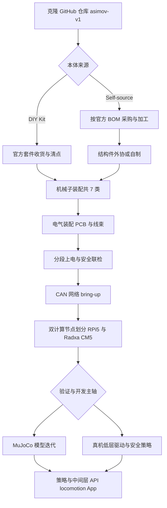

# Asimov v1（开源人形机器人仓库）

## 一句话定义

Asimov v1 由 asimovinc 在单仓内开放机械与电气 CAD、MuJoCo 模型及板载软件，配套 DIY Kit 与自采 BOM，适合作为全栈对齐与 Sim2Real 研究的硬件参考平台。

## 为什么重要

- **单一仓库全栈对齐**：官方入口 [asimovinc/asimov-v1](https://github.com/asimovinc/asimov-v1) 将机械子装配、线束、PCB 与 **MuJoCo** 模型、机载软件放在同一修订流下，减少「CAD 一版、MJCF 另一版」带来的质量与惯性参数漂移，对 **Sim2Real** 讨论更友好。
- **规格与接口公开透明**：README 给出身高约 **1.2 m**、质量约 **35 kg**、**25 个主动自由度 + 2 个被动自由度**、多路 **CAN** 与 **双板计算**（媒体/网络 vs 运动控制）等边界条件，便于与控制、估计、通信专题页交叉引用。
- **许可拆分清晰**：**硬件**采用 **CERN-OHL-S-2.0**，**软件**采用 **GPL-2.0**，便于研究机构评估二次分发与衍生固件/驱动的合规路径。

## 核心结构 / 机制

### 1. 机械与材料

- **腿**：每腿 **6 主动 DOF**，另含 **脚趾**相关被动/辅助结构（README 表述为腿侧配置的一部分）。
- **臂**：每臂 **5 DOF**（肩 pitch/roll/yaw、肘、腕 yaw）。
- **躯干**：**腰 yaw**；集成约 **10 W、4 Ω** 扬声器与 **6 轴 IMU**。
- **头**：**颈 yaw + pitch**；**四麦克风阵列**与 **约 2MP 单目相机**。
- **结构材料**：**7075 铝合金**与 **MJF PA12 尼龙**等组合，偏向在重量与刚度之间取得工程折中。

### 2. 电气与通信

- **CAN 总线**：**5 路 @ 1 Mbps** 与 **1 路 @ 500 kbps**（README 规格表）。典型用途是将关节驱动、电源管理、传感器预处理等模块分区到不同总线段，便于布线、隔离故障域与规划带宽。
- **线束与 PCB**：仓库包含 **线束设计**与 **原理图/PCB** 文件，支持从「原理图 → 板卡 → 线束表」对照装配与维修。

### 3. 计算架构（双节点）

- **Raspberry Pi 5**：偏 **媒体、网络与用户态服务** 一侧（例如相机流、音频、联网工具链）。
- **Radxa CM5**：偏 **运动控制** 一侧（实时性要求更高的回路更适合与多媒体解耦）。

这种 **异构双板** 与 [开源人形机器人“大脑”选型](./open-source-humanoid-brains.md) 中「运控高频 vs 感知/大模型低频」的分工思路一致，只是 Asimov 在 v1 上把角色写死在具体 SKU 上，便于采购与镜像维护。

### 4. 仿真与软件

- **MuJoCo 模型**：主 README 将 **MuJoCo simulation model** 标为已完成项，并与机械/电气资料同仓维护，用于 **build, simulate, and customize** 的一体化流程；更细的 **并行仿真训练、模仿奖励与观测合同** 见下文「仿真、模仿学习与训练」。
- **板载软件**：与硬件同仓维护，利于版本锁定（固件/驱动与机械修订号对齐）。

### 5. 落地路径（产品化与自造并存）

| 路径 | 要点 | 适用对象 |
|------|------|----------|
| **DIY Kit（官方套件）** | 预约金 + 目标价位与发货窗口以官网为准；套件含主要 BOM 零件（未组装）、电源与线缆、备件；**不含**工具与手部等（见官方 README 表格） | 希望减少寻源与品控时间、聚焦装配与软件的团队 |
| **自采（Self-source）** | 依据官方 **BOM** 自行采购与加工；跟随 **Assembly Manual** 装配 | 有供应链与加工渠道、希望自定义批次或替换件的研究组 |

> 价格、交期与套件边界以 [asimov.inc](https://asimov.inc/diy-kit) 与 [manual.asimov.inc](https://manual.asimov.inc) 为准；本页只归纳结构，不固化商业承诺。

### 6. 公开路线图中的缺口（研究机会）

README 中的路线项仍将 **Asimov API**、**Locomotion policy**、**Mobile app** 等标为待发布；与此同时，官方已单独开放 **[asimov-mjlab](https://github.com/asimovinc/asimov-mjlab)** 作为 **行走速度策略** 的可复现训练入口（见下节），因此「策略代码在主仓内一键可得」与「已有公开 fork 可训」应区分理解。

## 仿真、模仿学习与训练（公开资料）

本节把 **主仓 MuJoCo 资产**、**并行仿真训练仓库** 与 **Menlo 工程博文** 三条公开信息源对齐，便于在 [Sim2Real](../concepts/sim2real.md) 与 [mjlab](./mjlab.md) 语境下定位 Asimov v1。

### 1. 主仓库（asimov-v1）里的仿真定位

- [asimovinc/asimov-v1 README](https://github.com/asimovinc/asimov-v1/blob/main/README.md) 写明仓库聚合 **mechanical CAD, electrical CAD, simulation model, onboard software**，目标包括 **simulate**；路线图将 **MuJoCo simulation model** 标为 **已完成**。
- 工程含义：仿真资产与 **CAD / BOM / 线束** 在同一修订流下迭代，有利于惯量、几何与接触参数 **Sim2Real 对齐**；主 README **不**承诺已在该仓内提供「一键可部署的全身 locomotion 二进制/服务」——该项仍在路线图中。

### 2. 并行仿真与训练栈（asimov-mjlab）

官方维护 **[asimovinc/asimov-mjlab](https://github.com/asimovinc/asimov-mjlab)**，自述为 [mujocolab/mjlab](https://github.com/mujocolab/mjlab) 的 Fork，在 **MuJoCo Warp** 上提供与 mjlab 一致的 **manager-based** 任务组织，用于 **GPU 并行** RL（详见 [mjlab](./mjlab.md)）。

**机器人建模（README）**

- **12-DOF 双足**（每腿 6 关节：`hip_pitch`、`hip_roll`、`hip_yaw`、`knee`、`ankle_pitch`、`ankle_roll`），从全身 25 主动 DOF 中抽出 **行走子问题**。
- 几何与约束要点：**45° 前倾的 hip pitch 轴**、**左右不对称关节轴符号**、**窄站姿（README 写约 11.3 cm）**，并据此在训练配置中采用 **更保守的速度上限**、更强的 **`body_ang_vel` 惩罚**、更紧的 **踝部 pose 约束** 等相对 G1 基线的改编说明。

**模仿学习与奖励（README「Training」）**

- 算法为 **PPO**（自适应学习率），约 **5000 iterations**，并配合 **terrain curriculum**；策略 MLP 规模 **`(256, 256, 128)`**，与 12-DOF 动作维度匹配。
- 奖励表明确包含 **Imitation**：**匹配约 1.25 Hz 的行走参考步态**；并与 **Velocity tracking**、**Alternating feet**、关节方差型 **Pose**、**Air time**、**Self-collision** 等项组合——即在 **RL 框架内加入对参考节律/形态的模仿 shaping**，不等同于单独发布一条完整的 **纯行为克隆 / AMP 数据管线** 说明（若需 AMP 范式可对照 [AMP_mjlab](./amp-mjlab.md) 等页）。

**观测与 Sim2Real（README）**

- 策略侧观测包含 **`base_ang_vel`**（IMU）、**`projected_gravity`**、速度指令、相对默认姿态的 **`joint_pos` / `joint_vel`**、**`previous_actions`**，以及 **`gait_clock`**（`cos(φ), sin(φ)`，**φ 以 1.25 Hz 推进** 的相位信号）。
- **显式移除 `base_lin_vel`**：README 注明真机无该真值，避免策略在仿真中依赖特权速度。
- **Sim2Real** 小节给出 **物理启发 PD**：\(K_p = J_{\mathrm{reflected}} \omega_n^2\)（名义 **10 Hz**）、\(K_d = 5.0\ \mathrm{N\,m\,s/rad}\)（并声明受硬件上限约束），默认姿态取 **零位** 作为机械稳定站立参考。

**命令入口（README）**：`uv run train Mjlab-Velocity-Flat-Asimov`、`uv run play Mjlab-Velocity-Flat-Asimov`（支持通过 Weights & Biases run 路径回放）。

### 3. Menlo 博文对「观测合同」的补充叙述

[Menlo Research 博文 *Teaching a Humanoid to Walk*](https://menlo.ai/blog/teaching-a-humanoid-to-walk) 从工程角度解释：**Actor 仅使用真机可得的约 45 维观测**（含 IMU、投影重力、指令、分组关节状态与历史动作）、**刻意不提供 base 线速度**；并讨论 **按 CAN 读出顺序建模的分组观测时延**、**非对称 Actor–Critic**（Critic 使用足高、接触、GRF、**被动趾关节**等特权信息，以匹配真机无趾编码器的事实）。

**与 `asimov-mjlab` README 的表述关系**：该文说明其曾 **不采用显式 gait clock**，希望由动力学 **自发形成步频**；而 `asimov-mjlab` README 当前列出 **`gait_clock` 观测项**。二者在公开文字层面 **存在设计取舍差异**，可能对应不同实验迭代或分支；复现与写报告时应 **以所用 Git 提交与配置文件为准**，并将博文视为 **设计动机** 类参考。

### 4. 三条线对照表

| 信息层级 | 典型入口 | 你能直接拿到的内容 |
|----------|----------|---------------------|
| 资产与单机仿真 | [asimov-v1](https://github.com/asimovinc/asimov-v1) | CAD / 电气 / **MuJoCo 模型** / 板载软件；主仓路线图中的 **Locomotion policy** 仍标「即将到来」 |
| 规模化 RL + imitation shaping | [asimov-mjlab](https://github.com/asimovinc/asimov-mjlab) | mjlab 式并行环境、**PPO**、含 **1.25 Hz 参考步态 imitation** 的奖励组合、**无 `base_lin_vel`** 的观测裁剪与 PD 叙述 |
| 设计叙事与消融动机 | [Menlo 博文](https://menlo.ai/blog/teaching-a-humanoid-to-walk) | 观测合同、CAN 时延建模、非对称 AC、奖励与 **gait clock** 取舍的讨论 |

## 常见误区或局限

- **误区：把主仓当成「已内嵌唯一官方训练脚本」**。主仓强调 **制造 + MuJoCo 资产 + 板载软件**；**可复现的并行训练脚本**当前公开在 **asimov-mjlab**，与主仓路线图并行存在。
- **误区：双板架构下任意进程都可进运控回路**。若不划分 **CPU 隔离、实时中间件与网络负载**，容易出现抖动与延迟尖峰，反而放大 Sim2Real gap。
- **局限：商业套件与完全自采的 BOM 可能存在批次差异**，惯性参数与摩擦标定仍需以本机辨识为准。

## 与其他页面的关系

- 放在 **开源硬件对比** 谱系中，与 **Roboto Origin**、**Atom01** 等并列，但 Asimov 更突出 **单仓全栈 + 官方手册/BOM 外链 + 商业套件** 的闭环。
- 仿真工作流可接到 [MuJoCo](./mujoco.md) 与 [Sim2Real](../concepts/sim2real.md) 概念页；控制频率与 CAN 分段可接到通信/延迟类 query（若你正在做总线调度专题，可从本页规格表跳转到对应笔记）。

## 从仓库到实机/仿真的工程流（Mermaid）

下图概括 **资料获取 → 本体实现 → 电气与计算 bring-up → 仿真/真机分叉 → 与路线图对齐** 的推荐顺序；其中虚线表示「依赖官方后续发布或自建」。

## 关联页面

- [开源人形机器人硬件方案对比](./open-source-humanoid-hardware.md)
- [人形机器人（Humanoid Robot）](./humanoid-robot.md)
- [MuJoCo](./mujoco.md)
- [mjlab](./mjlab.md)
- [AMP_mjlab](./amp-mjlab.md)
- [Roboto Origin（开源人形机器人基线）](./roboto-origin.md)
- [Sim2Real](../concepts/sim2real.md)

## 推荐继续阅读

- [开源人形机器人“大脑”选型](./open-source-humanoid-brains.md) — 双板/异构计算与实时性分工
- [asimovinc/asimov-mjlab（行走训练 fork）](https://github.com/asimovinc/asimov-mjlab)
- [Assembly Manual（官方）](https://manual.asimov.inc)
- [BOM（官方）](https://manual.asimov.inc/v1/bom)

## 参考来源

- [asimov-v1.md](../../sources/repos/asimov-v1.md)
- [asimov-mjlab.md](../../sources/repos/asimov-mjlab.md)
- [asimovinc/asimov-v1 README（main）](https://github.com/asimovinc/asimov-v1/blob/main/README.md)
- [asimovinc/asimov-mjlab README（main）](https://github.com/asimovinc/asimov-mjlab/blob/main/README.md)
- [Teaching a Humanoid to Walk（Menlo Research 博文）](https://menlo.ai/blog/teaching-a-humanoid-to-walk)
