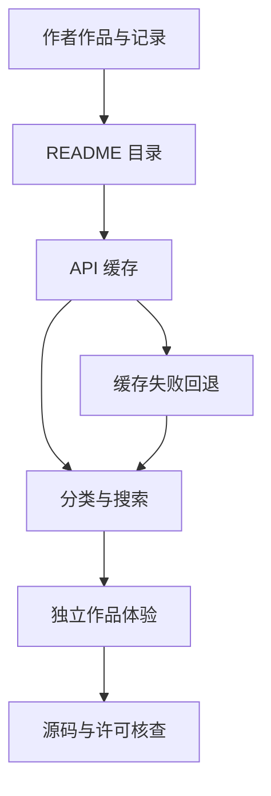

# Astra Games / Awesome GPT-6 Astra

## 一句话定义

一个社区 AI 辅助游戏与交互作品目录：GitHub 提供来源记录与部分源码，Astra Games 提供分类、搜索和体验入口，可作为机器人知识站的交互设计参考。

## 英文缩写速查

| 缩写 | 英文全称 | 简要说明 |
| --- | --- | --- |
| AI | Artificial Intelligence | 此处指辅助创作和编程的人工智能 |
| API | Application Programming Interface | 展示站获取目录及预览的接口 |
| GPU | Graphics Processing Unit | 浏览器图形渲染使用的处理器 |
| UI | User Interface | 参数控件、作品卡片与操作反馈 |
| ES | ECMAScript | THUNDERFALL 使用 JavaScript 模块组织代码 |

## 为什么重要

机器人教学常需要“调一个参数，立刻看到影响”。本目录提供可操作的浏览器成品与创作记录，让维护者观察参数面板、状态反馈、暂停和导出如何组成完整体验。与 [Easy-Vibe](easy-vibe.md) 的系统教程互补：教程学习构建过程，作品集观察交付结果。

对本库的价值主要在展示与工程方法。真实动力学、策略推理和训练应结合 [Robot Viewer](robot-viewer.md) 等机器人工具理解，不能从游戏画面的合理性推导物理精度。

## 流程总览

以下按本页已归纳的机制与资料绘制，表示模块或阅读路径关系。

## 核心原理：来源、展示与体验分层

| 层 | 输入与处理 | 输出及核查点 |
| --- | --- | --- |
| 上游目录 | 作者提交及维护者整理的 README | 作者、体验入口、截图、访问条件、模型参与证据和源码链接 |
| 展示站 | 解析上游 README，通过 API 获取并缓存目录 | 分类、搜索、预览；失败显示旧数据或回退快照 |
| 独立作品 | 用户输入、作品自身规则和渲染循环 | 可交互画面；实现与许可按作品核查 |

截至 2026-10-01，README 和首页列出 165 个作品。这是目录快照，不代表本库逐个验证，也不是模型基准样本数。README 将模型参与归因于作者或提交者声明，部分未确认细节单独标记。

### 两个已公开源码的参考案例

| 案例 | 可读源码与文档 | 值得学习的设计 | 不能推导的结论 |
| --- | --- | --- | --- |
| [Orbital Garden](https://github.com/MartinDelophy/awesome-gpt-6-astra/tree/main/works/orbital-garden) | 单文件 HTML、着色器、Prompt、元数据 | 形态切换、暂停、调速、视角、带参数的图像导出 | 粒子引力是艺术化表现，README 明确不是真实天体或流体模拟 |
| [THUNDERFALL](https://github.com/MartinDelophy/awesome-gpt-6-astra/tree/main/works/thunderfall) | ES Modules、引擎测试、设计与 Prompt | 状态机、暂停冻结、输入适配、明确的验证记录 | 自动模拟通关不能证明真人难度或实物手机性能 |

两者 README 都说明经过迭代和协作审阅，不属于一次提示生成的评测。目录收录许多第三方作品，不能将这两个案例的源码开放情况推广到全目录。

## 工程实践

### 阅读与运行入口

- **展示站：** 在上游仓库的 `website/` 按 README 执行 `npm install`、`npm run dev`；测试 `npm test`，构建 `npm run build`。本库核查了这些文档入口，未执行该项目。
- **Orbital Garden：** README 说明可直接打开 `works/orbital-garden/index.html`，或在仓库根启动静态服务。适合先读参数如何改变画面，再读图形实现。
- **THUNDERFALL：** 在仓库根执行 `python3 -m http.server 4173 --directory works/thunderfall`；该作品使用模块，应通过 HTTP 访问。目录中 `npm test` 使用 Node 内置模块。

### 迁移到机器人教学的具体例子（本库建议）

做一个关节 PD 控制小实验时，可借鉴上述交互方式，但动力学需独立实现和核验：

1. 明确实验输入：目标角度、Kp、Kd、惯量、初始状态；注明简化模型假设与单位。
2. 将物理步进与绘图分开：画面刷新变化时，积分步长和模拟结果应保持可控；显示角度、速度与力矩曲线。
3. 提供暂停、单步、重置和参数导出；切换后台时明确定义模拟时间如何处理。
4. 验证零误差、零速度时控制力矩为零，阻尼对自由运动的影响符合模型，再验证不同积分步长的结果。
5. 把“教学示意”和“与 MuJoCo 对照的动力学结果”分别标注；读者据此判断用途。

上述步骤是本库工程归纳，不是上游已有的机器人功能。与 [Agentic Coding 软件工程基础](../concepts/agentic-coding-software-fundamentals.md) 一起使用：先定义验收条件，再让 Agent 实现，最后核对行为与证据。

## 局限与风险

- **开放边界：** 展示站、目录与部分作品代码已公开；其他作品按条目核查。目录 CC0 不替代外链作品和素材的独立许可。
- **模型归因：** 名称保留上游原称；收录或作者声明不等于独立验证模型型号、贡献比例或性能。
- **物理边界：** 游戏碰撞、程序动画与粒子美术不能直接作为机器人训练环境、接触模型或 Sim2Real 依据。
- **验证边界：** 本次核查页面、源码路径和运行文档，没有逐一试玩或复测作者测试；显示快照也可能滞后于源站。
- **可维护性：** 参考其目录和展示分层即可；本库继续以 wiki 与 exports 为内容来源，避免维护第二份人工清单。

## 关联页面

- [Easy-Vibe](easy-vibe.md)：AI 原生产品构建教程，搭配作品案例学习。
- [Agentic Coding 时代的软件工程基础](../concepts/agentic-coding-software-fundamentals.md)：实现前的取舍与交付验收。
- [Robot Viewer](robot-viewer.md)：浏览器机器人模型查看和物理仿真的用途对照。

## 参考来源

- [Awesome GPT-6 Astra 仓库归档](../../sources/repos/awesome-gpt-6-astra.md)：README、作品文档、许可与代码入口。
- [Astra Games 站点归档](../../sources/sites/astra-games.md)：首页、目录关系和展示站开放核查。

## 推荐继续阅读

- [上游目录](https://github.com/MartinDelophy/awesome-gpt-6-astra)：逐作品查作者、证据、源码和许可。
- [英文展示站](https://astragames.aigccreative.com/en)：按交互类型寻找设计参考。
- [展示站 README](https://github.com/MartinDelophy/awesome-gpt-6-astra/blob/main/website/README.md)：目录缓存、回退与本地开发说明。
