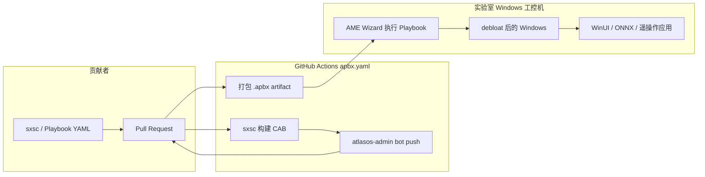

# Atlas OS（Windows 优化 Playbook）

**Atlas OS**（[Atlas-OS/Atlas](https://github.com/Atlas-OS/Atlas)，[atlasos.net](https://atlasos.net)，~21k stars）是 **开源 Windows 修改 Playbook**：在保留功能与可定制性的前提下，集中应用 **隐私、性能与可用性** 优化。与定制 Windows ISO 不同，Atlas **不重分发系统镜像**，用户在有合法 Windows 的前提下通过 [AME Wizard](https://amelabs.net) 执行可审计的 Playbook；合规 Microsoft Windows 使用条款。

## 一句话定义

用 **明文 YAML Playbook + 开源 TrustedUninstaller 后端** 批量应用 Windows tweak，而不是烧录私有 ISO；机器人研究者若长期在 **Windows 工控机** 上跑 [WinUI](./winui.md) 遥操作面板、[ONNX Runtime](./onnxruntime.md) 推理或本地助手（[OpenClaw](./openclaw.md)），可把 Atlas 当作 **宿主 OS 减噪与 debloat** 的透明选项。

## 英文缩写速查

| 缩写 | 英文全称 | 简要说明 |
|------|----------|----------|
| OS | Operating System | 本页指经 Atlas Playbook 优化后的 Windows 宿主 |
| AME | Ameliorated | AME Wizard：执行 Playbook 的安装器（GUI 闭源，后端 MIT 开源） |
| APBX | Atlas Playbook eXtension | CI 产出的密码保护 Playbook 包（ZIP 密码 `malte`） |
| CAB | Cabinet file | Windows 组件包；sxsc CI 自动构建并 bot 回推 |
| GP | Group Policy | 组策略；Atlas 用其减少遥测与后台行为 |
| HMI | Human-Machine Interface | 工控机操作员界面；常见 Windows + WinUI 栈 |
| GPL | GNU General Public License | 主仓 Playbook 许可（v3） |

## 核心信息

| 字段 | 内容 |
|------|------|
| 机构 | Atlas-OS 社区（Atlas-OS） |
| 类型 | Windows 优化 Playbook（AME Wizard） |
| 代码 | <https://github.com/Atlas-OS/Atlas>（GPL-3.0） |
| 许可 | GPL-3.0（Playbook）；TrustedUninstaller 后端 MIT |
| 开源结论 | **已开源**（Playbook 明文可审计；AME Wizard GUI 闭源） |

## 为什么对机器人栈重要

1. **Windows 工控机仍常见：** [Teleoperation](../tasks/teleoperation.md) 里多路相机、手柄 XInput、C# 推理与急停面板常跑在 **Windows x64 工控机**；默认 Windows 的后台更新、预装应用与遥测会占用 CPU/磁盘 IO 与网络，干扰长时间采数或在线推理。
2. **透明可审计：** Playbook 以 **明文 YAML** 为主（`src/playbook/Configuration/`），比黑盒 ISO 更适合实验室 IT 审阅；安全功能（Defender、Update、UAC 等）可按文档 **自行取舍**，而非一刀切关闭。
3. **与 Linux 训练机分工：** 重仿真/训练多在 Linux 或 GPU 云（见 [AutoDL](./autodl.md)）；Atlas 解决的是 **留在 Windows 上的操作员站与现场笔记本** 的体验，不替代 ROS 实时栈或 WSL 内的 Linux 工具链（[Agent Lightning](./agent-lightning.md) 等仍建议 WSL/Linux）。

## 核心原理

| 层 | 职责 |
|----|------|
| **Playbook YAML** | debloat、performance、networking、security 等分类 tweak（`Configuration/tweaks/`） |
| **TrustedUninstaller CLI** | MIT 开源后端，执行 Playbook 动作 |
| **AME Wizard** | 图形安装器；Playbook 为密码 `malte` 的 ZIP，便于 diff |
| **sxsc + CAB** | 自定义系统组件包；YAML 在 `src/sxsc/`，CI 构建签名 CAB |
| **apbx.yaml CI** | push `src/**` → 构建 Playbook artifact；sxsc 变更 → **bot 自动 commit/push CAB 回 PR** |

### 流程总览

### 源码运行时序图

不适用：Atlas 不是训练/推理运行时，而是 **一次性或版本升级的 OS 配置 Playbook**。复现路径为：clone 仓库 → 本地或 CI 构建 Playbook → AME Wizard 在目标 Windows 上执行；详见 [Building the Playbook](https://docs.atlasos.net/contributing/playbook/)。

## 工程实践

| 场景 | 建议 |
|------|------|
| **新装工控机** | 先完成合法 Windows 安装 → 按 [Installation](https://docs.atlasos.net/getting-started/installation/) 跑 Atlas Playbook → 再装相机 SDK、CUDA/ONNX、WinUI 应用 |
| **安全策略** | 阅读 [Atlas and security](https://docs.atlasos.net/general-faq/atlas-and-security/)；现场机器人网络若需隔离，勿默认关闭 Defender/防火墙而不替代方案 |
| **贡献 sxsc 包** | 只改 `src/sxsc/*.yaml`；合并前确认 CI 已 bot 回推 CAB，避免 PR 缺二进制 |
| **与 WSL 共存** | Atlas tweak 针对宿主 Windows；WSL2 内 Linux 训练环境独立维护，注意 [Agent Lightning](./agent-lightning.md) 等 **不支持原生 Windows runner** 的限制 |

## 局限与风险

- **不是机器人中间件：** 不提供 ROS 桥、实时调度或驱动；仅优化 Windows 宿主。
- **第三方闭源 GUI：** AME Wizard 界面闭源；审计应聚焦 Playbook 明文与 TrustedUninstaller 动作。
- **更名混淆：** 与 [World Labs Atlas 世界模型](./atlas-world-model.md)、Boston Dynamics **Atlas 人形** 无关；选型与搜索时用 **Atlas OS** 或 **Atlas-OS**。
- **过度 debloat：** 禁用 Update 或关键服务可能导致安全补丁滞后；实验室应写清策略而非盲目追求「极限 FPS」。

## 关联页面

- [Teleoperation](../tasks/teleoperation.md) — Windows 工控机遥操作与 HMI 场景
- [WinUI](./winui.md) — Windows 原生操作员控制台 UI 栈
- [ONNX Runtime](./onnxruntime.md) — 工控机侧 C#/C++ 推理
- [OpenClaw](./openclaw.md) — 本地助手/技能运行时（Windows 宿主）

## 推荐继续阅读

- [Atlas 官方文档](https://docs.atlasos.net/)
- [Contribution Guidelines — Playbook 构建](https://docs.atlasos.net/contributing/contribution-guidelines/)
- [TrustedUninstaller CLI（MIT）](https://github.com/Ameliorated-LLC/trusted-uninstaller-cli)

## 参考来源

- [Atlas-OS/Atlas 仓库归档](../../sources/repos/atlas_os_atlas.md)
- [AtlasOS 项目站摘录](../../sources/sites/atlasos.md)
