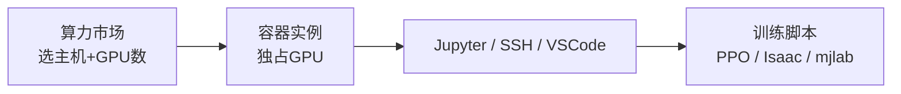

# AutoDL

**AutoDL**（[autodl.com](https://www.autodl.com/)）是国内 **GPU 算力租赁与炼丹** 平台：用 Docker 容器把物理机的 1–N 块 GPU 租给开发者，提供预装 PyTorch 等框架的镜像、JupyterLab、SSH 与 VSCode Remote-SSH，按 **运行中** 时长计费。

## 一句话定义

在控制台选地区与 GPU 型号创建「实例」，开机后通过 Jupyter 或 SSH 跑训练脚本；关机保留环境与数据，但连续关机过久实例会被释放——适合 **个人/小团队** 在缺少本地多卡时跑 [Isaac Lab](./isaac-lab.md)、mjlab 等 GPU 密集实验。

## 英文缩写速查

| 缩写 | 英文全称 | 简要说明 |
|------|----------|----------|
| GPU | Graphics Processing Unit | 租用与计费的核心算力单元 |
| SSH | Secure Shell | 远程终端与 VSCode Remote-SSH 登录 |
| IDE | Integrated Development Environment | VSCode / PyCharm 远程开发 |
| CUDA | Compute Unified Device Architecture | 选镜像与框架版本时需对齐的 NVIDIA 运行时 |
| RL | Reinforcement Learning | 平台最常见的高算力训练场景 |
| IO | Input/Output | 数据盘与 DALI 等管线关注的磁盘吞吐 |
| SaaS | Software as a Service | 按需租用的云端算力服务模式 |
| IDC | Internet Data Center | 平台物理 GPU 主机所在机房 |

## 为什么重要

- **填补算力缺口**：人形/足式 RL、大规模并行仿真（[Isaac Lab](./isaac-lab.md)、[mjlab](./mjlab.md)）常需 **多卡 + 大显存**；AutoDL 文档化 GPU 选型与多卡配比，降低「第一次租云卡」摩擦。
- **成熟运维文档**：计费、数据盘路径、守护进程、15 天保留策略、公网网盘与社区镜像均有说明，适合作为工程 checklist 外挂。
- **本库历史入口**：旧版训练资源列表已指向 AutoDL 算力市场；同类平台见 [国内 GPU 云平台选型](../comparisons/china-gpu-cloud-platforms.md)。

## 核心结构 / 机制

### 实例模型

| 概念 | 行为 |
|------|------|
| **物理主机 + N 卡** | 在同一主机上创建占用 1–N GPU 的实例；GPU **不共享** |
| **CPU/内存配比** | 随 GPU 数线性扩展（如 8 核 + 32GB / GPU） |
| **计费** | 状态为 **运行中** 时计费；关机停算力费，存储另计 |
| **数据保留** | 关机保留环境；**连续关机 15 天**释放实例（官方文档） |

### 存储（机器人项目常用路径）

| 路径 | 用途 |
|------|------|
| `/root/autodl-tmp` | 大数据集、checkpoint（高 IO 数据盘） |
| `/root/autodl-fs` | 同地区多实例共享 |
| `/root/autodl-pub` | 平台公共只读数据 |
| `/` 系统盘 | conda 环境、代码；约 30GB |

### GPU 选型（文档归纳）

| 场景 | 建议方向 |
|------|----------|
| 调试小模型 / 熟悉流程 | Pascal（1080Ti、P40） |
| 混合精度中等任务 | Turing/Volta（2080Ti、V100） |
| 主流 RL / 视觉训练 | Ampere（**3090/4090**、A5000、A40） |
| 大模型 / 多卡 scale | A100、H800 等（注意 CUDA 11.1+） |
| **图形仿真 GUI** | 需带 **RT 核心** 的消费级/专业图形卡；纯计算卡可能无法驱动 Omniverse 显示 |

官方强调：**CPU 与 DataLoader** 常是瓶颈；可尝试 **NVIDIA DALI** 加速数据读取。

### 推荐工作流（机器人 RL）

1. 按显存选卡（单卡 24GB 起较常见；大规模并行考虑 4–8 卡）。
2. 选带目标 **CUDA + PyTorch** 的社区镜像，或自建 conda 环境。
3. 代码与大数据放 **数据盘**；`git clone` 或公网网盘同步。
4. **VSCode Remote-SSH** 或 Jupyter 终端启动训练；长任务用 `screen`/`tmux` 防 SSH 断开。
5. 实验结束 **关机**；长期不用注意 15 天释放与存储费。

## 常见误区或局限

- **容器内不能跑 Docker**：Isaac/Omniverse 若强依赖嵌套容器，需改裸金属方案（平台客服路径）或本地工作站。
- **系统盘有限**：把整套 Isaac Sim 装进系统盘易满；大权重与数据集应放数据盘或网盘。
- **≠ 实验追踪**：训练监控仍用 [TensorBoard](./tensorboard.md) / [W&B](./weights-and-biases.md)；AutoDL 只提供算力与 shell。
- **区域与库存波动**：热门卡型（4090）可能抢不到；需备选地区或卡型。

## 与其他页面的关系

- [算力自由（GPUFree）](./gpufree.md) — 同类国内 GPU 云；大显存 L40/L40S 与仿真桌面镜像为其差异点
- [国内 GPU 云平台选型](../comparisons/china-gpu-cloud-platforms.md) — 六平台并列对比
- [Isaac Lab](./isaac-lab.md) — 常见高算力训练栈
- [仿真选型指南](../queries/simulator-selection-guide.md) — 仿真框架与算力侧约束
- [训练栈分层地图](../overview/robot-training-stack-layers-technology-map.md) — 训练基础设施全景

## 推荐继续阅读

- [AutoDL 帮助文档](https://www.autodl.com/docs/)（快速开始、GPU 选型、计费）
- [GPU 选型说明](https://www.autodl.com/docs/gpu/)
- [VSCode 远程开发](https://www.autodl.com/docs/vscode/)

## 参考来源

- [AutoDL 官方文档与算力市场](../../sources/sites/autodl.md)
