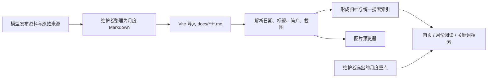
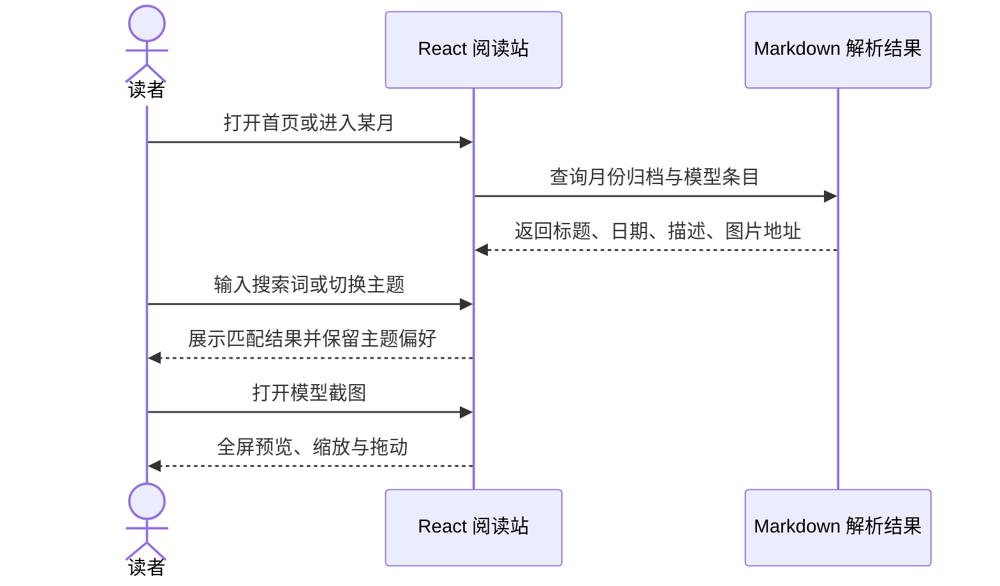

# Awesome Open LLMs：中文开源模型月度追踪档案

**Awesome Open LLMs** 是「刘聪 NLP」整理维护的开源模型发布档案。项目把模型名称、发布日期、发布机构、参数规模、能力方向、技术特点与截图按年月组织，当前 README 覆盖 **2025 年 6 月至 2026 年 9 月**。Markdown 是内容源，在线阅读站则负责年月导航、全文搜索、月度重点模型和截图浏览。项目仓库使用 Apache License 2.0。

## 一句话定义

**一个由 Markdown 驱动的中文开源模型发布目录：适合发现和回溯模型，不替代官方模型卡、论文或标准化评测。**

## 基本信息

| 项目 | 内容 |
|---|---|
| 维护者 | README 标注「刘聪 NLP」整理维护 |
| 代码 | [liucongg/awesome-open-llms](https://github.com/liucongg/awesome-open-llms) |
| 在线阅读 | [awesome-open-llms.logcongcong.workers.dev](https://awesome-open-llms.logcongcong.workers.dev/) |
| 归档范围 | 2025-06 至 2026-09（按 README 核查，可能随更新扩展） |
| 内容语言 | 中文为主，提供中英文 README |
| 技术 | React、TypeScript、Vite；Markdown 月档通过 glob 导入 |
| 许可证 | Apache License 2.0（仓库）；截图与商标另属各自权利人 |

## 项目解决什么问题

开源模型发布信息经常散落于厂商公告、代码仓库、技术报告和社区帖子。该项目提供一份按月维护的入口，帮助读者先回答：

- 最近发布了哪些模型？
- 哪个机构或团队发布？
- 主打能力、参数规模或场景是什么？
- 哪个月份、哪类模型值得进一步追踪？

项目把这类“发现”工作做得轻量、可搜索、可回溯。README 的声明也划定了边界：模型能力、参数、许可范围和安全策略可能变化，具体使用判断仍应回到官方仓库、报告与公告。

## 内容组织与功能

| 功能 | 实现 / 用途 |
|---|---|
| 月度归档 | `docs/YYYY/MM.md`，按年份和月份维护，较新月份优先浏览 |
| 本月之最 | 首页选择一项重点模型并展示亮点；属于维护者策展 |
| 全文搜索 | 按模型名称、机构、参数规模或技术关键词检索 |
| 图片预览 | 全屏查看截图，支持滚轮 / 双指缩放和拖动 |
| 自适应页面 | 面向桌面、平板和手机 |
| 亮暗主题 | 手动切换，主题选择保存在当前浏览器 |
| 参与维护 | Issue 收集建议，PR 提交新模型、信息更正或来源补充 |

### 数据与界面流程



仓库中的 `src/content.ts` 实现主要解析：匹配符合约定格式的 Markdown 条目，提取日期、标题和简介，并向后寻找对应图片；随后生成月份数据和按发布时间倒序排列的全局 `allEntries`。因此新增档案不只是写文字，也要符合解析器的格式约定。

### 读者交互时序



## 内容格式与维护要点

解析器在 `src/content.ts` 中以固定格式识别条目：

```markdown
- **09-29 · 模型名称** — 一句话介绍机构、能力和特点。

  
```

- 日期和条目标题应遵循格式，否则 parser 可能跳过该记录。
- 图片放在对应条目后续行，遵循相对 `public/assets` 的目录约定。
- 新条目尽量附官方仓库 / 公告、发布日期、机构、关键特点与截图来源，以便核对。
- 修正错误或失效链接可开 Issue 或提交 PR。

## 本地开发

仓库提供常见 Vite 命令：

| 命令 | 作用 |
|---|---|
| `npm run dev` | 启动本地开发站点 |
| `npm run build` | TypeScript 检查并构建静态页面 |
| `npm run preview` | 预览构建产物 |

结构上，`docs/` 是内容，`src/App.tsx` 管理阅读界面及交互，`src/content.ts` 转换月档数据，`public/assets/` 保存配图。

## 价值与局限

- **价值：** 统一的月度档案降低寻找近期模型发布的成本；纯 Markdown 便于人工维护，自动解析让目录内容可直接进入网页搜索。
- **价值：** 发布日期与原始截图等信息适合建立快速扫描与历史回溯入口；贡献入口使读者可反馈遗漏或更正。
- **局限：** 项目是中文编辑目录，收录范围和「本月之最」都受维护者选择影响，不代表完整模型宇宙或客观质量排名。
- **局限：** 简介偏摘要，不等于技术验证；榜单条目不统一提供可复现实验设置，因此不能横向比较性能。
- **时效风险：** 参数、模型版本、许可、API 可用性和安全策略可能变化；核对时以官方材料为准。
- **权利边界：** 仓库许可证为 Apache-2.0，但项目声明截图、产品名称与商标归各自权利人；这不代表第三方模型权重也采用同一许可证。

## 结论

Awesome Open LLMs 的强项是**发布信息组织和初筛**：月度归档、全文搜索和截图预览把分散的开源模型消息变成易浏览的时间线。它不应被读成排行榜或模型评测结论。对具体模型做技术选型时，从目录定位候选项，再查看官方模型卡、代码、技术报告与许可证，才是可靠的使用路径。

## 关联页面

- [开源 LLM 与基础模型](../concepts/llm-robotics-control-interfaces.md) — 模型目录所涵盖对象的技术背景
- [机器人学习评测](../concepts/ai-agent-evaluation.md) — 为什么信息收录与统一评测应分开看
- [来源归档](../../sources/repos/liucongg_awesome_open_llms.md) — README、实现和范围记录

## 参考链接

- [GitHub 仓库](https://github.com/liucongg/awesome-open-llms)
- [在线阅读站](https://awesome-open-llms.logcongcong.workers.dev/)
- [README 中文版](https://github.com/liucongg/awesome-open-llms/blob/main/README.md)
- [README English](https://github.com/liucongg/awesome-open-llms/blob/main/README_EN.md)
- [月度内容解析器](https://github.com/liucongg/awesome-open-llms/blob/main/src/content.ts)
