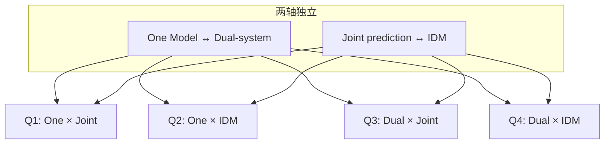

# Awesome World-Action Models（RCL / MBZUAI）

**Awesome World-Action Models**（GitHub：[rcl-robotics/Awesome-World-Action-Models](https://github.com/rcl-robotics/Awesome-World-Action-Models)，站点：[rcl-robotics.github.io/Awesome-World-Action-Models](https://rcl-robotics.github.io/Awesome-World-Action-Models/)）是 *World-Action Models for Robot Learning and Control: A Survey* 的 **配套策展与交互索引**：按 **架构四象限**、八大类与主题标签组织 **564** 条文献，并提供证据化 Reading reports。

## 一句话定义

面向 **机器人 WAM 研究与工程** 的 **大规模可检索索引** — 用 **control utility** 准则与 **2×2 taxonomy** 导航世界预测与动作生成的耦合方式。

## 英文缩写速查

| 缩写 | 英文全称 | 简要说明 |
|------|----------|----------|
| WAM | World-Action Model | 未来状态建模与可执行动作生成耦合 |
| VLA | Vision-Language-Action | 视觉–语言–动作策略（清单独立大类） |
| IDM | Inverse Dynamics Model | 先预测未来再反推动作的 plan-then-act 接口 |
| MBRL | Model-Based Reinforcement Learning | 经典模型+规划分解；综述对照节 |
| Q1–Q4 | Architecture quadrants | One/Dual × Joint/IDM 四象限浏览键 |

## 为什么重要

- **taxonomy 更细**：在 [OpenMOSS Awesome-WAM](../../sources/repos/awesome-wam-openmoss.md) 的 Cascaded/Joint 主线之外，独立拉出 **One Model vs Dual-system** 与 **Joint vs IDM** 两轴，便于对照 Q1–Q4 选型。
- **规模与证据**：**296** 条 WAM 论文 + 组件/数据/基准/指标分册；`papers.json` 与 **Reading reports** 支持机器消费与人工深读。
- **机器人导向**：应用节按操纵/导航/驾驶组织，并强调 **动作接地、时空一致、闭环改进、实时预算** 四项 control utility 准则。
- **与 WM 全谱互补**：[Awesome World Models](./awesome-world-models.md) 覆盖更广 WM；本清单 **深耕 WAM 生态** 与评测协议。

## 核心结构（怎么读）

### 架构四象限

站点提供各象限 **交互筛选**；联合训练 alone 不等价于 One Model。

### 八大类（截至 2026-09-13）

| 类别 | 侧重 |
|------|------|
| Foundational work | 2026 前世界模型、MBRL、规划与理论 |
| VLA | 视觉–语言–动作策略与学习方法 |
| WAMs | 世界预测与动作生成耦合的完整系统 |
| Datasets | 演示、交互、视频与多模态资源 |
| Evaluation metrics | 预测质量、动作一致性与控制表现 |
| Benchmarks & simulators | 任务、环境与仿真平台 |
| Components of WAMs | 编码器、生成骨干、tokenizer、动作头 |
| Related resources | 相关综述、运行时与表征研究 |

### 推荐浏览路径

1. [Research map](https://rcl-robotics.github.io/Awesome-World-Action-Models/map/) — 视觉化类别与架构
2. [Paper library](https://rcl-robotics.github.io/Awesome-World-Action-Models/papers/) — 多维筛选
3. [Reading reports](https://rcl-robotics.github.io/Awesome-World-Action-Models/reports/) — 单篇证据化解读
4. 站内概念页 [WAM](../concepts/world-action-models.md) — 与实例论文实体交叉阅读

## 中文导读（具身智能之心，2026-09-25）

[近 300 篇工作调研 · WAM 训练策略](../../sources/blogs/wechat_embodied_heart_rcl_wam_survey_2026-09-25.md) 用中文串读综述主线：**WM/VLA/WAM 分界**、**π0.5 / EgoScale** 两类 VLA 扩展、**三类数据金字塔**、**预训练（视频自监督 + 动作表征）→ 后训练（微调 / 增广 / 神经仿真 RL）**，并与本站 Q1–Q4 架构轴对照。文内「近 300 篇」指综述梳理规模；本清单 **564 entries** 含 VLA/数据/基准分册，宜并列使用。

## 局限与使用注意

- **综述 PDF**：正式编号 [arXiv:2609.16074](https://arxiv.org/abs/2609.16074)；引用以 PDF 与项目页为准。
- **清单滞后**：awesome 依赖维护者更新；关键结论以原文与官方仓为准。
- **非可运行栈**：MIT 许可的是站点/策展工具链，不含训练代码。
- **与 OpenMOSS 分工**：2605.12090 配套 [Awesome-WAM](../../sources/repos/awesome-wam-openmoss.md) 更早建立 Cascaded/Joint 叙事；本清单 **条目更多、架构轴更细**，宜并列使用而非互相替代。

## 关联页面

- [World Action Models（WAM）](../concepts/world-action-models.md) — 概念定义与文献实例
- [WAM 纵深路线](../../roadmap/depth-wam.md) — 学习路径
- [Awesome World Models](./awesome-world-models.md) — WM 全谱策展
- [VLA](../methods/vla.md) · [Generative World Models](../methods/generative-world-models.md) · [Model-Based RL](../methods/model-based-rl.md)
- [机器人世界模型训练闭环](../overview/robot-world-models-training-loop-taxonomy.md)
- [动作后果技术地图](../overview/robot-world-models-action-consequence-technology-map.md)

## 参考来源

- [sources/repos/awesome-world-action-models-rcl.md](../../sources/repos/awesome-world-action-models-rcl.md)
- [sources/sites/awesome-world-action-models-rcl.md](../../sources/sites/awesome-world-action-models-rcl.md)
- [sources/papers/rcl_wam_robot_learning_survey.md](../../sources/papers/rcl_wam_robot_learning_survey.md)
- [具身智能之心 · WAM 训练策略导读（2026-09-25）](../../sources/blogs/wechat_embodied_heart_rcl_wam_survey_2026-09-25.md)

## 推荐继续阅读

- [项目主页](https://rcl-robotics.github.io/Awesome-World-Action-Models/)
- [GitHub 仓库 README](https://github.com/rcl-robotics/Awesome-World-Action-Models)
- [OpenMOSS Awesome-WAM](https://github.com/OpenMOSS/Awesome-WAM) — Cascaded/Joint 专题对照
- Wang et al., *World Action Models: The Next Frontier in Embodied AI* — [arXiv:2605.12090](https://arxiv.org/abs/2605.12090)
