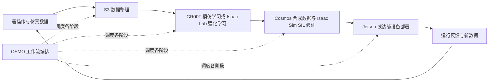

# The Physical AI Toolchain on AWS

## 一句话定义

**AWS Physical AI Toolchain** 是一组用于在 AWS 上搭建 Physical AI 开发闭环的参考架构、基础设施代码和部署样例。

## 英文缩写速查

| 缩写 | 英文全称 | 简要说明 |
|---|---|---|
| PAI | Physical AI | 与物理环境交互的 AI 系统总称 |
| SIL | Software-in-the-Loop | 在软件仿真环节验证策略和系统 |
| HIL | Hardware-in-the-Loop | 将真实硬件纳入闭环测试 |
| IaC | Infrastructure as Code | 以代码描述和部署云基础设施 |
| RL | Reinforcement Learning | 强化学习，用于策略训练 |
| VLA | Vision-Language-Action | 视觉、语言与动作联合策略 |

## 这是什么

AWS 样例仓库把 Physical AI 工程拆成一条云端工作流：生成或整理数据、训练策略、在仿真中验证，再部署到边缘设备并把运行结果反馈到下一轮开发。它将 AWS 托管服务与 NVIDIA Isaac Sim、Isaac Lab、GR00T、Cosmos 和 OSMO 等工具组合起来，目标是提供可复用的基础设施起点，而非提出一个新的机器人学习算法。

## 架构与组件

仓库用四个环节描述开发飞轮：

1. **合成数据生成：** 场景组合、域随机化和生成式数据增强。
2. **模型训练：** 模仿学习、强化学习、微调和 checkpoint 管理。
3. **SIL 仿真：** 物理验证、对抗场景与回归测试。
4. **Sim-to-Real / HIL：** 域适配、安全监控和边缘部署。

NVIDIA OSMO 被用作跨异构算力的调度与数据依赖编排层；Strands Agents 示例则探索通过自然语言编排机器人任务。仓库把各阶段拆成独立模块，已有入口包括 Foundation、Cosmos、Isaac Lab、Isaac GR00T、DreamZero、Isaac Sim、OSMO、Strands Agents 和 Isaac Lab Arena Evaluation。仓库 README 将 Edge Deployment 标为 planned，模块的状态需按对应目录核实。

## 数据到部署的闭环

仓库的端到端示例以 UR3 和 Robotiq 2F-85 为例，包含 27 条真实遥操作 episode；示例将遥操作数据整理成 LeRobot 格式，在云上微调 GR00T，并组合仿真、数据生成和部署步骤。换机器人时需要提供自己的模型和数据，示例工作流并不会自动解决每种本体的驱动、标定或安全问题。

## 使用时要核对的事项

- **先选模块再部署：** 已有 Kubernetes 或自建流水线时，可单独部署相关工具；要搭建完整控制面时再考虑 OSMO。
- **成本是配置相关的：** README 的估算依赖实例规格、区域、Spot/Capacity Block 与运行时间；应在当前 AWS 区域重新核算。
- **权重和容器有各自条件：** NGC、Hugging Face、模型权重、仿真资产及云服务分别可能要求账号、许可或配额。
- **不是实时控制架构：** AWS 云端负责训练、仿真和管理；机器人硬实时控制仍需要在本地控制器/边缘节点满足时序与安全约束。
- **不是自动化安全认证：** HIL 和回归门禁是工程流程组件，不等于通过了特定机器人或行业的安全认证。

## 关联页面

- [仿真到真机迁移](../concepts/sim2real.md)
- [世界-动作模型](../concepts/world-action-models.md)
- [Video Prediction Policy 2（VPP2）](./video-prediction-policy-2.md)

## 参考来源

- [AWS 官方仓库来源归档](../../sources/repos/aws-physical-ai-toolchain-on-aws.md)
- [sample-the-physical-ai-toolchain-on-aws](https://github.com/aws-samples/sample-the-physical-ai-toolchain-on-aws)
