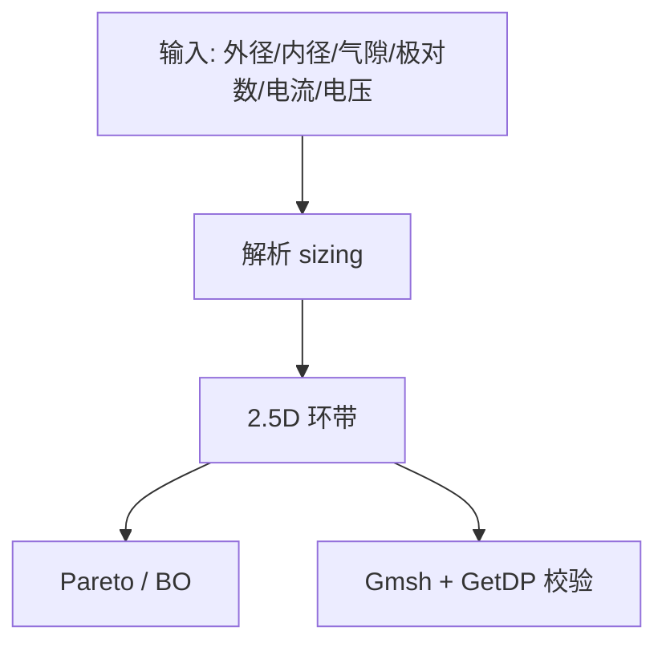

# axfluxmdo（轴向磁通电机多学科优化工具包）

## 一句话定义

**axfluxmdo**（[jman4162/axfluxmdo](https://github.com/jman4162/axfluxmdo)，文档 [jman4162.github.io/axfluxmdo](https://jman4162.github.io/axfluxmdo/)）是轴向磁通永磁电机的 **开源参数化建模 / 仿真 / 可视化 / MDO** Python 工具链，强调用开源求解器钩子（Gmsh、GetDP）做早期设计探索。

## 英文缩写速查

| 缩写 | 英文全称 | 简要说明 |
|------|----------|----------|
| AFM | Axial-Flux Machine | 轴向磁通电机 |
| MDO | Multidisciplinary Design Optimization | 多学科设计优化 |
| FEA | Finite Element Analysis | 有限元分析 |
| Gmsh | Gmsh mesh generator | 开源网格生成器 |
| GetDP | GetDP FE solver | 常与 Gmsh/ONELAB 配对的开源 FE 求解器 |
| Pareto | Pareto front | 多目标下的非支配最优解集 |

## 为什么重要

- 轴向磁通「薄饼」外形适合关节包络，高极对数适配低速大力矩；但气隙敏感、轴向力与装配公差难——需要 **快速扫参** 而不是一上来全 3D FEA。
- 明确对标「学 [PYLEECAN](./pyleecan.md) 的径向框架模式，但专攻轴向」；不依赖 Motor-CAD / Maxwell / COMSOL 许可即可起步。
- 与 [PCB Motor](./pcb-motor.md) 互补：后者给可制造 PCB 定子样例，本工具给几何—性能—约束的连续优化空间。

## 核心原理

五层能力（文档）：

1. **解析模型** — 转矩、反电势、损耗、温升与约束裕度（微秒级）
2. **2.5D 环带** — 沿半径积分；脉动、轴向力、效率地图、制造误差
3. **多目标优化** — pymoo Pareto、OpenMDAO、灵敏度
4. **开源 FEA 钩子** — Gmsh 网格 + GetDP 磁静力校验
5. **代理 / 贝叶斯优化** — 昂贵目标时的少次评估

## 工程实践

| 场景 | 做法 |
|------|------|
| 关节初筛 | 设连续/峰值转矩与温升、电流密度上限，看约束裕度 |
| 极对数权衡 | 用官方 pole-pair sweep：固定气隙载荷下转矩可与极对数无关，密度来自轭部变薄 |
| 安装 | `pip install axfluxmdo`；优化/FEA/3D 可视化用 extras |
| 与径向路线分工 | 径向外转子人形髋膝优先 PYLEECAN；轴向薄型腕/肩包络再上本工具 |

## 局限与风险

- **无固定已加工人形电机样机**；输出是设计点与曲线，不是 BOM。
- 官方自述：**不能替代** 高保真瞬态三维电磁仿真；脉动多为代理量。
- 轴向磁拉力、多气隙与散热在真机上往往主导失败模式——优化结果必须进 FEA/台架。

## 关联页面

- [开源力矩电机电磁设计完整度对比](../comparisons/open-source-torque-motor-em-design.md)
- [PYLEECAN](./pyleecan.md) · [PCB Motor](./pcb-motor.md) · [ACMOP](./acmop.md)
- [电机电磁仿真软件选型](../comparisons/motor-em-simulation-software.md)

## 参考来源

- [sources/repos/axfluxmdo.md](../../sources/repos/axfluxmdo.md)
- [sources/sites/axfluxmdo_docs.md](../../sources/sites/axfluxmdo_docs.md)
- [开源力矩电机电磁设计策展](../../sources/personal/open_source_torque_motor_em_design_curator.md)

## 推荐继续阅读

- 文档：<https://jman4162.github.io/axfluxmdo/>
- GitHub：<https://github.com/jman4162/axfluxmdo>
