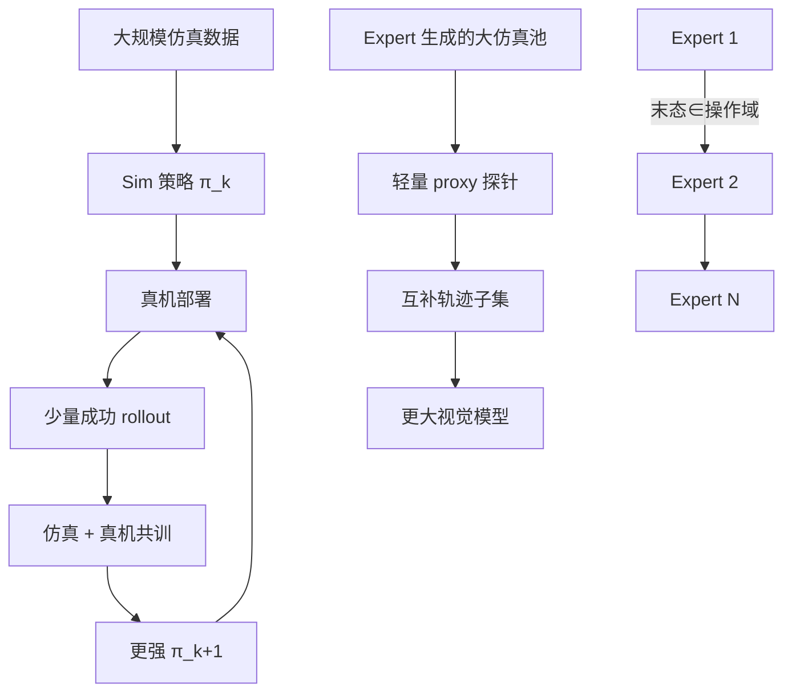

# Axis 可组合 Robotic 能力库

**Axis Robotics** 在 **2026-09-25** [官方博客](https://axisrobotics.ai/blogs/blog/beyond-more-tasks-axis-is-building-a-composable-library-of-robotic-capabilities) 中总结一轮实验：**scaling 的基本单位** 从「更多任务轨迹」转向 **可重复生产、可调用、可组合的 Expert（能力单元）**，并给出 Sim2Real **自改进环**、**数据筛选** 与 **低成本 Expert** 三条可操作建议。

## 一句话定义

**用仿真大规模覆盖 + 部署后少量自生成真机数据共训（Grounded RSI）、用 proxy 从大池选互补轨迹、用极低成本训满成功率 Expert 并链式拼接，构建可复利的能力库而非只堆数据量。**

## 英文缩写速查

| 缩写 | 英文全称 | 简要说明 |
|------|----------|----------|
| RSI | Recursive Self-Improvement | 本文 **Grounded RSI**：部署策略产生数据训更强后继 |
| Sim2Real | Simulation to Real | 仿真主数据 + 真机校准数据共训 |
| VLA | Vision-Language-Action | 文内：Expert rollout 可监督统一基础模型 |
| Expert | Task Expert Policy | 单任务近满成功率、具操作域的模块化策略 |
| GPU | Graphics Processing Unit | 文内单 A100 3–6 h / 任务量级 |

## 为什么重要

- **真机数据 sublinear scaling：** 与「每增一任务就要线性增遥操作小时」的假设对照；若 Grounded RSI 可复现，[Sim2Real](../concepts/sim2real.md) 从 **一次性迁移** 变为 **部署后持续校准**。
- **数据 scaling 的第二变量：** 在 [具身规模法则](../concepts/embodied-scaling-laws.md) 讨论中，除 **体积** 外显式加入 **筛选与互补性**（proxy），与 blind data scaling 形成对照。
- **组合式执行：** Expert **操作域重叠即可衔接**，接近软件 **库函数** 语义，与 [Multi-Expert Distillation](../methods/multi-expert-distillation.md)（蒸馏进单网）是不同合成路径。

## 核心原理

### Finding 1：Grounded RSI（自改进 Sim2Real 环）

- **输入：** 大规模仿真数据 + 初版 sim 训策略。
- **机制：** 真机部署（初始成功率可低）→ 策略 **自主产生少量成功 rollout** → 与仿真数据 **co-training** → 部署更强策略 → 迭代。
- **报告结果：** 真机成功率 **约 22% → 52%**。
- **解读：** 仿真负责 **广度**；每代策略负责 **窄而准的 deployment 校准**；真机数据需求不必随任务数线性增长。

### Finding 2：Proxy 轨迹筛选

- **观察：** 仿真 Expert 扩数据后，**全量训练未必更好**；剔除部分轨迹后性能仍升。
- **准则：** 轨迹价值 = **对当前模型的直接贡献** + **对全集的行为覆盖/互补**（非只保留单条最高分）。
- **实现：** **轻量 proxy model** 快速估计 utility/diversity，从大池选子集再训 **更大视觉模型**。

### Finding 3：低成本模块化 Expert

- **成本：** 少量用户数据或 agent prior + **单 A100 约 3–6 h**，纯算力 **约 $5–10/任务**，**近 100%** 成功率。
- **鲁棒性：** 初态、外扰、控制扰动下仍可恢复 → **操作域内** 执行，非单条演示过拟合。
- **组合：** 状态落在 Expert 可处理范围即可接管；**Expert A 末态 → Expert B 初态** 已用于更长 horizon。

### 流程总览

## 工程实践

| 项 | 建议 |
|----|------|
| 复现入口 | 截至 2026-09-27 **无** 博客配套公开仓库；平台侧见 [AxisAIOrg](../../sources/repos/axisaiorg.md) |
| RSI 定位 | 读作 [有界真机闭环](../concepts/recursive-self-improvement.md)，非 full ignition |
| 数据策略 | 扩池后 **先设计 utility+diversity 探针**，再决定是否全量喂大模型 |
| Expert 运维 | 链式任务需定义 **操作域接口**（状态集合）与 **失败时的回退**（博客未展开） |
| VLA 路线 | Expert 作 **高质量 rollout 源** 与 skill family 覆盖探针；与直接 BC scaling 并行评估 |

## 局限与风险

- **证据级别：** 单篇公司博客 + 内部实验；**22%→52%**、**$5–10** 未附协议、任务集与统计细节。
- **RSI 循环稳定性：** 低初成功率部署的安全与采样偏置未讨论。
- **Proxy 偏置：** 小模型探针可能漏掉对大模型关键的 rare 轨迹。
- **开源：** Expert/proxy/RSI **未开源**；勿与已开源 **轨迹清洗** 模块混为一谈。

## 源码运行时序图

**不适用** — 截至入库日官方未发布可运行 Expert 训练、proxy 筛选或 Grounded RSI 共训入口（见 [开源核查](../../sources/blogs/axis_composable_library_robotic_capabilities_2026-09-25.md)）。

## 关联页面

- [Axis Robotics（公司与平台）](./axis-robotics.md)
- [Sim2Real](../concepts/sim2real.md) · [具身数据飞轮](../concepts/data-flywheel.md)
- [递归自改进](../concepts/recursive-self-improvement.md)
- [Multi-Expert Distillation](../methods/multi-expert-distillation.md) · [VLA](../methods/vla.md) · [DAgger](../methods/dagger.md)

## 参考来源

- [Composable Library 博客归档](../../sources/blogs/axis_composable_library_robotic_capabilities_2026-09-25.md)
- [axisrobotics.ai 站点归档](../../sources/sites/axisrobotics-ai.md)

## 推荐继续阅读

- 原文：<https://axisrobotics.ai/blogs/blog/beyond-more-tasks-axis-is-building-a-composable-library-of-robotic-capabilities>
- [Axis 平台技术报告](https://techreport.axisrobotics.ai/)
