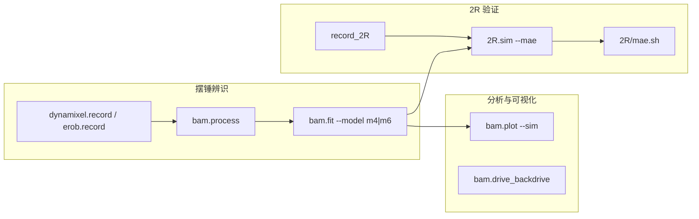

# BAM（Better Actuator Models）

**BAM**（[Rhoban/bam](https://github.com/Rhoban/bam)）是论文 [*Extended Friction Models for the Physics Simulation of Servo Actuators*](https://arxiv.org/abs/2410.08650v1)（ICRA 2025）的 **Apache-2.0** 参考实现：在 **摆锤台架** 上采集轨迹、用 **CMA-ES** 辨识 **M1–M6** 摩擦与电机参数，并在 **MuJoCo 2R 机械臂** 上对比仿真与真机 MAE。

## 一句话定义

把「舵机摩擦比 Coulomb–Viscous 复杂」这件事变成 **可复现的 record → fit → sim** 脚本与公开参数/日志。

## 英文缩写速查

| 缩写 | 英文全称 | 简要说明 |
|------|----------|----------|
| Sim2Real | Simulation to Real | 把仿真中学到的策略迁移落地真机的工程主线 |
| MuJoCo | Multi-Joint dynamics with Contact | 接触丰富的刚体物理仿真引擎 |
| URDF | Unified Robot Description Format | 统一机器人描述格式 |

## 为什么重要

- **降低执行器 sim2real 门槛：** 不必先训练 ActuatorNet，也能用 **物理可解释参数** 改善 MuJoCo 跟踪误差（论文报告 **>50% MAE 下降**）。
- **硬件覆盖示例：** 内置 **Dynamixel MX-64/106** 与 **eRob80（Etherban）** 流程，可改 `record.py` 适配其它舵机。
- **与论文/数据闭环：** 辨识数据在 [Google Drive](https://drive.google.com/drive/folders/1SwVCcpJko7ZBsmSTuu3G_ZipVQFGZ11N?usp=drive_link)；方法细节见 [论文实体页](./paper-bam-extended-friction-servo-actuators.md)。

## 流程总览

## 核心用法（归纳）

| 阶段 | 典型命令 | 说明 |
|------|----------|------|
| 采集 | `python -m bam.dynamixel.record --trajectory sin_time_square ...` | `--mass`、`--length`、`--kp`、`--motor mx106` |
| 批采 | `bam.dynamixel.all_record` | 多轨迹 × 多 $K_p$ |
| 后处理 | `python -m bam.process --raw data_raw --dt 0.005` | 统一时间步 |
| 拟合 | `python -m bam.fit --actuator mx106 --model m6 --method cmaes` | 输出 `params/.../m*.json` |
| 2R 仿真 | `python -m 2R.sim --log ... --params m4.json,m4.json --mae` | `--testbench mx` 或 `erob` |

**轨迹名（摆锤）：** `sin_time_square`、`sin_sin`、`lift_and_drop`、`up_and_down`。  
**轨迹名（2R）：** `circle`、`square`、`square_wave`、`triangular_wave`。

## 常见误区

1. **拟合用 m6、2R 也用 m6：** README 示例对 MX-106 拟合 m6，但 **Dynamixel 2R 论文推荐 m4** 参数对，避免过拟合。
2. **忽略 eRob 的 Etherban：** eRob 分支需先 `generate_protobuf.sh` 与 `etherban` 服务，并设置 `offset` 零点。
3. **与 ActuatorNet 二选一：** 可先 BAM 解析摩擦，残差再用数据驱动网络；也可对照 [SAGE](./sage-sim2real-actuator-gap-estimator.md) 看 gap 是否已足够小。

## 参考来源

- [Rhoban/bam 仓库归档](../../sources/repos/rhoban_bam.md)
- [论文归档](../../sources/papers/bam_extended_friction_servos_arxiv_2410_08650.md)

## 关联页面

- [扩展摩擦论文实体](./paper-bam-extended-friction-servo-actuators.md)
- [Sim2Real](../concepts/sim2real.md)、[System Identification](../concepts/system-identification.md)
- [Actuator Network](../methods/actuator-network.md)、[SAGE](./sage-sim2real-actuator-gap-estimator.md)

## 推荐继续阅读

- [GitHub README](https://github.com/Rhoban/bam) — 完整 CLI 与 2R URDF 转换说明
- [教程视频](https://youtu.be/5XPEEKDnQEM) — 采集与拟合演示
- [arXiv:2410.08650](https://arxiv.org/abs/2410.08650v1)
