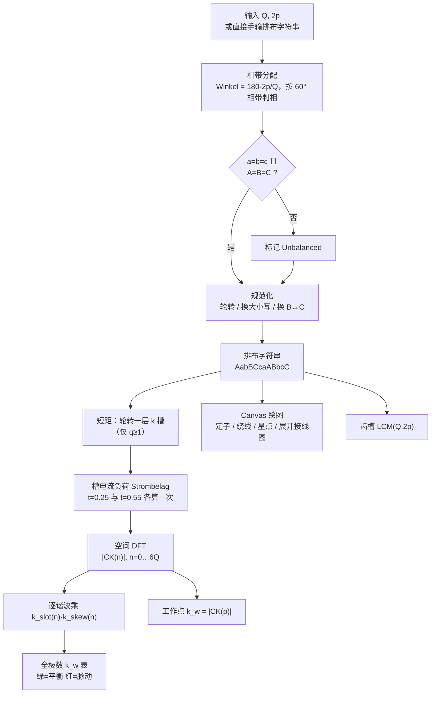

# Bavaria Direct 绕组方案计算器（Bewicklungsrechner XL）

## 一句话定义

**Bavaria Direct Winding Scheme Calculator**（源码名 *Bewicklungsrechner XL*，(C) 2010 Felix Niessen，GPLv3）是一个 **2005 行、零依赖的单文件 JavaScript 工具**：输入槽数 Q 与极数 2p，用 **槽电势星形法** 生成三相绕组排布字符串，再把排布转成 **槽电流负荷序列** 做 **空间 DFT**，一次性给出**所有极数**下的绕组系数 k_w、绕组平衡性判据、齿槽定位次数 LCM(Q, 2p)，并用 Canvas 画出定子绕线图与星/角接线图。

## 英文缩写速查

| 缩写 | 英文全称 | 简要说明 |
|------|----------|----------|
| Q / N | Number of Slots（德 *Nuten*） | 定子槽数（等价于集中绕组的齿数） |
| 2p | Number of Poles（德 *Pole*） | 转子磁极数；p 为极对数 |
| q | Slots per Pole per Phase（德 *Lochzahl*） | 每极每相槽数 `q = Q/(3·2p)`；q<1 为分数槽集中绕组 |
| k_w | Winding Factor（德 *Wickelfaktor*） | 绕组系数，反电势/转矩相对理想满绕的折扣 |
| FSCW | Fractional-Slot Concentrated Winding | 分数槽集中绕组（齿绕组），q<1 |
| MMF | Magnetomotive Force | 磁动势；本工具算的是其空间谐波幅值 |
| LCM | Least Common Multiple（德 *KgV*） | 最小公倍数，用于齿槽转矩周期 |
| DFT | Discrete Fourier Transform | 离散傅里叶变换（源码函数名写作 `WF_FFT`，实为朴素 DFT） |

## 为什么重要

- **它是「选槽极」这一步的标准答案生成器**：人形关节电机从任务指标走到 FEM 之前，必须先定 Q/2p 与绕组排布；这个工具把 [电机设计工作流](../overview/motor-design-workflow.md) 中「拓扑与槽极」一格从查表变成可复算。
- **少见地把「全极数谱」而不是「单个 k_w」当作输出**：同一套排布对 2、4、6…4Q 极各自的 k_w 一次列全，直接暴露**次谐波**与**镜像谐波**——这正是 FSCW 转子涡流损耗与振动的根源，多数在线计算器不给。
- **源码可读且可移植**：全部逻辑在一个 JS 文件里，没有框架、没有构建、没有网络请求；把 200 行核心数学端口到 Python/C++ 只需半天，适合塞进自研选型脚本。
- **站点已下线，源码即遗产**：`bavaria-direct.co.za` 已停止解析，SimpleFOC 社区讨论串确认工具不可访问。本页与 [归档页](../../sources/repos/bavaria_direct_winding_calculator.md) 的目的就是把原理留下来，而不是留一个死链。

## 源码结构总览

| 区块 | 行数范围（近似） | 职责 |
|------|------------------|------|
| 语言表 `lang[]` | 89–209 | 德/英双语词条；语言探测靠嗅 `navigator.userAgent` |
| `jsStart()` / `checkSPS()` / `checkVerteilt()` | 214–367 | 建表单、按 Q 的奇偶与 q 的大小动态切换「1/2 层」「Y/D」「短距」控件 |
| `berechnen()` | 1874–2005 | **核心算法 A**：槽极 → 排布字符串（相带分配 + 规范化） |
| `mit_schema()` | 371–434 | 高级模式：直接手输排布字符串，跳过 A |
| `Schema_ausgeben()` | 443–601 | 上色、LCM、短距移位，调度绘图与系数计算 |
| `WF_FFT()` | 1739–1826 | **核心算法 B**：电流负荷 → 空间 DFT → 全极数 k_w 谱 |
| `WF_FFTschnell()` | 1671–1732 | 单谐波 + 逐时刻版本，支撑「非等匝数」脉动动画 |
| `w_n_factor()` / `w_s_factor()` | 850–961 | 槽口因子、斜槽因子（两个 `sin(x)/x`） |
| `drawStator()` / `WicklungV()` / `pole_dazu()` | 1000–1668 | Canvas 绘图：定子齿、绕线、相间连接分层走线、星点、磁极、展开接线图 |

---

## 核心原理

### 0）中间表示：一个字符串 DSL

整个程序围绕**一个字符串**运转，这是它简洁的根源：

| 字符 | 含义 |
|------|------|
| `A` / `B` / `C` | U/V/W 三相，**正向**绕（输入时 `U/V/W` 会被自动替换为 `A/B/C`） |
| `a` / `b` / `c` | 同相**反向**绕 |
| `-` | 空齿（不绕线），用于单层/交替齿绕组，源码注释 *für leeren Hammer* |
| `/` | 切分**独立子电机**（*Teilmotor*），各段独立引出首尾 |
| `\|` | 槽分隔符，切换到**分布式记法**：`Ab\|CC\|…`，每段 1–2 个字符代表该槽的上/下层导体 |

- **集中绕组（q<1）**：字符串长度 = 齿数，第 i 个字符是第 i 个**齿线圈**的相与方向。
- **分布式绕组（q≥1）**：字符串是**槽占用表**，每槽 1（单层）或 2（双层）个导体边。

两种记法后续走不同的电流负荷分支，但共用同一套 DFT。

### 1）相带分配：槽电势星形法（`berechnen()`）

```js
Winkel = 180 * Pole / Nuten;          // 相邻槽的电角度步进
summe  = (summe + Winkel) % 360;      // 第 i 个槽的电角度 = i·Winkel (mod 360)
```

`Winkel = 180·2p/Q = p·360/Q` 就是相邻槽间的**电角度**。把 [0,360) 按 60° 切成 6 个相带，按角度落点直接判相：

| 电角度区间 | 字符 | 对应相轴 |
|------------|------|----------|
| [330,360)∪[0,30) | `A` | +U（0°） |
| [30,90) | `b` | −V（V 在 240°，反向即 60°） |
| [90,150) | `C` | +W（120°） |
| [150,210) | `a` | −U（180°） |
| [210,270) | `B` | +V（240°） |
| [270,330) | `c` | −W（300°） |

这就是教科书的 **60° 相带槽电势星形（star of slots）**：A, −B, C, −A, B, −C 的顺序不是拍脑袋，而是三相轴 0°/240°/120° 加反向后在圆周上的自然排列。**单层模式**（源码 `istSPS`，UI 写作「1 schicht」，要求 Q 为偶数）额外把奇数号齿写成 `-`，即交替齿绕线。

**平衡性判据**：统计 `A/B/C` 与 `a/b/c` 各自出现次数，若不满足 `a==b==c && A==B==C` 就打「Lösung unausgewogen / Unbalanced」。这与「三相平衡要求 `Q/(3·gcd(Q,p))` 为整数」的标准判据在常见组合上一致（例：12/6 → 判为不平衡；9/6 → 平衡）。

### 2）规范化：让同一物理绕组只有一种写法

三步纯字符串变换，目的是消除**旋转**与**相序**造成的等价表示：

1. 把结尾连续的 `a/A` 轮转到开头，使排布从一个完整 A 相组起头；
2. 若首字符是 `a`（即从 −U 起头），全局互换大小写（`A↔a` 等），改从 +U 起头；
3. 若 `c/C` 比 `b/B` 先出现，互换 B 与 C——把相序统一成 A→B→C（等价于统一旋向）。

结果：12/10 恒定输出 `AabBCcaABbcC`，9/8 恒定输出 `AaABbBCcC`，与文献常见写法对齐。

### 3）电流负荷（*Strombelag*）：从排布到「每槽安匝」

绕组系数的物理含义是**电流分布相对理想正弦分布的折扣**，所以先要把排布翻译成沿圆周的电流密度序列。源码在某个电时刻 t（以电周期为单位）取三相瞬时电流：

```js
Fasen['a'] = sin(2πt);   Fasen['b'] = sin(2πt + 2π/3);   Fasen['c'] = sin(2πt − 2π/3);   Fasen['-'] = 0;
```

**集中绕组分支**（关键细节）：一个**齿**线圈的两条边落在该齿两侧的两个槽里，电流方向相反。所以第 i 个槽的负荷 = 齿 i 的贡献 + 齿 i−1 的贡献，且两者**符号规则相反**：

```js
wert1 = ±Fasen[schema[i]];      // 小写 → 取负
wert2 = ∓Fasen[schema[i-1]];    // 大写 → 取负   ← 线圈另一条边，符号翻转
Strombelag[i] = (wert1 + wert2) / 2;   // 仅当两侧都有导体时才 /2
```

`i==0` 时 `schema[i-1]` 取末字符，天然处理圆周闭合。「只有一侧有导体时不除 2」不是笔误——它让**单层交替齿绕组**（相邻齿为 `-`）保持正确归一，这也是 12/10 单层能算出教科书值 0.966 的原因。

**分布式分支**：`NutBelag[i]` 形如 `"AA"`/`"Ab"`，两个字符就是两层导体本身，大小写直接给方向，两层平均即可，无需符号翻转。

### 4）空间 DFT：一次算出全极数绕组系数谱（`WF_FFT()`）

```js
for (n = 0; n <= 6*Q; n++) {
  CK_Re = 2 * Σ_x  Strombelag[x]/Q * sin(n·2π·x/Q);
  CK_Im = 2 * Σ_x  Strombelag[x]/Q * cos(n·2π·x/Q);
  WF[T][n-1] = |CK| = sqrt(CK_Re² + CK_Im²);
}
```

`x/Q` 是沿圆周的机械位置比例，所以 `n·2π·x/Q` 表示「一圈走 n 个周期」，即 **n = 极对数**。这一句就是把槽电流负荷序列做**空间离散傅里叶变换**，取第 n 阶谐波的幅值。归一化因子 `2/Q`（即两倍均值）使理想满绕情况下结果恰为 1；源码里 `if (WF > 1) → "err"` 就是这个归一化的守卫。

**这才是「XL」的含金量**：同一套排布，对每个 n 都给一个数，表格按 `2n`（等效极数）逐行列出。于是你读到的不是「12 槽 10 极的 k_w 是 0.933」，而是：

| n（极对数） | 等效极数 2n | 12/10 双层 k_w | 读法 |
|---|---|---|---|
| 1 | 2 | **0.06699** | **次谐波**：转不动，但同步旋转的低阶磁场 → 转子涡流损耗、径向力、振动 |
| 5 | 10 | **0.93301** | 工作谐波（本机） |
| 7 | 14 | **0.93301** | 镜像谐波：**同一套绕线也能配 14 极**，反转旋向 |
| 11 | 22 | 0.06699 | 高阶残留 |
| 其余 | — | 0 | 被三相对称与排布对称消掉 |

一次计算同时回答了「这套线还能配哪些极数」和「这套线的寄生谐波有多大」。

### 5）平衡性判据：为什么取 t = 0.25 与 t = 0.55 两个时刻

`t = [0.25, 0.55]` 是两个电时刻（0.25 恰为 A 相电流峰值，0.55 是任取的另一相位）。

对**平衡**绕组，合成磁动势是幅值恒定的旋转波，任意时刻第 n 阶谐波幅值相同 → `WF[0][n] == WF[1][n]`；
对**不平衡**绕组，合成波幅值随时间脉动 → 两个时刻结果不等。源码据此上色：相等且大于 0 → 绿条；不等 → 红条并在结论处显示「Schwankend / Unbalanced」。

用 12 槽 6 极（判为不平衡）验证：n=3 的幅值在两个时刻分别是 **0.79057** 与 **0.72535**，确实脉动。**用两次求值代替一套对称性证明——工程上极省事的技巧。**

### 6）非等匝数脉动动画（`WF_FFTschnell()` / `startAnim()`）

高级面板允许给**每个齿单独填匝数**（默认全 1），然后：

- 只算工作谐波：`Σ Strombelag[x]/Q · sin(2p·π·x/Q)`（`2p·π = p·2π`，与上式 n=p 同义）；
- 对 `t = 0.00 … 3.99`（步长 0.01，共 400 点 = 4 个电周期）逐点求值；
- 用 `maxnut`（相邻两齿匝数和的最大值）归一，结果画成 34 根柱子的滚动条形图，并给出 min/max/平均。

这把「绕组是否平衡」从一个布尔值变成一条**可见的脉动曲线**，也是研究**非等匝数（正弦化匝数分布）**的入口。

### 7）槽口因子与斜槽因子：两个 `sin(x)/x`

两者都是对 DFT 结果的**逐谐波乘法修正**，结果存进 `WF1`（槽口）、`WF2`（斜槽）、`WF3`（两者叠加）：

```js
k_slot(n) = sin(n·b_s/D) / (n·b_s/D)                 // D = 定子内径, b_s = 槽口宽（mm）
k_skew(n) = sin(sk·π·n/Q) / (sk·π·n/Q)               // sk = 斜槽量（单位：槽）
```

对照教科书：槽口所张机械角 γ = b_s/(D/2)，第 n 阶的展宽因子 `sin(nγ/2)/(nγ/2)` ≡ 源码式；斜槽机械角 = sk·2π/Q，`sin(θ/2)/(θ/2)` ≡ 源码式。两式逐位吻合（本次 ingest 已数值核验）。

### 8）短距（*Verkürzung*）与齿槽 LCM

- **短距**：q≥1 时 UI 出现「Verkürzung / Shortening」输入 k。实现是把双层排布的**一层整体轮转 k 个槽**，线圈跨距变成 `Q/2p − k`。这不是近似——24 槽 4 极短距 0/1/2/3 槽时源码给出 0.96593 / 0.93301 / 0.83652 / 0.68301，与教科书 `k_d·k_p` 完全一致。
- **齿槽**：`KgV = LCM(Q, 2p)`，用「谁小谁自加」的朴素循环求得，文案为「每转 N 次定位」。这是齿槽转矩基波每机械转的周期数，**LCM 越大齿槽越平滑**——12/10 得 60，12/8 只得 24，这就是为什么 12/10 比 12/8 顺滑。

### 计算链路总览



### 9）绘图部分怎么工作

`drawStator()` 在 700×700 画布上：

1. 画定子内外圆（r=148/112），再画 Q 个 T 形齿（源码称 *Hammer*），每画一个就 `rotate(2π/Q)`；齿宽 `950/Q`、齿高随 Q 递减，是纯经验缩放。
2. 每个齿上画 **5 匝**斜线（半径 156→216，步长 15），斜向 ±15 px 编码绕向：大写向一边、小写向另一边——**图上的斜率就是电流方向**。
3. 相间连线走 **6 条同心「层」**（`a1,a2,b1,b2,c1,c2`，半径 s_basis+40…+15），保证三相跨齿连线不重叠；每相首线圈引出「Anfang/Start」标注到 r=300，末线圈引「Ende/End」；选 Y 接时三个末端改走 r=100 的圆弧汇成星点。
4. `pole_dazu()` 画转子：r=301 的灰色磁轭 + 2p 段红/蓝交替磁极，**磁极弧长硬编码为极距的 67%**。
5. 分布式绕组另开第二块画布 `WicklungV()`，画**展开式接线图**：每槽一行 50 px，箭头示方向，斜线连到相距 `Q/2p − k` 槽的另一线圈边——直接就是绕线工的作业图。

绘图与算法完全解耦：`drawStator` 只读排布字符串，不参与任何数值计算。

---

## 工程实践

| 步骤 | 操作 | 得到什么 |
|------|------|----------|
| 1 | 本地打开 `winding_calc.shtml`（`file://` 即可，零依赖） | 免装环境 |
| 2 | 填 Q 与 2p，选「1/2 层」与 Y/D，点 Calculate | 排布字符串 + 齿槽 LCM + 工作点 k_w |
| 3 | 点「advanced / erweitert」展开 | **全极数 k_w 表**：确认次谐波、找可复用的镜像极数 |
| 4 | 填定子内径与槽口宽、斜槽槽数 | 修正后的 k_w（更接近实测反电势常数） |
| 5 | q≥1 时填 Verkürzung | 短距对基波与谐波的取舍 |
| 6 | 用 `-` `/` `\|` 手输排布 | 校核非常规方案（空齿、双子电机、自定分层） |
| 7 | 把排布字符串搬进 [FEMM-FOC-Simulation](./femm-foc-simulation.md) 或 [PYLEECAN](./pyleecan.md) | 进入 2D FEA，验证转矩与脉动 |

**选型读数建议**：先看 LCM（齿槽），再看工作点 k_w（转矩密度），最后看次谐波幅值（转子损耗与振动）。三个数都好看的组合才值得进 FEM。

**URL 直达**：页面支持 `?nuten=12&pole=10` 与 `?schema=AabBCcaABbcC&pole=10` 两种参数，便于把选型结果写进文档链接（但见下方安全提示）。

## 局限与风险

- **站点已下线，无上游仓库**：`bavaria-direct.co.za` 已停止解析，工具从未进过 GitHub，只靠站点与论坛离线包流传。要长期用就得自己存档——这正是本次 ingest 的动机。
- **`eval()` 与 URL 参数注入**：`berechnen()` 用 `eval(form.Nuten.value)` 解析槽数；URL 参数 `pole`/`schema` 未经校验就拼进 `setTimeout('…"'+值+'"…')` 字符串执行。**不要把它挂到公网、也不要点别人给的带参链接**；本地 `file://` 自用没问题。移植时应换成 `parseInt` + `textContent`。
- **输入约束**：Q 必须能被 3 整除且 ≥3、2p 必须为偶数且 ≥2、Q ≠ 2p；简单模式下槽数输入框 `maxlength=2`，即 Q ≤ 99。
- **手输分布式排布不要以 `\|` 结尾**：`mit_schema()` 统计段数时从 0 起（`berechnen()` 从 1 起），末尾多写一个 `|` 会让槽数多算 1，进而卡在「必须被 3 整除」或算出错误的 k_w。
- **代码卫生差，移植前先读**：循环变量 `i/y/x/n/T` 全是隐式全局，跨函数互相覆盖；`startAnim()` 第 692 行 `if(i=0)` 是赋值而非比较，导致归一化用的「最大槽满率」漏算了首尾环绕的那个槽；`verteilt` 一个变量兼当 boolean 与字符串；语言探测嗅 `navigator.userAgent` 里的 `'; de'`，在现代浏览器上永远失效（默认落到英文）。
- **只是磁动势谐波分析，不是有限元**：不含铁磁饱和、槽漏磁、磁钢形状、端部效应、温度与退磁。它给的是 **k_w 与谐波结构**，不给转矩数值、齿槽转矩幅值或效率——那些要交给 [FEMM](./femm.md) / [PYLEECAN](./pyleecan.md) / 商业求解器（见 [仿真软件选型](../comparisons/motor-em-simulation-software.md)）。
- **磁极弧 67%、每齿 5 匝等均为绘图硬编码**：图是示意，不是尺寸图，别拿去反推磁钢包角。
- **`WF_FFT` 名不副实**：是 O(Q·6Q) 的朴素 DFT，不是 FFT；Q ≤ 99 时无所谓，但别照抄函数名。

## 关联页面

- [电机设计工作流](../overview/motor-design-workflow.md) — 本工具落在「拓扑与槽极」这一格，是进入 FEM 之前的最后一步纸面工作
- [开源力矩电机电磁设计完整度对比](../comparisons/open-source-torque-motor-em-design.md) — 各开源项目的绕组维度对照
- [电机电磁仿真软件选型](../comparisons/motor-em-simulation-software.md) — 下游求解器选择
- [FEMM-FOC-Simulation](./femm-foc-simulation.md) — 把排布字符串变成 FEMM 里的绕组方向与扫角转矩
- [PYLEECAN](./pyleecan.md) · [FEMM](./femm.md) · [Ironless QDD 执行器](./ironless-qdd-actuator.md)
- [磁场定向控制](../concepts/field-oriented-control.md) — 三相 `sin(2πt)` / `±120°` 电流模型的控制侧对应
- [SimpleFOC](./simplefoc.md) — 社区侧的下游用户群
- [力矩电机纵深路线](../../roadmap/depth-torque-motor-design.md) — Stage 2「电磁与热设计」的入口工具

## 参考来源

- [sources/repos/bavaria_direct_winding_calculator.md](../../sources/repos/bavaria_direct_winding_calculator.md) — standalone 包归档、版本核对与数值核验记录

## 推荐继续阅读

- Wayback 存档的原始脚本（2014-05-28 抓取）：<https://web.archive.org/web/20140528131642id_/http://bavaria-direct.co.za/scheme/calculator/bewicklungsrechner_xl_script.js>
- Emetor 在线绕组计算器（现役替代品，同样给 k_w 与谐波）：<https://www.emetor.com/windings/>
- SimpleFOC 社区「Alternative for Motor Winding Scheme Calculator」讨论串（下线与离线包线索）：<https://community.simplefoc.com/t/alternative-for-motor-winding-scheme-calculator/8001>
- F. Magnussen & C. Sadarangani, *Winding factors and Joule losses of permanent magnet machines with concentrated windings*, IEEE IEMDC 2003 — 分数槽集中绕组 k_w 与谐波的经典参考
