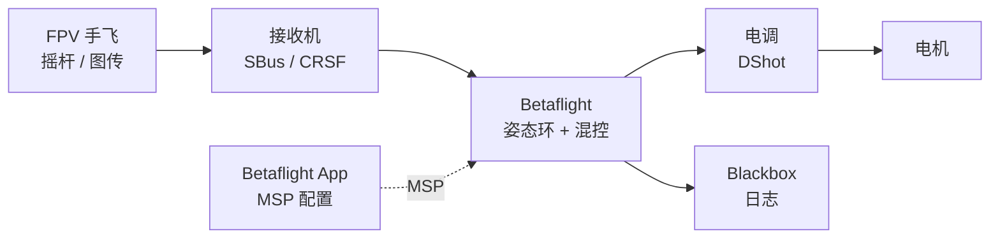

# Betaflight

**Betaflight**（[betaflight/betaflight](https://github.com/betaflight/betaflight)）是面向 **FPV 手飞、竞速与自由式** 的 **开源飞控固件**，优化摇杆跟踪与扰动响应；与 [PX4](./px4-autopilot.md) 的 **自主导航 / MAVLink / SITL** 属于多旋翼生态中的 **不同赛道**。

## 英文缩写速查

| 缩写 | 英文全称 | 简要说明 |
|------|----------|----------|
| FPV | First Person View | 第一人称视角图传飞行 |
| OSD | On-Screen Display | 叠加在图传画面上的飞行数据显示 |
| MSP | Multiwii Serial Protocol | Betaflight 与地面站/外设通信的串口协议族 |
| DShot | Digital Shot | 数字电调协议，低延迟、无需油门校准 |
| IMU | Inertial Measurement Unit | 惯性测量单元，提供加速度与角速度 |
| PID | Proportional–Integral–Derivative | 姿态/速率闭环控制律 |

## 为什么重要

- **FPV 事实标准之一**：全球竞速与自由式社区广泛采用；硬件 Partner 计划覆盖众多 STM32 飞控板。
- **性能导向固件设计**：强调内环延迟、滤波与 rate 曲线，而非任务规划或 Offboard API。
- **可观测性**：**Blackbox** 飞行日志与内置 **OSD** 便于调参与事故复盘；与 [gym-pybullet-drones](./gym-pybullet-drones.md) 中可选的 Betaflight 风格参数可对照理解真机 PID 行为。
- 在多旋翼栈中补齐 **「手飞 FPV 飞控层」**，避免与 PX4 混为同一工具链（见 [多旋翼栈总览](../overview/multirotor-simulation-planning-control-stack.md)）。

## 核心结构/机制

| 组件 | 说明 |
|------|------|
| **姿态 / 速率环** | 多模式（Acro/Angle 等）；飞行中可调 PID、rate profile 与滤波器滑块 |
| **电机输出** | DShot / Multishot / Oneshot 等数字或模拟 PWM 协议 |
| **接收机链路** | SBus、CRSF、PPM 等；内置 failsafe 与解锁安全检查 |
| **MSP** | 与 [Betaflight App](https://app.betaflight.com) 及外设通信；**非 MAVLink** |
| **Blackbox** | 记录陀螺仪、设定点、电机输出等到板载 Flash 或 SD |
| **OSD** | 电量、速度、高度、模式等叠加进模拟图传，无需独立 OSD 芯片固件 |
| **目标硬件** | STM32 F4/G4/F7/H7 等；由社区维护 `target` 配置 |

**版本节奏**（2025 起）：`YYYY.M.PATCH` 语义化版本，每年约 **6 月、12 月** 稳定发布；文档与 App 与固件版本对齐。

## 常见误区或局限

- **误区：Betaflight = PX4 的轻量版** — Betaflight 服务 **手飞 FPV** 与特技性能；**不提供** MAVLink Offboard、ROS 任务栈或工业级自主导航工作流。
- **误区：仿真里调 Betaflight 参数即可上 PX4 真机** — [gym-pybullet-drones](./gym-pybullet-drones.md) 的「Betaflight 风格」仅为 **近似参数**；与 PX4 SITL 观测/动作空间无关。
- **局限：研究向群体规划** — 多机避障、EGO-Planner 等输出需 **PX4 + MAVSDK** 等伴机栈，而非 Betaflight 原生对接。
- **局限：硬件支持** — 团队不生产飞控板；硬件故障应联系厂商（官方 README 明确说明）。

## 参考来源

- [sources/repos/betaflight.md](../../sources/repos/betaflight.md)
- [sources/sites/betaflight-com.md](../../sources/sites/betaflight-com.md)
- [betaflight/betaflight](https://github.com/betaflight/betaflight)
- [Betaflight 官方站](https://betaflight.com/)

## 关联页面

- [多旋翼仿真—规划—飞控栈总览](../overview/multirotor-simulation-planning-control-stack.md)
- [PX4 Autopilot](./px4-autopilot.md) — 自主飞控 / MAVLink 对照
- [gym-pybullet-drones](./gym-pybullet-drones.md) — RL 仿真与 Betaflight 风格参数
- [Crazyflie Firmware](./crazyflie-firmware.md) — 微四轴嵌入式栈对照

## 推荐继续阅读

- [Betaflight 文档 Wiki](https://betaflight.com/docs/wiki) — 安装、调参、Blackbox
- [Betaflight App](https://app.betaflight.com) — 固件刷写与配置
- [Betaflight 发布说明](https://www.betaflight.com/docs/category/release-notes) — 版本变更
