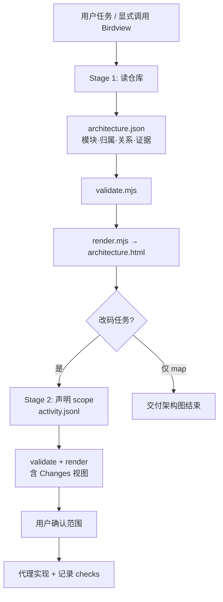
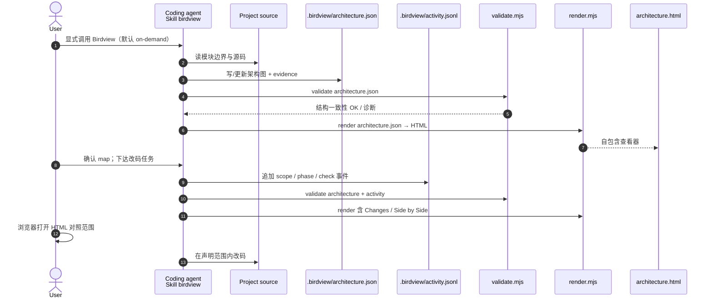

# Birdview

**Birdview**（[Qiuner/birdview](https://github.com/Qiuner/birdview)，MIT）是面向 Codex、Claude Code、DeepSeek Harness 等宿主的 **Agent Skill + Node 工具链**：代理在编辑源码前 **先理解并映射项目架构**，把模块职责、文件归属、关系与 **源码证据** 写入 `.birdview/architecture.json`；执行任务时再写 `activity.jsonl` 声明 **计划触达范围、进度与检查结果**，校验后渲染为 **浏览器可直接打开的 HTML**（无需部署服务）。项目页：[qiuner.github.io/birdview](https://qiuner.github.io/birdview/)。

## 一句话定义

把「代理认为系统长什么样、这次打算改哪里、依据哪些文件」编译成 **可校验、可浏览、可对照** 的架构图 — **改码前的范围门禁**，不是 diff 替代品，也不是自动观测代理行为的监控系统。

## 英文缩写速查

| 缩写 | 英文全称 | 简要说明 |
|------|----------|----------|
| Skill | Agent Skill | 可装载工作流规约（本仓 `SKILL.md` + `scripts/`） |
| JSON | JavaScript Object Notation | `architecture.json` 与 `activity.jsonl` 的数据格式 |
| HTML | HyperText Markup Language | 校验后生成的自包含架构查看器 |
| CLI | Command-Line Interface | `validate.mjs` / `render.mjs` / `birdview.mjs` |
| MIT | Massachusetts Institute of Technology License | 本仓开源协议 |

## 核心信息

| 字段 | 内容 |
|------|------|
| 作者 | Qiuner（独立维护） |
| 许可 | MIT |
| Stars（入库日） | ~483（GitHub，以克隆时为准） |
| 官方站 | [qiuner.github.io/birdview](https://qiuner.github.io/birdview/) |
| 开源状态 | **已开源** — 代码、Schema、示例与测试均在 GitHub；npm 包未公开发布，安装走 `npx skills add`；见 [项目页核查](../../sources/sites/birdview.md) |

## 为什么重要（对本知识库读者）

- **补「改之前」：** [Open Code Review](open-code-review.md) 与 git diff 擅长 **改之后** 的行级审查；[Superpowers](superpowers-obra.md) 的 brainstorming / writing-plans 是 **流程契约**。Birdview 把 **模块级变更范围 + 源码证据** 钉在一张可打开的图上，降低「代理搜到哪改到哪、漏模块或误伤邻域」的风险。
- **机器人栈多仓并行时的同构问题：** 仿真训练、策略部署、ROS2 驱动、数据集脚本常跨多个目录；在让 Cloud Agent 动 `wiki/`、`scripts/` 或 `docs/` 前，**先 map 再改** 与本站 `make ci-preflight` 的「派生文件同步」文化一致 — 范围错了，后面 CI 再绿也救不了架构误伤。
- **与 Archify / Graphify 分工：** [Archify](archify.md) 从描述生成 **类型化展示图**（architecture / workflow / sequence 等）；[Graphify](graphify.md) 偏 **知识图自动构图**。Birdview 从 **真实仓库** 归纳 **architecture.json** 并跟踪 **activity.jsonl** — 更贴近 **改码前 scope 声明**，而非对外路演幻灯片。
- **Architecture-first Coding 叙事：** 项目 slogan 把未来编程压缩为 **constraints + architecture**；与 [Agentic Coding 时代的软件工程基础](../concepts/agentic-coding-software-fundamentals.md) 中「人仍要用取舍语言 steer agent」同向 — Birdview 提供 **架构语境**，不替代人的架构判断。

## 核心结构

| 层次 | 内容 |
|------|------|
| **分发** | `npx skills add Qiuner/birdview --skill birdview`；各宿主 slash / `$birdview` 显式调用 |
| **Stage 1：Map** | 代理读源码 → 创建/更新 `architecture.json` → 模块链到 source evidence |
| **Stage 2：Change** | 同一图上标注计划模块/文件、当前步骤、验证记录 → `activity.jsonl` |
| **校验与渲染** | `validate.mjs` 检查 schema 与跨记录规则 → `render.mjs` 生成自包含 HTML |
| **模式** | 默认 **on-demand**；可选 **auto**（每次改码前强制 map）；`birdview.mjs mode` 写 `AGENTS.md` / `CLAUDE.md` |
| **查看器** | Architecture / Changes / Side by Side；模块详情、关系过滤、深浅主题、中英切换 |
| **实现** | TypeScript/JavaScript；`schemas/`、`scripts/`、`assets/` 查看器、`test/` 契约测试 |

### 流程总览

## 源码运行时序图

主仓 **已开源**（MIT）。下列时序对齐 README「How It Works」与 `scripts/validate.mjs` → `render.mjs` 路径；activity 为可选第二输入。

## 工程实践

| 场景 | 建议 |
|------|------|
| 维护本 wiki / 多目录 refactor | 新任务开头：`Use Birdview to show this project's architecture; do not edit code.` → 确认 `.birdview/` 与 HTML 再让 agent 改 `wiki/` |
| 与 Superpowers 并用 | 设计确认（brainstorming）后、writing-plans 前插入 **Birdview map**，把计划文件列表与 architecture 模块对齐 |
| 与 OCR 并用 | Birdview **改前 scope** → 实现 → `ocr review` **改后行级评审**；二者不互替 |
| 小 fix 是否启用 | 默认 **on-demand** — 一行 typo 不必每次 map；跨模块或 unfamiliar 仓开 **auto** 或显式调用 |
| 自检安装 | `node <skill-root>/scripts/birdview.mjs doctor`（检查 Skill 安装，不保证宿主已激活） |
| 仅已有 JSON | `node scripts/validate.mjs .birdview/architecture.json` → `node scripts/render.mjs ...` |

## 局限与风险

- **代理声明，非 ground truth：** 校验保证 JSON 结构与跨记录规则；**不证明** 架构划分正确或 evidence 文件存在 — 人仍需 spot-check 模块边界。
- **不自动观测：** v0.1 无 live hook；activity 是代理 **自述**，不能替代 git log、CI 或 IDE 遥测。
- **刷新成本：** 每次更新须重新 render 并 **手动刷新浏览器**；无 WebSocket 自动同步。
- **确认是 agent 引导：** HTML 不写锁仓库；material scope 变化应重新确认 — 别把「看过一次图」当成永久批准。
- **npm 未公开发布：** 依赖 `skills` CLI 从 GitHub 安装；企业离线环境需自行 mirror 仓。
- **领域重心非机器人：** 通用编码代理工具；具身栈知识仍在本站 `wiki/tasks/`、`wiki/methods/` — Birdview 只服务 **改码前的架构可见性**。

## 关联页面

- [Archify](archify.md) — 描述驱动的可校验系统图
- [Open Code Review](open-code-review.md) — 改后 diff 级评审 CLI
- [Superpowers（obra）](superpowers-obra.md) — 交付流程 skills
- [LearnPrompt](learnprompt.md) — 中文 Agent / Skills 教程生态
- [Graphify](graphify.md) — 自动知识图构图
- [Agentic Coding 时代的软件工程基础](../concepts/agentic-coding-software-fundamentals.md) — 取舍语言框架
- [LLM Wiki（Karpathy 模式）](../references/llm-wiki-karpathy.md) — 本库维护范式
- [Ingest Workflow](../../schema/ingest-workflow.md) — 维护规范

## 参考来源

- [Birdview 仓库源归档（本站）](../../sources/repos/birdview.md)
- [Birdview 项目页源归档（本站）](../../sources/sites/birdview.md)
- [Qiuner/birdview（GitHub）](https://github.com/Qiuner/birdview)
- [qiuner.github.io/birdview](https://qiuner.github.io/birdview/)

## 推荐继续阅读

- [Birdview contract（数据契约）](https://github.com/Qiuner/birdview/blob/main/references/contract.md) — 字段语义与不变量
- [Stage 1: Map a project](https://github.com/Qiuner/birdview/blob/main/references/map-project.md) — 首次建图工作流
- [Stage 2: Show changes](https://github.com/Qiuner/birdview/blob/main/references/show-changes.md) — 变更 scope 与 activity 记录
- [LearnPrompt · 第一个 SKILL.md](https://www.learnprompt.pro/agent-skills/first-skill-md/) — Skill 文件结构中文导读
