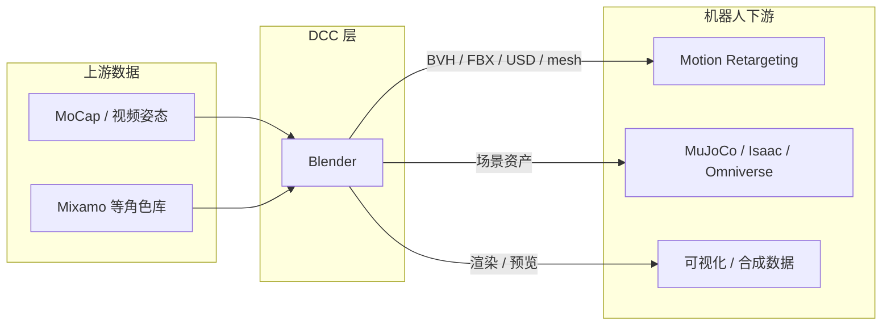

# Blender（开源 3D 创作套件）

**Blender** 是由 **Blender Foundation** 维护的 **免费开源 3D 创作套件**，覆盖建模、雕刻、UV、绑定、动画、物理模拟、路径追踪渲染、合成、运动跟踪与视频编辑。在机器人研究与工程中，它 rarely 充当 RL 闭环仿真器，却频繁出现在 **资产创作、动捕后处理、场景可视化与 DCC→仿真格式交换** 链路上——与 [MuJoCo](./mujoco.md) / [Isaac Lab](./isaac-gym-isaac-lab.md) 等「训练后端」形成互补。

## 英文缩写速查

| 缩写 | 英文全称 | 简要说明 |
|------|----------|----------|
| DCC | Digital Content Creation | 数字内容创作软件（建模/动画/渲染工具总称） |
| GPL | GNU General Public License | Blender 整体采用的 copyleft 开源许可 |
| USD | Universal Scene Description | 皮克斯开源场景描述格式，Omniverse 等栈的交换层 |
| BVH | Biovision Hierarchy | 常用骨骼动画交换格式，动捕→DCC→重定向常见中间件 |
| MoCap | Motion Capture | 动作捕捉；Blender 常作轨迹检视与曲线编辑 |
| VFX | Visual Effects | 视觉特效；含相机/物体跟踪与实拍合成 |

## 为什么对机器人栈重要

1. **资产与场景 authoring**：机器人仿真需要 mesh、材质、灯光、相机与布局；Blender 是 **零许可成本** 的全功能 DCC，可导出 FBX/OBJ/glTF/USD 等供 [NVIDIA Omniverse](./nvidia-omniverse.md)、自定义渲染或 **NeRF/3DGS** 数据合成使用。室内场景生成（如 [HomeWorld](./paper-homeworld-whole-home-scene-generation.md)）中亦常见 **Blender unfurnished shell** 作显式 3D 约束。
2. **动画与重定向上游**：[Motion Retargeting](../concepts/motion-retargeting.md) 链路里，人体/角色动作常在 DCC 中 **检视、剪辑、绑定与曲线平滑** 后再导出；[SAM3DBody-cpp](./sam3dbody-cpp.md) 等提供 **BVH + Blender/MakeHuman 插件**，把单目姿态估计接入 DCC。
3. **插件宿主与远程求解**：高保真离线物理（如 [ppf-contact-solver](./ppf-contact-solver.md)）通过 **Blender 5+ 插件** 在本地 DCC 调远程 GPU 求解器——典型「图形学精度仿真 + 艺术家工作流」组合。
4. **Python 脚本层**：界面、批渲染、网格处理均可脚本化，适合 **合成数据集、相机轨迹批量导出、可视化 pipeline**，而不必绑定某一商业 DCC。

## 核心能力分区（与机器人管线的映射）

| Blender 模块 | 机器人相关用法 |
|--------------|----------------|
| **建模 / Geometry Nodes** | 程序化场景与道具；研究原型中的快速 mesh 迭代 |
| **绑定 & 动画** | 骨骼 rig、动作剪辑；BVH/FBX 导出供重定向或预览 |
| **VFX 跟踪** | 实拍相机轨迹重建；AR/数字孪生素材对齐 |
| **Cycles 渲染** | 高保真 RGB/深度合成数据（需自行对齐传感器模型） |
| **Python API / Add-ons** | 定制导入导出、批量处理、连接外部求解器或 MCP 驱动 |

## 在知识库生态中的位置

- **与商业 DCC 对照**：[Mixamo](./mixamo.md) 提供 **在线角色与动作库**；Blender 提供 **本地全流程编辑与 GPL 源码**——科研复现与插件二次开发通常偏向后者。
- **与仿真底座对照**：[NVIDIA Omniverse](./nvidia-omniverse.md) 强调 **USD 协作 + GPU 物理**；Blender 强调 **authoring + 动画**——Omniverse 文档亦将 Blender 列为常见 USD 来源之一。
- **与专用机器人编辑器对照**：[机器人关键帧与运动编辑工具](./robot-motion-keyframe-editors.md) 绑定 **URDF/MJCF/CSV/NPZ**；Blender 绑定 **通用网格与骨骼**——二者常在 pipeline 中 **串联** 而非互斥。

## 常见误区或局限

- **不是 RL 训练仿真器**：Blender 内置物理与游戏引擎级实时性不足以替代 [MuJoCo](./mujoco.md) / Isaac 的 **千赫兹级控制环**；宜作 **资产与动画层**，不宜直接当策略训练环境（除非极简化验证）。
- **单位与坐标系**：导出到 URDF/MJCF 时需显式处理 **轴系、缩放与关节零位**；与 [Motion Retargeting Pipeline](../concepts/motion-retargeting-pipeline.md) 中的几何一致化步骤不可省略。
- **许可边界**：Blender 本体 GPL；**社区 add-on** 与 **导出资产** 许可各自独立——集成进开源数据集或商业产品时需逐件核对。

## 关联页面

- [NVIDIA Omniverse（USD 协作仿真底座）](./nvidia-omniverse.md)
- [Mixamo（Adobe 在线角色与动画）](./mixamo.md)
- [ppf-contact-solver（Blender 远程 GPU 仿真插件）](./ppf-contact-solver.md)
- [SAM3DBody-cpp（BVH 导出与 Blender 插件）](./sam3dbody-cpp.md)
- [MotionCode（产业侧运动数据供应商）](./motioncode.md)
- [机器人关键帧与运动编辑工具](./robot-motion-keyframe-editors.md)
- [Motion Retargeting](../concepts/motion-retargeting.md)
- [Character Animation vs Robotics](../concepts/character-animation-vs-robotics.md)
- [HomeWorld 全屋场景生成论文实体](./paper-homeworld-whole-home-scene-generation.md)

## 参考来源

- [Blender 官网归档](../../sources/sites/blender-org.md)
- [Blender 官方源码仓库归档](../../sources/repos/blender.md)
- [Blender 用户手册](https://docs.blender.org/manual/en/latest/index.html)
- [Blender 开发者文档](https://developer.blender.org/docs/)

## 推荐继续阅读

- [Blender 官网 — 产品与社区](https://www.blender.org/)
- [Building Blender（构建手册）](https://developer.blender.org/docs/handbook/building_blender/)
- [OpenUSD 官方文档](https://openusd.org/) — 与 Omniverse/Isaac 资产交换对照
