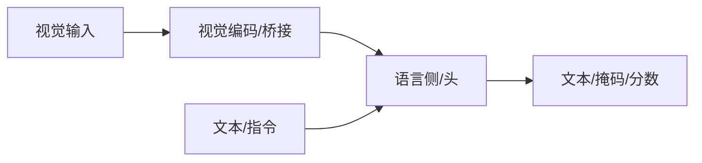

# BLIP

## 一句话定义

BLIP 统一理解与生成的图文预训练：通过自举过滤噪声网图，并联合对比、匹配与语言模型目标，为后续 BLIP-2 奠基。

## 英文缩写速查

| 缩写 | 英文全称 | 简要说明 |
|------|----------|----------|
| BLIP | Bootstrapping Language-Image Pre-training | 自举图文预训练 |
| ITC | Image-Text Contrastive | 对比目标 |
| ITM | Image-Text Matching | 匹配目标 |
| LM | Language Modeling | 生成目标 |
| CapFilt | Captioning & Filtering | 自举清洗 |

## 为什么重要

- 课程第 5–6 章多模态主线节点；与机器人 VLM/VLA 选型直接相关。
- 理解其输入输出接口，才能正确接到检测、分割或策略模块。

## 核心原理

多任务预训练 + 噪声网页数据的 caption 过滤自举，得到更干净的有效监督。

## 工程实践

| 项 | 建议 |
|----|------|
| 权重 | 优先官方或 Hugging Face 发布 |
| 微调 | 指令数据质量优先；可用 LoRA |
| 机器人 | 明确延迟预算；重模型可云端核验 |

## 局限与风险

幻觉、错误 grounding、许可与安全过滤必须单独评估；开源状态以项目页为准，部署前核查权重协议。

## 关联页面

- [多模态基础](../concepts/multimodality-basics.md)
- [多模态 LLM 路线](../overview/multimodal-llm-development.md)
- [BLIP-2](./paper-blip2.md)
- [Transformer CV 课程策展](../entities/transformer-cv-curriculum.md)

## 参考来源

- [Transformer 视觉应用课程大纲](../../sources/courses/transformer_cv_applications_syllabus.md)

## 推荐继续阅读

- [论文 / 项目](https://arxiv.org/abs/2201.12086)
