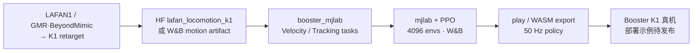
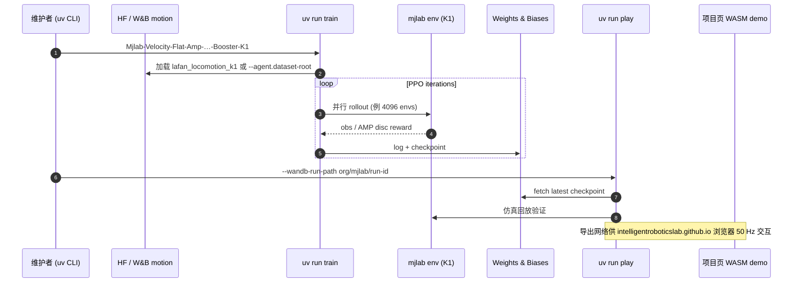

# booster_mjlab（Booster K1 × mjlab）

**booster_mjlab** 是由 [whIRLwind Amsterdam](https://whirlwind.team/)（Intelligent Robotics Lab）维护的开源项目，在 **[mjlab](./mjlab.md)** 上为 **Booster K1** 提供机器人模型、速度跟踪与 motion tracking 任务，以及基于 **Adversarial Motion Priors（AMP）** 的自然步态训练管线。

## 英文缩写速查

| 缩写 | 英文全称 | 简要说明 |
|------|----------|----------|
| AMP | Adversarial Motion Prior | 用对抗判别约束状态转移接近专家运动分布的先验 |
| MJLab | MuJoCo + Isaac Lab API | mujocolab 的 GPU 加速 RL 框架 |
| RL | Reinforcement Learning | 通过与环境交互最大化长期回报来学习策略的范式 |
| DA | Data Augmentation | 本仓指左右对称镜像增广（任务名 `-DA-`） |
| W&B | Weights & Biases | 实验日志、checkpoint 与 motion artifact 托管 |
| WASM | WebAssembly | 项目页浏览器内 MuJoCo 实时策略 demo 的运行载体 |
| Sim2Real | Simulation to Real | 把仿真中学到的策略迁移落地真机的工程主线 |
| LAFAN1 | LaFAN1 Animation Dataset | Ubisoft 人体 locomotion 数据集，经重定向供 K1 AMP 使用 |
| ONNX | Open Neural Network Exchange | 跨框架神经网络模型交换格式（导出路径随 mjlab 生态） |

## 为什么重要？

- **K1 的 mjlab 主线：** 加速进化官方 [`booster_gym`](../../sources/repos/booster_gym.md) 基于 Isaac Gym；本仓代表 **MuJoCo Warp / mjlab** 上与 [unitree_rl_mjlab](./unitree-rl-mjlab.md) 同代的 Booster 侧训练入口。
- **AMP + 足球场景验证：** whIRLwind 在 RoboCup 2026 Humanoid Soccer 获第 4 名；AMP velocity 策略已在 **真机 K1**（约 30k 步）与 **浏览器 WASM** 双端展示。
- **motion 工程闭环：** 默认 [LAFAN1→K1 parallel-ankle 数据集](https://huggingface.co/datasets/whirlwind-ams/lafan_locomotion_k1) + `visualize-motions` 浏览器编辑 + W&B artifact 跟踪 imitation 任务，降低「换参考动作 → 重训」成本。

## 流程总览

## 核心机制

| 任务族 | 代表 task id | 说明 |
|--------|--------------|------|
| **Velocity + AMP** | `Mjlab-Velocity-Flat-Amp-DA-Muon-Booster-K1` | 平地速度指令 + AMP 风格；可选 `-Rough-`、去 `-DA-`、Adam 变体（去 `Muon`） |
| **Motion tracking** | `Mjlab-Tracking-Flat-Booster-K1` | 跟踪 W&B 注册的 GMR `.pkl` 或 BeyondMimic `.csv` 转换 motion |
| **踝模型** | `-Parallel` 后缀 | 使用 K1 **parallel-linkage ankle** 模型（与默认任务区分） |
| **优化器实验** | `-Muon-` | Actor/Critic 权重矩阵用 [Muon optimizer](https://kellerjordan.github.io/posts/muon/)（Jordan et al., 2024） |

奖励设计上，README 强调 velocity reward **与 AMP 参考 motion 联合调参**，避免纯跟踪速度而牺牲步态自然度。

## 源码运行时序图

关键复现路径：`git clone` → `uv run list_envs` → 默认 AMP velocity 训练命令 → `play` 拉 W&B checkpoint；自定义 motion 走 `--agent.dataset-root` 或 tracking 任务的 `--registry-name`。

## 工程实践

| 维度 | 记录 |
|------|------|
| 安装 | `uv` + `git clone`；`uv run list_envs` 同步依赖 |
| 算力 | **NVIDIA GPU** 训练；macOS 仅 evaluation |
| 默认数据 | [whirlwind-ams/lafan_locomotion_k1](https://huggingface.co/datasets/whirlwind-ams/lafan_locomotion_k1) |
| Motion 准备 | tracking 见仓内 `docs/motion_preparation.md`（GMR pkl / BeyondMimic csv → W&B） |
| 可视化 | `uv run visualize-motions` 浏览器浏览编辑 clip |
| 开源状态 | **训练 / 仿真 / 数据：已开源**；**真机 deploy 示例：待发布**（README 2026-09-21） |
| 真机证据 | 项目页视频：30k 步 AMP velocity 在 K1 上行走；部署代码未随仓发布 |

## 局限与风险

- **部署缺口：** 与 [unitree_rl_mjlab](./unitree-rl-mjlab.md) 的 ONNX→C++ 官方链路不同，截至入库日 **无仓库内真机 deploy 脚本**，复现者需自行对接 Booster SDK / [booster_deploy](../../sources/repos/booster_deploy.md) 等运行时。
- **硬件绑定 K1：** parallel-ankle 模型与 Booster 关节拓扑强绑定；换 T1 或其它人形须改 asset / retarget，不能照搬 task id。
- **W&B 依赖：** checkpoint 与 motion artifact 流程默认 W&B；离线团队需自行改存储或导出本地权重。
- **生态年轻：** ~29★（2026-09-21），API 与 task 命名可能随 whIRLwind 赛季迭代。

## 与相邻路线对比

| 路线 | 仿真 | 目标硬件 | AMP | 部署 |
|------|------|----------|-----|------|
| **booster_mjlab** | mjlab | Booster K1 | ✅ LAFAN1 retarget | 待发布 |
| [unitree_rl_mjlab](./unitree-rl-mjlab.md) | mjlab | Unitree 多机型 | 部分任务 | ONNX→C++ 官方 |
| [AMP_mjlab](./amp-mjlab.md) | mjlab | Unitree G1 | ✅ walk+recovery 统一 | wbc_fsm 社区 |
| [htwk-gym](../methods/htwk-gym.md) | Isaac Gym | Booster T1/K1 足球 | 非核心 | TFLite 量化部署 |
| [mjlab_playground](./mjlab-playground.md) | mjlab | Go1 / Booster T1 等 | 无 | 示例级 |

## 结论

**booster_mjlab 把 Booster K1 接进 mjlab AMP 生态，价值在「足球强队验证过的 K1 locomotion 管线 + 可浏览器试玩的导出策略」，而非完整 Sim2Real 工具链。**

- 若目标是在 **mjlab** 上训 K1 自然步态并复用 LAFAN1 类参考，本仓是截至 2026-09 最直接的公开入口。
- 真机落地前须预留 **自研 deploy 层** 或等待官方 deployment 示例合入。
- 与 [AMP_mjlab](./amp-mjlab.md) 对照阅读：G1 社区 AMP 偏 walk+recovery 统一；本仓偏 **K1 + 足球场景 velocity AMP + motion tracking 特技**。

## 关联页面

- [mjlab](./mjlab.md) — 底层 manager-based + MuJoCo Warp 框架
- [AMP_mjlab](./amp-mjlab.md) — Unitree G1 社区 AMP 实现对照
- [humanoid-soccer](../tasks/humanoid-soccer.md) — whIRLwind 足球主线
- [htwk-gym](../methods/htwk-gym.md) — 另一 Booster K1 足球 RL 框架（Isaac Gym）
- [motion-retargeting](../concepts/motion-retargeting.md) — LAFAN1→K1 参考 motion 前提

## 参考来源

- [sources/repos/booster_mjlab.md](../../sources/repos/booster_mjlab.md)
- [sources/sites/booster_mjlab-github-io.md](../../sources/sites/booster_mjlab-github-io.md)
- [IntelligentRoboticsLab/booster_mjlab GitHub](https://github.com/IntelligentRoboticsLab/booster_mjlab)
- [booster_mjlab 项目页](https://intelligentroboticslab.github.io/booster_mjlab/)

## 推荐继续阅读

- [whIRLwind 团队主页](https://whirlwind.team/) — RoboCup Humanoid Soccer 赛季与招募
- [whirlwind-ams/lafan_locomotion_k1 数据集](https://huggingface.co/datasets/whirlwind-ams/lafan_locomotion_k1) — 默认 AMP locomotion 参考
