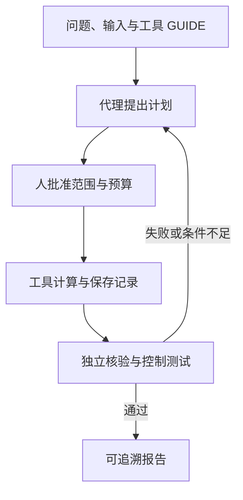

# BootLoops：可核验的精确科学计算工具箱

**BootLoops 1.0** 是 Matthew D. Schwartz 维护、模型无关的科学计算 harness：让代理调用有文档、误差口径和验收测试的工具，生成能独立检查的计算结果。

## 英文缩写速查

| 缩写 | 英文全称 | 简要说明 |
|------|----------|----------|
| LLM | Large Language Model | 读取工具指南、提出计划并调用工具的模型 |
| ODE | Ordinary Differential Equation | 工具中的常微分方程与解析延拓对象 |
| CLI | Command-Line Interface | 工具及自检的命令行入口 |
| GPL | GNU General Public License | 部分文件及外部引擎的独立许可 |

## 为什么重要

有更多有效数字不代表有误差保证；通过一个参考例不代表算法适用所有输入。BootLoops 把工具能力、验收标准与来源记录放在一起，适合作为可验证科研软件的工程参照，而不是直接替代机器人训练框架。

## 核心原理

核查版本固定为 **66b680ce742e654cfe86da4f072a69061fe182b1**。主仓含 49 个 tools 包、自有引擎、配方与资源准入工具。每包 GUIDE 声明用途与门禁；独立路线、未参与拟合的检查点、能被故意错误触发的控制测试，用来避免同一计算同时生成和“证明”自己的结果。

| 组件示例 | 职责 | 读者应看什么 |
|------------|------|---------------|
| baller | 球算术及精度纪律 | 包围区间如何传播、哪些环节受保证 |
| gatekeeper | 数据完整性与留出核验 | 拟合数据和验证数据是否隔离 |
| emitall | 报告数字从记录重新生成 | 文字中的数字是否对应可复跑记录 |
| longhand | 独立数值计算路线 | 与主算法的依赖是否真正不同 |
| run_selftests.py | 按 BATTERIES.json 调度各包测试 | PASS、REFUSED、FAIL 与缺失依赖 |

### 验证闭环



这里描述推荐使用流程，不是主仓内置统一 agent 服务的运行架构。

## 工程实践

先读 [固定版本 README](https://github.com/BootLoops-ai/bootloops/blob/66b680ce742e654cfe86da4f072a69061fe182b1/README.md) 与工具 GUIDE；安装示例见 [来源归档](../../sources/repos/bootloops.md)。Python 3.12 为主，部分包依赖 Julia 和独立外部引擎。

```bash
# 在已安装依赖的固定版本仓库中运行
python3 run_selftests.py --par 8
# 仅核验指定包，避免直接启动所有重计算
python3 run_selftests.py mixalot eras
```

工具索引的四类状态必须区分：selftest 可冷启动核验；partial 只有部分腿可执行；smoke 仅示例/拒绝路径等检查；data-gated 缺数据时按设计拒绝。REFUSED 不是完整功能通过，缺引擎的 skip 也不能用于支持结果声明。

**对机器人软件的迁移建议：** 把“接触求解器输出”“离线辨识结果”“训练统计摘要”各自配上独立对照、失败控制和可重算数字记录。这是验证方法的迁移，不意味着物理积分工具能直接训练 PPO 或 VLA。

## 局限与风险

- **开放边界：** 主仓通用工具与自有引擎已发布；skills、JaCKandJill 和 Kira/Blade/AMFlow.cpp forks 在独立仓。逐问题代码在官网，本次未成功读取官网，不能保证所有文章成果都能从此 commit 复现。
- **许可不统一：** 主体 MIT、文字/图 CC BY 4.0；部分文件与外部引擎仍有各自 GPL 等许可。
- **输入可能执行代码：** 第三方 JSON/YAML/pickle 等不能当作无害数据；验收证书不是沙箱，先审查或隔离运行。
- **不是 Anthropic 官方产品：** 由 Schwartz 维护；在线模型、外部数据、引擎和算力另行配置。
- **未实跑上游工具：** 本次核查公开源码文档和入口，不声称验证了所有计算包，也不将其用于真实机器人安全认证。

## 关联页面

- [Claude-shaped science](./claude-shaped-science.md)：选题与领域专家分工。
- [AI Auto-Research](../concepts/ai-auto-research.md)：科研自动化生命周期。
- [ScienceDiscovery](./sciencediscovery.md)：带沙箱与来源治理的科研工作台，与工具箱定位不同。

## 参考来源

- [BootLoops 固定版本仓库归档](../../sources/repos/bootloops.md)
- [客座研究文章归档](../../sources/sites/anthropic-claude-shaped-science.md)

## 推荐继续阅读

- [固定版本工具索引](https://github.com/BootLoops-ai/bootloops/blob/66b680ce742e654cfe86da4f072a69061fe182b1/tools/README.md)
- [安装与验证说明](https://github.com/BootLoops-ai/bootloops/blob/66b680ce742e654cfe86da4f072a69061fe182b1/INSTALL.md)
