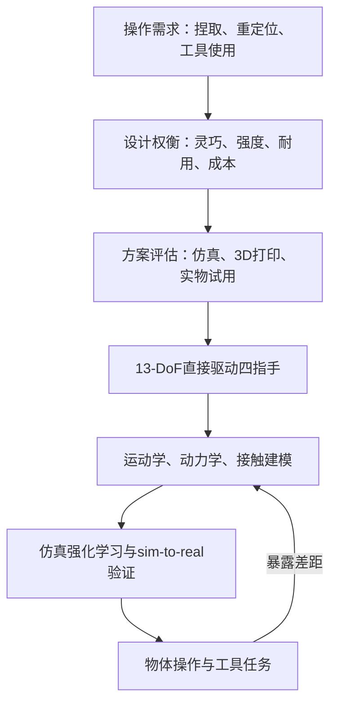

# Boston Dynamics Atlas 13-DoF 灵巧手

**Boston Dynamics Atlas 13-DoF 灵巧手**是新一代 Atlas 面向实物工作的末端操作器：通过四指布局、直接驱动和可回驱交互支持捏取、三点抓握、物体重定位与工具操作，并将仿真保真度、鲁棒性和量产维护纳入同一设计问题。

## 英文缩写速查

| 缩写 | 英文全称 | 简要说明 |
|------|----------|----------|
| DoF | Degrees of Freedom | 描述手部可独立控制的关节自由度 |
| RL | Reinforcement Learning | 通过与环境交互学习任务策略的范式 |
| sim-to-real | Simulation to Reality | 将仿真中学得的行为迁移到真实机器人 |
| CAD | Computer-Aided Design | 机械结构设计文件；本文未提供手部 CAD |

## 为什么重要

人形手并非自由度越多或越像人就越适合机器人工作。灵巧性、力量、耐久、成本、可维修性和感知能力彼此牵制；手部形态还影响工具使用、演示迁移、仿真可信度和接触策略能否泛化。Atlas 手的设计叙事将末端执行器视为整个机器人学习系统的一部分，而不是孤立的机械夹爪。

## 核心原理

### 四指结构与任务能力

官方介绍的新一代 Atlas 手具有 **13 DoF、直接驱动、四指布局**。视频及文章举例包括精细捏取、三点抓持、重定位物体，以及握持工具并操作触发器。相较上一代展示的 7 DoF，增加自由度的目的在于支持更细致的物体操作，而非单纯增加关节数。

团队选择不加入小指。官方给出的理由是增加小指会额外引入三个自由度和执行器，带来体积、功耗与系统复杂度；当前任务中新增的操作收益不足以抵销这些代价。这是具体工程取舍，不意味着四指手对所有手内操作或装配任务都更优。

### 直接驱动、可回驱与接触

文章将可回驱性与力/运动透明性联系起来：环境施加到手指上的力能体现在机器人本体感觉中，手指施加给环境的运动也能更直接地参与物理交互。发生碰撞时，关节可以顺应外力并让位，帮助减小高摩擦或高惯量对传动机构的冲击。该属性因此同时服务操作性能和机械鲁棒性。

### 仿真与 sim-to-real

官方将仿真匹配分成三个层次：

| 仿真层次 | 需表达的因素 | 对操作的影响 |
|-----------|--------------|--------------|
| 运动学 | 手部几何、连杆和关节 | 决定可达姿态与接触位置 |
| 动力学 | 摩擦、输出力矩、回差 | 决定动作和执行器响应 |
| 接触动力学 | 手与物体/环境交互 | 决定抓稳、滑移、重定位及工具操作是否可信 |

因此，可仿真不等于“有一份几何模型”：执行器响应和接触行为若与真机差异很大，策略仍可能在部署时失效。官方将该手的设计与 sim-to-real RL 联系起来，但文章未披露具体策略架构、仿真配置或训练细节。

## 流程总览

下图归纳官方设计叙述，不表示已经公开的可执行软件流水线。

## 工程实践

- **任务先于自由度：** 用捏取、三点抓握、物体重定位和工具触发等动作验证设计收益，不以关节数作为单一指标。
- **分层校准仿真：** 依次核对几何/运动学、执行器动力学与手–物接触；只匹配外形不足以支撑 sim-to-real。
- **把维修和碰撞风险纳入机构决策：** 可回驱顺应有助于接触响应，但其效果仍需结合真实载荷、寿命和维护数据评估。
- **区分演示和基准：** 视频说明目标行为，不等同于统计评测或对照实验。

## 局限与风险

- 文章是厂商官方博客，没有公开量化基准、成功率、误差、消融或独立复现实验。
- 规格和设计解释来自该篇官方介绍；未给出完整数据手册、传感器规格、控制频率、负载测试条件或寿命数据。
- 文章没有列出手部 CAD、仿真资产、训练代码或数据集链接；因此该节点记录为公开设计介绍，而非可直接复现的开源手部平台。
- 四指布局与不采用小指是特定的工程权衡；对于需要更多接触面或复杂手内操作的工作负载，应重新验证自由度收益。

## 关联页面

- [Boston Dynamics](./boston-dynamics.md) — Atlas 所属公司与产品背景。
- [Allegro Hand](./allegro-hand.md) — 可对照的四指科研灵巧手平台。
- [机器人操作任务](../tasks/manipulation.md) — 操作任务的能力与挑战。
- [Sim2Real](../concepts/sim2real.md) — 仿真到真机迁移。

## 参考来源

- [Robot Hands for Modern AI and Real Work（Boston Dynamics 官方博客）](../../sources/blogs/boston_dynamics_robot_hands_modern_ai_real_work.md)

## 推荐继续阅读

- [Boston Dynamics Atlas 产品页](https://bostondynamics.com/atlas/) — Atlas 平台官方信息。
