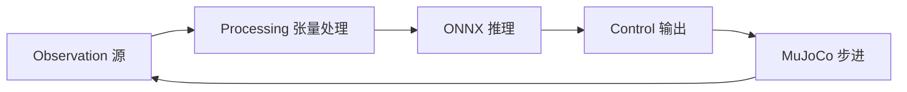

# BotLab / MotionCanvas（浏览器内策略–仿真编排）

**BotLab** 是 [地瓜机器人（D-Robotics）](https://www.d-robotics.cc/) 提供的 **Web 端机器人学习与控制实验台**；应用壳层标题为 **MotionCanvas**（与学术界的「MotionCanvas」视频生成项目同名但主体不同）。它在浏览器中把 **观测构造 → 张量处理 → ONNX 推理 → 低层控制/力矩 → MuJoCo 物理步进** 连成可编辑的 **有向节点图**，适合作为 Isaac / RL 训练管线之外的 **轻量对照与可视化沙盒**。

## 为什么重要

- **对齐训练侧 obs 语义**：历史缓冲节点显式支持 **IsaacGym** 与 **IsaacLab** 两种堆叠约定，减少「仿真里能跑、图上维度对不上」的低级错误。
- **推理–物理同步可配置**：**Strict** 与 **Pipelined（Fast）** 两种模式对应「每步必等推理完成」与「仿真不阻塞、始终施加最新可用动作」，是端侧 sim 与异步推理讨论里的常见分歧点。
- **端云协同入口**：与地瓜 **RDK** 硬件/社区同一品牌脉络，可作为具身智能教学中「从策略文件到可交互仿真」的零安装跳板（仍受浏览器 WebGL2 / WebGPU 能力约束）。

## 核心结构 / 机制

1. **五类侧边栏分区**：Observation、Processing、Inference、Control、Visualization（另有 Templates、Scene Settings）。
2. **ONNX Runtime 在浏览器**：通过 **WASM** 与 **WebGPU** 执行提供方；WebGPU 不可用时自动回退 WASM。模型节点可打开 **Netron** 风格图预览。
3. **MuJoCo 在 WebGL2 中运行**：支持跟随/锁定相机、视觉/碰撞几何体图层切换；画布规则限制 **仅一个** MuJoCo 仿真节点。
4. **MSCP**：节点图可 **导出 / 导入 MSCP**（文档化格式名以前端文案为准），用于保存可复现的管线拓扑。
5. **面向 Unitree 的内置示例链**：公开资源中出现 **G1** 相关 WBC / AMP / MJAMP 与 **Go2** policy 的 ONNX 文件名与 obs 维度标签（如 `G1 WBC obs[439]`、`Go2 obs+history[270]` 等），用于一键模板而非保证与官方 SDK 版本逐字节一致。

### 流程总览（主干数据流）

## 常见误区或局限

- **不是训练框架**：它侧重 **已有 ONNX（及浏览器内 MuJoCo 场景）** 的编排与调试，大规模分布式 RL 仍应回到 [Isaac Gym / Isaac Lab](./isaac-gym-isaac-lab.md)、[mjlab](./mjlab.md)、[robot_lab](./robot-lab.md) 等训练栈。
- **浏览器能力边界**：WebGL2 / WebGPU、WASM 内存与实时性都会限制可承载的模型规模与并行度；复杂场景仍建议原生或云端仿真。
- **名称碰撞**：检索「MotionCanvas」时需区分 **本站点产品** 与 **图像/视频生成** 方向的同名研究项目。

## 与其他页面的关系

- 物理步进核心依赖 [MuJoCo](./mujoco.md) 与 Web 仿真栈。
- 与 [Isaac Gym / Isaac Lab](./isaac-gym-isaac-lab.md) 通过 **history stack 语义** 与常见 RL obs 设计形成互证。
- 与 [Unitree G1](./unitree-g1.md)、[四足机器人](./quadruped-robot.md)（Go2）策略文件名与 obs 维度在模板中强相关。
- [Sim2Real](../concepts/sim2real.md) 讨论中，可把本工具视为 **策略侧快速可视化** 的一环，而非系统辨识或域随机化的主战场。

## 推荐继续阅读

- [Unitree RL × mjlab](./unitree-rl-mjlab.md) — 官方 GPU RL + MuJoCo 训练主线，可与浏览器沙盒对照。
- [wbc_fsm](./wbc-fsm.md) — G1 上 C++ FSM + ONNX 部署参考，理解从图编排到真机周期的 gap。

## 参考来源

- [sources/sites/botlab_motioncanvas.md](../../sources/sites/botlab_motioncanvas.md)
- [BotLab 官方站点](https://botlab.d-robotics.cc/)
- [地瓜机器人开发者社区](https://www.d-robotics.cc/)
