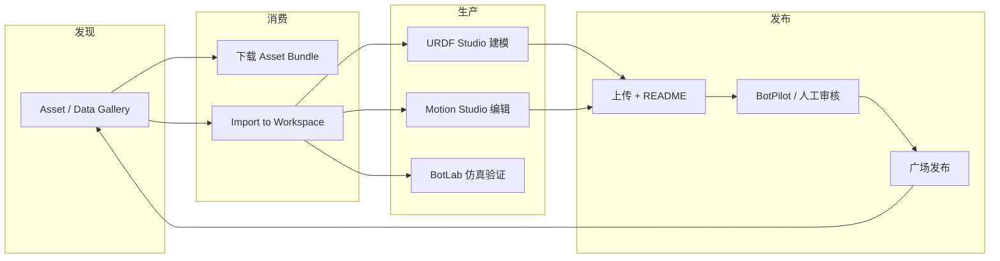

# BotWorld（机器人资产平台）

**BotWorld**（<https://botworld.enkeebot.com/>）是 **EnkeeBot** 运营的 **机器人资产社区与分发平台**：把 **URDF/MJCF/SDF 等模型**、**动捕/遥操/VLA/RL 轨迹等数据资产** 以及 **技能、场景、案例** 组织成可检索广场，支持 **上传—审核—发布—下载—导入工作区** 闭环；并作为 **URDF Studio、Motion Studio、BotLab** 的统一 Web 入口，串联 [step2urdf](./step2urdf.md)、[Motrix](./motrix.md) Viewer、[BridgeDP Engine](https://engine.bridgedp.com/) 等周边工具。

## 英文缩写速查

| 缩写 | 英文全称 | 简要说明 |
|------|----------|----------|
| URDF | Unified Robot Description Format | ROS 生态统一的机器人连杆/关节描述格式 |
| MJCF | MuJoCo XML Format | MuJoCo 模型与场景描述格式 |
| SDF | Simulation Description Format | Gazebo/仿真器常用场景描述格式 |
| VLA | Vision-Language-Action | 视觉–语言–动作多模态策略/数据范式 |
| RL | Reinforcement Learning | 通过与环境交互学习控制策略的范式 |
| SSO | Single Sign-On | 单点登录；平台支持 D-Robotics 账号体系 |

## 为什么重要

- **资产层缺口：** 机器人研究与工程长期缺的不是「又一个仿真器」，而是 **可发现、可版本化、可复用的模型与数据包**。BotWorld 把 GitHub 式分散仓库压缩成 **带 README、缩略图、分类标签与审核状态** 的广场形态。
- **工具链聚合：** 同一域名下挂 **建模（URDF Studio）→ 动作编辑（Motion Studio）→ 轻量仿真（BotLab）→ 真机 OMO（开发中）**，降低「找工具比找资产还难」的摩擦。
- **中英双语与本土生态：** 广场分类覆盖 **宇树、智元、云深处、傅里叶** 等国内整机/零部件品牌合集，并内置 **URDF Studio 中文教程** 与 **BotPilot** 审核助手，面向国内具身智能开发者社区。

## 核心结构

### 1. 资产广场（Asset / Data Gallery）

| 资产大类 | 典型内容 |
|----------|----------|
| 机器人本体 / 末端 / 传感器 / 执行器 / 环境物体 | URDF、MJCF、SDF、XACRO、USD 包 |
| 数据资产 | 动捕、重定向、遥操、VLA、RL 轨迹（BVH、CSV、NPZ、JSON 等） |

用户可 **收藏、点赞、下载 Asset Bundle**；详情页提供 **规格摘要、推荐用法、关联合集** 与 **Import to Workspace**（一键打开对应 Studio）。

### 2. 工作区应用

| 应用 | 定位 |
|------|------|
| **[URDF Studio](./urdf-studio.md)** | Web 机器人设计/组装/BOM；内置 AI 审阅、AI 对话、碰撞体优化 |
| **Motion Studio** | 动作预览、编辑、调试与复用；挂载轨迹跟踪、轨迹编辑、BridgeDP 等插件 |
| **[BotLab / MotionCanvas](./botlab-motioncanvas.md)** | 浏览器内资产加载、轻量仿真与策略调试 Runtime |
| **OMO（Onboard Magic OS）** | 真机固件烧录、遥测与调试（前端标注开发中） |

### 3. 上传与治理

- 登录（含 **D-Robotics SSO**）后可上传；生命周期：**草稿 → 待审核 → 已发布**。
- **BotPilot** AI 辅助审核；人工审核未通过可退回草稿。
- 单用户 **草稿 + 待审 + 下架** 资产数上限 **5**（平台前端配额文案）。

### 流程总览

## 插件中心（生态外延）

广场 **Plugin Center** 把常用工具挂到对应 Studio，避免用户在各子域名间跳转：

- **建模侧（URDF Studio 内置）：** AI Inspection、AI Conversation、Collision Optimizer
- **动作侧（Motion Studio）：** [Motion Tracking](https://motion-tracking.axell.top/)、[Trajectory Editing](https://motion-editor.cyoahs.dev/)、[BridgeDP Engine](https://engine.bridgedp.com/)
- **仿真/云开发侧（BotLab）：** [RoboGo](https://robogo.d-robotics.cc/)、[Motrix Viewer](https://motrix.motphys.com/)
- **CAD 导入：** [step2urdf.top](./step2urdf.md)

## 常见误区或局限

- **不是训练框架替代品：** BotLab 分区侧重 **已有资产 + 轻量仿真/调试**；大规模 RL 仍应回到 [Isaac Lab](./isaac-gym-isaac-lab.md)、[mjlab](./mjlab.md) 等训练栈。
- **与 Qwen-RobotWorld 无关：** 检索「RobotWorld」时需区分 **本资产平台** 与通义 **[Qwen-RobotWorld](./qwen-robot-world.md)** 具身世界模型。
- **审核与配额：** 公开发布需过审；免费档资产槽位有限，重度贡献者应预期 **草稿管理成本**。
- **OMO 仍在建设：** 真机固件链路前端标注 **Under Development**，不宜当作成熟 Fleet 平台引用。

## 关联页面

- [URDF-Studio](./urdf-studio.md) — BotWorld 内置核心建模工作站
- [BotLab / MotionCanvas](./botlab-motioncanvas.md) — 浏览器策略–仿真编排，对应 BotWorld BotLab 分区
- [step2urdf](./step2urdf.md) — 插件中心 STEP→URDF 工具
- [Motrix](./motrix.md) — 插件中心 Web 仿真 Viewer
- [Robot Viewer](./robot-viewer.md) — 另一类多格式 Web 检视器，可与广场资产下载后对照使用
- [Sim2Real](../concepts/sim2real.md) — 标准化资产包是 sim2real 数据与模型治理的上游
- [训练栈分层地图](../overview/robot-training-stack-layers-technology-map.md) — 资产平台在「数据/模型层」的定位

## 推荐继续阅读

- [URDF Studio GitHub](https://github.com/OpenLegged/URDF-Studio) — 建模工作站源码与 `@urdf-studio/react-robot-canvas`
- [地瓜机器人开发者社区](https://www.d-robotics.cc/) — BotWorld 登录与 RoboGo 云开发同一品牌脉络
- [URDD（Beyond URDF）](./paper-urdd-universal-robot-description-directory.md) — URDF 派生模块目录化思路，与广场「可复用资产包」互补

## 参考来源

- [BotWorld 站点归档](../../sources/sites/botworld.md)
- [BotWorld 平台](https://botworld.enkeebot.com/)
- [URDF Studio GitHub](https://github.com/OpenLegged/URDF-Studio)
