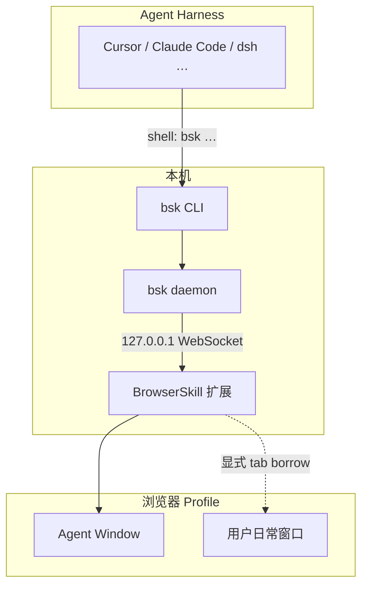
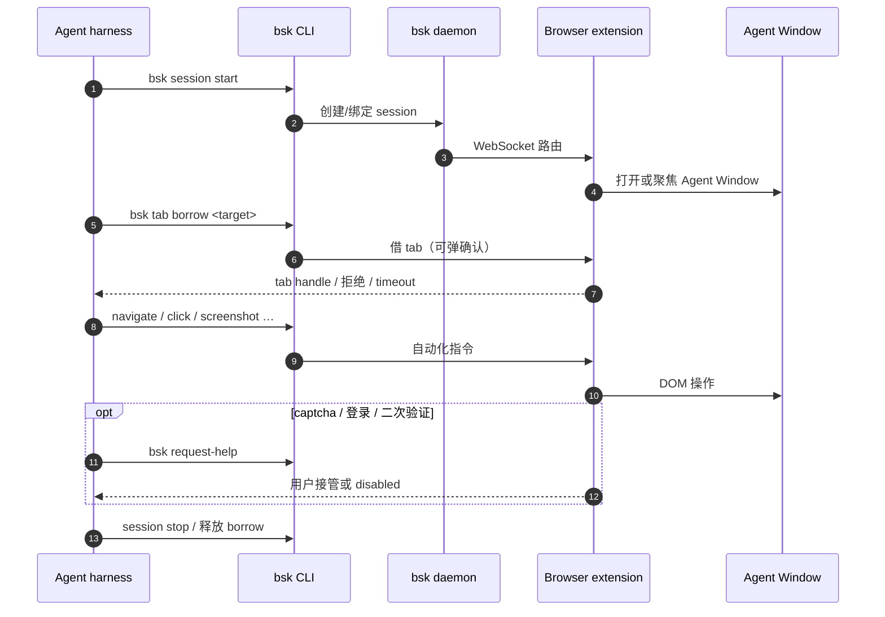

# BrowserSkill（腾讯 · 浏览器 Agent 桥）

**BrowserSkill**（[Tencent/BrowserSkill](https://github.com/Tencent/BrowserSkill)，MIT）让 **Cursor、Claude Code、Codex、OpenClaw、Hermes Agent、[DeepSeek Harness](./deepseek-harness.md)** 等编码代理，通过本地 **`bsk` CLI** 使用你 **已经登录** 的 Chrome / Edge，而不必另开无 cookie 的无头环境。

## 一句话定义

**把「代理读网页」从 Playwright 无登录沙箱，换成「借真实 profile + 独立 Agent Window + 可回退的人工接管」——复用 SSO、内网与付费墙会话。**

## 英文缩写速查

| 缩写 | 英文全称 | 简要说明 |
|------|----------|----------|
| CLI | Command-Line Interface | `bsk` 命令行与本地 daemon 控制面 |
| DSH | DeepSeek Harness | 官方插件 `@wxg-prc-cpg/browser-skill-dsh-plugin` 宿主 |
| SSO | Single Sign-On | 借真实浏览器 profile 时可复用的企业/站点登录态 |
| IPC | Inter-Process Communication | CLI ↔ daemon ↔ 扩展的本地通信 |
| CAPTCHA | Completely Automated Public Turing test to tell Computers and Humans Apart | 需 human-in-loop 的典型拦截 |

## 为什么重要

- **与 [Agent Reach](./agent-reach.md) 分工：** Agent Reach 聚合 **只读检索**（Jina、yt-dlp、`gh`、RSS 等 CLI/MCP）；BrowserSkill 解决 **需交互、需登录态、需可见 DOM** 的浏览器任务（表单、内网控制台、项目页步骤 2.5 核查）。
- **维护本 wiki 的 ingest 场景：** [Karpathy LLM Wiki](../references/llm-wiki-karpathy.md) 要求维护者 **打开项目页核代码开放**；对仅 Web UI 发布、需登录的 lab 页，`bsk` 可在 **不中断你当前浏览** 的前提下让 agent 代开 Agent Window 取证。
- **Harness 生态位：** 内置 `skill/SKILL.md`，`bsk install-skill` 写入 Cursor / Claude Code / Codex 等技能目录；与 [Agent Skills 目录](./agent-skills-addyosmani.md) 同属 **可装载规约**，但对象是 **浏览器操作协议** 而非 TDD/评审流程。
- **DeepSeek 一等公民：** [DeepSeek Harness](./deepseek-harness.md) 用户可 `dsh plugin add @wxg-prc-cpg/browser-skill-dsh-plugin`，获得原生 `browser_*` 工具与 Web UI 会话视图，无需再 `install-skill`。

## 核心信息

| 项 | 内容 |
|----|------|
| **机构** | 腾讯（Tencent） |
| **代码** | [Tencent/BrowserSkill](https://github.com/Tencent/BrowserSkill) |
| **安装** | `curl -fsSL …/install.sh \| sh` → `~/.local/bin/bsk`；扩展见 Chrome / Edge 商店 |
| **许可** | MIT |
| **开源** | **已开源**（CLI + daemon + 扩展源码 + npm dsh 插件） |
| **平台** | macOS / Linux / Windows；Chrome、Edge（其他 Chromium 预期可用） |

### 运行时组件

| 组件 | 职责 |
|------|------|
| **`bsk` CLI** | Agent 唯一入口：`session start`、`tab borrow`、`screenshot`、`request-help` 等 |
| **`bsk daemon`** | 本地 IPC 路由；默认自动启动；沙箱 agent 需 [持久 host + `BSK_AUTO_START=0`](https://github.com/Tencent/BrowserSkill/blob/main/docs/sandboxed-agents.md) |
| **浏览器扩展** | WebSocket 连 daemon；在 **Agent Window** 执行自动化；**仅在被要求时** borrow 用户 tab |
| **`browser-skill` SKILL** | 教 harness 如何正确起 session、借 tab、处理 help/captcha |

### 自动化与人机策略（扩展 popup）

| 借 tab 前确认 | 允许 request-help | 行为 |
|---------------|-------------------|------|
| 开 | 开 | 默认：借 tab 需批准；captcha/登录可弹 UI 交还用户 |
| 开 | 关 | 借 tab 需批准；help 返回 `disabled`，代理须自行 retry |
| 关 | 开 | 静默借 tab；仍可 request-help |
| 关 | 关 | 全自动借 tab；无 help UI（脚本须接受 `disabled`） |

## 核心原理

Agent **从不直连浏览器**；所有操作经 `bsk` → daemon → 扩展，在隔离的 Agent Window 完成，避免 agent 误关用户正在写的 issue 或论文 tab。

### 源码运行时序图

对齐官方 README「How It Works」与 `session start` → `tab borrow` → 页面操作路径：

图下说明：DeepSeek Harness 路径相同，只是 Agent 侧调用 **`browser_*` 插件工具**，插件内部仍 exec `bsk`。

## 工程实践

| 场景 | 建议 |
|------|------|
| **首次接入** | `bsk doctor` + 扩展 popup 确认 connected；.harness 内试 `/browser-skill open example.com` |
| **沙箱 Cloud Agent** | daemon 须在 **持久 host**；agent 命令设 `BSK_AUTO_START=0` 与共享 `BSK_HOME` |
| **远程 GPU 机 + 本地浏览器** | 见 [remote extension connection](https://github.com/Tencent/BrowserSkill/blob/main/docs/remote-extension-connection.md) |
| **全页截图** | `bsk screenshot --session --full-page --out page.png` 或扩展 Quick actions |
| **升级** | 活动任务结束后 `bsk update --yes`；扩展走商店；dsh 插件单独 `dsh plugin update …` |

## 局限与风险

- **Chromium 系为主：** Firefox 计划中；Safari 不在当前支持表。
- **安全面：** 代理可操作用户登录态下的任意已授权站点；借 tab 与 help 开关应默认保守，勿在不可信 prompt 下关确认。
- **与纯 API 抓取对比：** 动态站点、重 JS、反爬仍可能失败；只读公开页优先 [Agent Reach](./agent-reach.md) 等轻量链。
- **版本耦合：** CLI / daemon / 扩展协议需匹配（当前 help 路径要求 protocol 1.3）；混版本可能遗留 `BSK_REQUEST_HELP=off` 等弃用行为。

## 与其他页面的关系

- [DeepSeek Harness](./deepseek-harness.md) — 官方 dsh 插件与 Web UI 浏览器视图
- [Agent Reach](./agent-reach.md) — 只读多平台检索脚手架，互补非替代
- [Hermes Agent](./hermes-agent.md) — README 列出的兼容 harness 之一
- [Jev / System One](./typesafe-jev.md) — 毫秒级 typed 路由 vs 浏览器 IO 层，可分层编排
- [AI 自动科研](../concepts/ai-auto-research.md) — 文献调研闭环中的「可登录浏览器」选项

## 推荐继续阅读

- [AGENT_INSTALL.md](https://raw.githubusercontent.com/Tencent/BrowserSkill/main/AGENT_INSTALL.md) — 一键让 agent 自装 CLI + 技能
- [sandboxed-agents.md](https://github.com/Tencent/BrowserSkill/blob/main/docs/sandboxed-agents.md) — 沙箱环境 daemon 持久化
- [DeepSeek Harness 插件 README](https://github.com/Tencent/BrowserSkill/tree/main/packages/dsh-plugin-browserskill)

## 参考来源

- [BrowserSkill 仓库归档](../../sources/repos/browserskill.md)
- [Tencent/BrowserSkill README](https://github.com/Tencent/BrowserSkill/blob/main/README.md)
