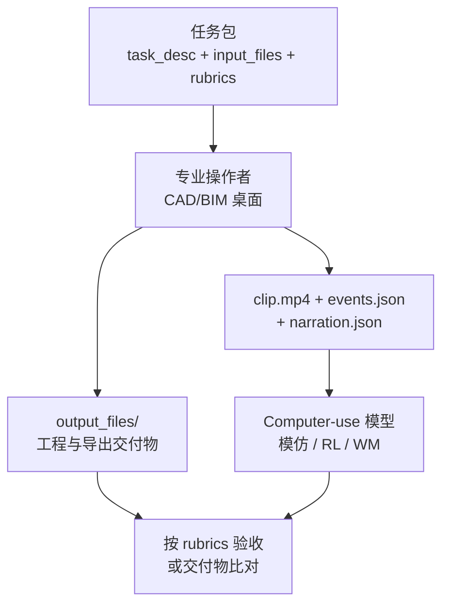

# CAD 1000 Hours（Markov AI）

**CAD 1000 Hours**（[markov-ai/cad-1000-hours](https://huggingface.co/datasets/markov-ai/cad-1000-hours)，Markov AI）是面向 **桌面 computer-use agent** 的大规模 **专业 CAD/BIM 工作流** 语料：每条工作流自包含 **30 FPS 录屏、同步键鼠事件、帧级 narration、任务说明与评分 rubric、输入参考与最终工程交付物**（如 `.dwg`）。

## 一句话定义

**把真实 CAD 桌面操作录成可训练的「屏幕 + 事件 + 任务 + 成品文件」闭环，覆盖 AutoCAD / SOLIDWORKS / Revit 等 10 款软件约一千小时——是 GUI agent 与 text-to-CAD 的数据层，不是机器人遥操作轨迹。**

## 英文缩写速查

| 缩写 | 英文全称 | 简要说明 |
|------|----------|----------|
| CAD | Computer-Aided Design | 计算机辅助设计；本集主场景 |
| BIM | Building Information Modeling | 建筑信息模型；含 Revit 等 |
| GUI | Graphical User Interface | 图形界面；agent 通过录屏+事件学习 |
| HF | Hugging Face | 数据集托管平台 |
| CUA | Computer-Use Agent | 桌面软件自动化代理 |
| MEP | Mechanical, Electrical, Plumbing | 机电管线；部分 BIM 任务域 |
| RPA | Robotic Process Automation | 传统 GUI 自动化；本集规模更大且带任务 rubric |

## 为什么重要

- **填补「专业 CAD 长程操作」数据缺口：** 相对通用 web/mobile GUI 或纯 text-to-mesh，本集强调 **多小时级工程工作流** 与 **真实交付物**（`output_files/` 内工程源文件）。
- **与机器人 CAD 栈互补：** [文字生成 CAD](../concepts/text-to-cad.md) / [CAD Skills](./cad-skills.md) 走 **LLM + 脚本/STEP**；本集走 **像素+键鼠 imitation**——可训练「在 AutoCAD 里点哪里」的 CUA，也可为 narration→action 提供监督。
- **对比 CLI harness 路线：** [CLI-Anything](./cli-anything.md) 主张用结构化 CLI 替代脆弱 GUI；本集是 **GUI 路线的规模化语料**，选型时需明确要训的是 **RPA 式点击** 还是 **API/CLI harness**。
- **工程文件真值：** 除视频外保留 `input_files/` / `output_files/`，便于做 **结果验收**（对照 `rubrics.json`）而非只看屏幕相似度。

## 核心信息

| 字段 | 内容 |
|------|------|
| 发布方 | Markov AI（`markov-ai` on Hugging Face） |
| 规模 | **1,021.64 h** · **597** workflows · **8,973** files · **~257 GiB** |
| 软件 | AutoCAD、SOLIDWORKS、CATIA、Siemens NX、SketchUp、Revit Architecture/Structure、STAAD.Pro、V-Ray、D5 Render |
| 模态 | 录屏 mp4 + events JSON + narration + PDF 任务说明 + CAD 工程/导出 |
| HF | <https://huggingface.co/datasets/markov-ai/cad-1000-hours> |
| 许可 | Hub 卡片 **未声明** SPDX；下载前须核对 Hub Terms |
| 开源核查 | **数据已公开**（ungated）；**无** 官方训练/评测代码仓 |

### 数据集速查

| 维度 | 内容 |
|------|------|
| **规模** | 1,021.64 h / 597 workflows / 10 软件 |
| **模态** | Screen + keyboard/mouse + NL narration + task/rubric + CAD deliverables |
| **许可证** | **未在 HF 卡片写明**；商用/再分发前须人工确认 |
| **重定向就绪度** | **不适用**：桌面 GUI 轨迹，**无** 机器人关节 / 手姿 / 仿真资产字段 |

## 流程总览

## 工程实践

| 项 | 建议 |
|----|------|
| **下载** | `huggingface-cli download markov-ai/cad-1000-hours`；按 `autocad/`、`solidworks/` 等子树增量拉取 |
| **对齐** | 用 `frame_events.json` 将 `events.json` 与 `clip.mp4` 帧对齐；`narration.json` 可作语言监督 |
| **验收** | `rubrics.json` + `output_files/` 支持 **结果级** 评测，不仅看动作序列 |
| **许可** | 卡片无 SPDX → 企业训练前走法务；勿默认等同 CC-BY |
| **与 CAD Skills 分工** | 若要 **STEP 真值 + inspect 闭环**，仍优先 [CAD Skills](./cad-skills.md)；本集适合训 **GUI 操作分布** |
| **同族数据集** | [cad-environments](https://huggingface.co/datasets/markov-ai/cad-environments) 更小但更偏结构化 benchmark（51 任务 / 99 h） |

## 源码运行时序图

**不适用** — 纯 Hugging Face 数据集发布，无官方可运行训练/推理仓库。典型消费路径为：下载 workflow 子树 → 解析 JSON → 训练 CUA 或构建离线 benchmark。

## 与相邻语料 / 工具对比

| 对照 | CAD 1000 Hours 的定位 |
|------|----------------------|
| **[CAD Skills](./cad-skills.md)** | Agent **脚本 CAD**（build123d → STEP）；本集是 **GUI 录屏模仿** |
| **[CLI-Anything](./cli-anything.md)** | 生成 **CLI harness** 替代点击；本集假设仍要训 **像素/事件级** 操控 |
| **[GenCAD](./gencad.md)** | 从渲染图生成 **CAD program**；本集保留 **人类在商业软件中的操作轨迹** |
| **[Multi-Agent CAD](./multi-agent-cad.md)** | LLM 多 agent 写 CadQuery；本集是 **观测数据** 而非方法 |
| **markov-ai/cad-environments** | 同发布方、更短、任务索引更清晰；本集 **规模更大、软件覆盖更广** |
| **机器人遥操作集（如 HIW-500）** | 真机关节与场景；本集 **桌面 CAD**，不可直接当 WBC/VLA 训练集 |

## 局限与风险

- **许可不透明：** HF 未标 SPDX；大规模商用训练前必须核对条款。
- **体量大：** 全量 256+ GiB，需分软件/工作流增量下载与存储规划。
- **无 Viewer：** `viewer: false`，探索成本高于带 parquet 索引的数据集。
- **GUI 脆弱性：** 分辨率、主题、软件版本漂移会导致策略 OOD；与 CLI/API 路线相比维护成本高。
- **非制造级审图：** 录屏展示操作流程，**不保证** 每条 `output_files/` 均达生产放行标准。
- **机器人距离：** 对人形/操纵主线是 **上游设计工具链数据**；进仿真仍要经过 CAD→mesh/URDF 管线（见 [text-to-cad](../concepts/text-to-cad.md)）。

## 关联页面

- [文字生成 CAD（Text-to-CAD）](../concepts/text-to-cad.md)
- [CAD Skills](./cad-skills.md)
- [CLI-Anything](./cli-anything.md)
- [Multi-Agent CAD](./multi-agent-cad.md)
- [GenCAD](./gencad.md)
- [Tinkercad](./tinkercad.md)

## 参考来源

- [`sources/datasets/cad-1000-hours-markov-ai.md`](../../sources/datasets/cad-1000-hours-markov-ai.md)
- Hugging Face：<https://huggingface.co/datasets/markov-ai/cad-1000-hours>

## 推荐继续阅读

- [CAD 1000 Hours README（HF）](https://huggingface.co/datasets/markov-ai/cad-1000-hours)
- [Markov AI cad-environments](https://huggingface.co/datasets/markov-ai/cad-environments) — 同组织结构化 CAD 工作流集
- [CLI-Anything 技术报告](https://arxiv.org/abs/2606.03854) — GUI vs CLI harness 选型对照
