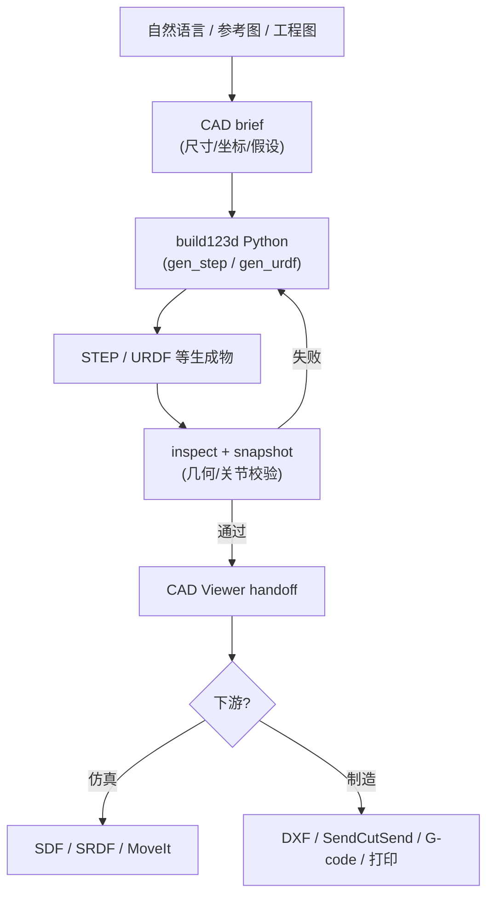

# CAD Skills

## 一句话定义

**CAD Skills** 是 [earthtojake/text-to-cad](https://github.com/earthtojake/text-to-cad) 仓库（品牌名 **CAD Skills**，文档 [cadskills.xyz](https://www.cadskills.xyz)）公开的 **Agent Skills** 技能库：把 **自然语言/图像 → 参数化 CAD（STEP 优先）→ 几何校验与本地预览 → URDF/SRDF/SDF 机器人描述 → DXF / 切片 / 打印交接** 拆成 **`skills/**/SKILL.md` 规约 + Python CLI**，供 Claude Code、Codex 等代理 **按需安装**（`npx skills install earthtojake/text-to-cad`），而不是提供单一闭源 text-to-CAD 模型。

## 英文缩写速查

| 缩写 | 英文全称 | 简要说明 |
|------|----------|----------|
| CAD | Computer-Aided Design | 计算机辅助设计，硬件结构建模 |
| STEP | Standard for the Exchange of Product model data | 工业 B-rep 零件/装配交换格式 |
| URDF | Unified Robot Description Format | 统一机器人描述格式 |
| SRDF | Semantic Robot Description Format | MoveIt2 等用的语义机器人描述扩展 |
| SDF | Simulation Description Format | Gazebo/Ignition 等仿真场景描述格式 |
| LLM | Large Language Model | 大语言模型，常作高层任务/语言接口 |
| OCP | Open CASCADE Technology (Python bindings) | OpenCascade 几何内核的 Python 绑定 |
| DFM | Design for Manufacturing | 面向制造的设计，降低量产成本与风险 |
| G-code | — | CNC/FDM 打印机执行的刀路/挤出指令文本 |
| Sim2Real | Simulation to Real | 把仿真中学到的策略迁移落地真机的工程主线 |

## 为什么重要

- **把「文字生成 CAD」落到可审计工程环：** 与 [文字生成 CAD](../concepts/text-to-cad.md) 所归纳的 **LLM + 脚本 CAD** 路线一致，但进一步把 **brief → build123d 源码 → STEP → inspect/measure/snapshot → CAD Viewer handoff** 写进 skill 非协商项，降低「对话一次黑盒 mesh」在机器人夹具/结构件上的风险。
- **CAD 与机器人描述同一代理栈：** `URDF` / `SRDF` / `SDF` skill 与 `CAD` skill 分工明确（几何 vs 运动学/仿真语义），并与 [URDF-Studio](./urdf-studio.md) 所代表的 **Web 端描述编辑** 形成 **CLI+skill vs GUI** 对照；下游仍须核对 **坐标系、惯性、碰撞简化**（参见 [Sim2Real](../concepts/sim2real.md)）。
- **制造与原型闭环：** 除建模外还覆盖 **step.parts 标准件**、**SendCutSend 上传前检查**、**G-code 切片** 与 **Bambu Labs 本地打印**——把「能生成 STEP」延伸到 **可打/可切/可外协** 的交接面，但仍需人类 sign-off。
- **Agent Skills 生态样本：** 与 [Skills For Real Engineers（mattpocock）](./mattpocock-skills.md)（通用编码习惯）、[SenseNova-Skills](./sensenova-skills.md)（办公产出）并列，是 **硬件/CAD 垂直** 的技能库参照。

## 核心结构

| 技能 | 角色 |
|------|------|
| **CAD** | 自然语言/参考图/工程图 → **build123d** 源码（`gen_step()`）→ **STEP**；`scripts/step` / `inspect` / `snapshot` 校验；次级 STL/3MF/GLB |
| **CAD Viewer** | 本地浏览器预览 CAD、G-code、URDF 等；CAD 工作完成后 **强制 handoff** |
| **step.parts** | 检索螺钉、轴承、电机等 **现成 STEP**；装配前优先于占位几何 |
| **DXF** | 2D 轮廓/垫片/切割布局；3D 零件投影时 CAD 拥有 STEP、DXF 拥有图面 |
| **URDF** | `gen_urdf()` Python 真值 → `.urdf`；生成时默认图/关节/网格校验 |
| **SRDF** | MoveIt2 规划组、末端执行器、姿态与 **碰撞豁免** |
| **SDF** | 仿真模型与世界（物理、传感器、光照） |
| **SendCutSend / G-code / Bambu Labs** | 外协/FDM：**检查 → 切片 →（谨慎）打印** |
| **Implicit CAD** | 实验性 **SDF + GLSL** 隐式建模与 Viewer 光线步进 |

技术栈公开强调 **Python 3.11+**、**build123d**、**OCP（OpenCascade）**；装配推荐 **`cadpy.assembly.AssemblyHelper`** 与源码级 **build123d joints**。

## 流程总览

## 与 Text-to-CAD 概念页的关系

- **相同抽象：** [文字生成 CAD](../concepts/text-to-cad.md) §「LLM + CadQuery/build123d」——**语言 → 结构化程序 → B-rep**。
- **CAD Skills 的增量：** 把该抽象 **产品化为可安装 skills**（安装、handoff、基准、打印链），并 **强制 STEP 真值 + 校验/report 结构**，更接近机器人团队的 **可回归硬件草稿** 工作流，而非 API 黑盒。
- **不同目标：** 不含 Zoo/Adam 等 **商业 CAD 宿主**；也不等同 [Articraft](./articraft.md) 的 **可关节 3D 资产 agent**——后者偏 **仿真就绪网格与 harness 验证**，CAD Skills 偏 **制造向 B-rep 与 URDF/MoveIt 描述**。

## 常见误区或局限

- **误区：** 安装 skills 即可 **无人值守签发生产图纸**。Skill 正文明确 **非工程认证/FEA 结论**；复杂公差链与 DFM 仍须专业 CAD 复审（与 [Text-to-CAD](../concepts/text-to-cad.md) 边界一致）。
- **误区：** 生成 URDF 即 **MuJoCo/Isaac 开箱可用**。惯性、碰撞凸包、网格尺度与 **frame 语义** 仍是主要错误源；须 consumer smoke test（RViz、Gazebo、MoveIt 等）。
- **误区：** 与 [mattpocock/skills](./mattpocock-skills.md) 可互相替代。后者服务 **通用应用工程**；CAD Skills 为 **毫米制机械/机器人** 专用 CLI 与规约，迁移时需重写项目 `CONTEXT` 与验收标准。
- **局限：** Bambu / 切片 / 外协技能涉及 **本地设备与安全策略**；Implicit CAD 标记 **Experimental**；重 benchmark 资产在 **Git LFS**，轻量 clone 需按需 `git lfs pull`。

## 关联页面

- [文字生成 CAD（Text-to-CAD）](../concepts/text-to-cad.md) — 制造向 text-to-CAD 成熟度与工具谱系总览
- [URDF-Studio](./urdf-studio.md) — Web 端机器人描述与 BOM；与 URDF skill 的 GUI 对照
- [Articraft](./articraft.md) — 可关节 3D 资产生成 agent；偏仿真网格而非 STEP 加工链
- [Skills For Real Engineers（mattpocock）](./mattpocock-skills.md) — 通用编码 Agent Skills 对照
- [Sim2Real](../concepts/sim2real.md) — CAD/URDF 与仿真/真机几何一致性

## 推荐继续阅读

- [CAD Skills 文档](https://www.cadskills.xyz)
- [在线 Demo](https://demo.cadskills.xyz)
- [build123d 文档](https://build123d.readthedocs.io/)
- [Agent Skills 规范](https://agentskills.io/) — `SKILL.md` 约定
- [Zoo Text-to-CAD 教程](https://zoo.dev/docs/developer-tools/tutorials/text-to-cad) — 商业 API 向 text-to-CAD 对照

## 参考来源

- [earthtojake/text-to-cad 仓库源归档（本站）](../../sources/repos/earthtojake-text-to-cad.md)
- [CAD Skills（GitHub）](https://github.com/earthtojake/text-to-cad)
