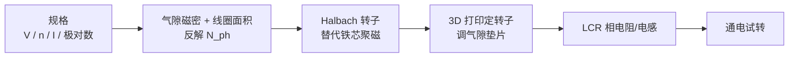

# Caden Kraft Ironless Axial Flux Motor（无铁芯轴向磁通电机）

## 一句话定义

**Ironless Axial Flux Motor**（[cadenkraft.com Part 1](https://cadenkraft.com/designing-a-coreless-axial-flux-motor-part-1/)）是 Caden Kraft 的 **无铁芯轴向磁通** DIY 电机：用 **Halbach** 转子塑形气隙磁通，按 Batzel 等公式估匝数并 3D 打印装配；**截至入库日无专用开源 CAD/FEM 仓**，价值在设计叙事与后续 [Ironless QDD](./ironless-qdd-actuator.md) 的 Halbach 经验传承。

## 英文缩写速查

| 缩写 | 英文全称 | 简要说明 |
|------|----------|----------|
| AFM | Axial-Flux Machine | 轴向磁通电机，气隙法向沿轴向 |
| Halbach | Halbach Array | 磁化方向逐步旋转、单侧聚磁的阵列 |
| LCR | Inductance / Capacitance / Resistance meter | 测相电阻与电感的仪器 |
| PMSM | Permanent Magnet Synchronous Motor | 永磁同步电机 |
| DIY | Do It Yourself | 自制/非商业交付样机 |

## 为什么重要

- 把「公寓级无法做铁芯叠片」翻译成可执行替代：**Halbach 用多余磁钢换铁芯磁导**——同一思路后来写进 Ironless QDD 的 FEMM 四象限对照。
- 给出一条可读的 **规格 → 匝数** 估算链（电压、基速、极对数、线圈面积、气隙磁密），适合接 [电机设计流程](../overview/motor-design-workflow.md) 的早期手算课，再进 FEM/台架。
- 与 [PCB Motor](./pcb-motor.md)（PCB 轴向绕组）/[axfluxmdo](./axfluxmdo.md)（轴向 MDO 工具）形成三角：本页是 **漆包线线圈 + 打印结构** 的叙事样例，不是可克隆制造包。

## 核心信息

| 项 | 内容（博文） |
|----|--------------|
| 拓扑 | 轴向磁通；无铁芯线圈；Halbach 转子（12 极 / 24 磁钢） |
| 电气目标 | 24 V、700 rpm、7 A rms；线径 0.65 mm；Y 接 |
| 槽极叙事 | 12 极 / 18 线圈（高绕组因数） |
| 几何 | \(r_o=65\) mm，\(r_i=35\) mm（\(\alpha\approx 0.5\)） |
| 匝数结论 | \(N_{ph}\approx 82\) → 约 **14 匝/线圈** |
| 磁钢 | 矩形 **36×6×6 mm** 钕铁硼 |
| 轴承 | 62×40×12 mm 滚子轴承 |
| 开源 | **未开源** CAD/代码；仅博文步骤与照片 |
| 转矩台架 | **未测**（作者无测功机） |

## 核心原理

- **为何轴向：** 气隙近似二维，垫片调间隙；矩形磁钢免定制弧形磁钢。
- **为何 Halbach：** 无铁芯时用磁钢阵列把主磁通压向线圈侧；相对 180° 交替阵列更「像铁芯」地塑形场。
- **匝数链（作者口径）：** \(e_{ph}=N_{ph}A_{coil}\omega_e B_m\)，\(\omega_e\) 由轴速与极对数得到；母线电压按 Y 接相电压反解 \(N_{ph}\)。

## 工程实践

| 学习点 | 做法 |
|--------|------|
| 手算匝数 | 对照博文参数表重算 \(N_{ph}\)，再除以每相线圈数 |
| Halbach 装配 | 用磁力计辨北极；磁化方向按 90° 步进排布 |
| 相一致性 | LCR 查相间电阻/电感差（作者约 699–708 mΩ / 56–58 μH） |
| 下一步开源复现 | 不要在本页找 STEP；转 [Ironless QDD](./ironless-qdd-actuator.md) 的 `CAD/` + `FEMM/` |
| 轴向重设计工具 | 参数化扫参用 [axfluxmdo](./axfluxmdo.md)；PCB 绕组路线见 [PCB Motor](./pcb-motor.md) |

## 局限与风险

- **开源状态：未开源** — 截至 2026-07-25 项目页未列 GitHub；不可当作可下载制造包。
- **无转矩/效率台架数据**；首次旋转 ≠ 已验证 \(K_t\) / 连续温升。
- 打印塑料在热、蠕变与气隙公差上的边界需自行评估；公寓级绕线一致性依赖 LCR，不是产线工艺。
- 勿把本机指标外推到人形髋膝；轴向薄型关节另有轴向磁拉力与多气隙装配成本。

## 关联页面

- [Halbach Array](../concepts/halbach-array.md) · [Ironless QDD Actuator](./ironless-qdd-actuator.md) — Halbach / 无铁芯经验的后续完整开源关节
- [PCB Motor](./pcb-motor.md) · [axfluxmdo](./axfluxmdo.md)
- [开源力矩电机电磁设计完整度对比](../comparisons/open-source-torque-motor-em-design.md)
- [电机设计流程](../overview/motor-design-workflow.md)

## 参考来源

- [sources/blogs/cadenkraft_coreless_axial_flux_motor_part1.md](../../sources/blogs/cadenkraft_coreless_axial_flux_motor_part1.md)
- [sources/sites/cadenkraft_coreless_axial_flux_motor_part1.md](../../sources/sites/cadenkraft_coreless_axial_flux_motor_part1.md)

## 推荐继续阅读

- 博文：<https://cadenkraft.com/designing-a-coreless-axial-flux-motor-part-1/>
- 后续完整开源关节：<https://cadenkraft.com/ironless-cycloidal-planetary-actuator/>
- 文内文献：Batzel et al., IAJC-ISAM 2014（Ironless Axial Flux + Halbach）
