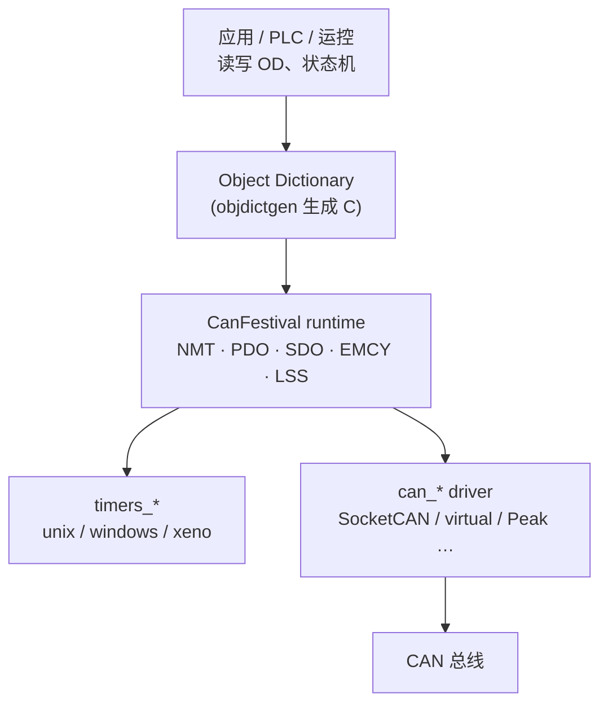
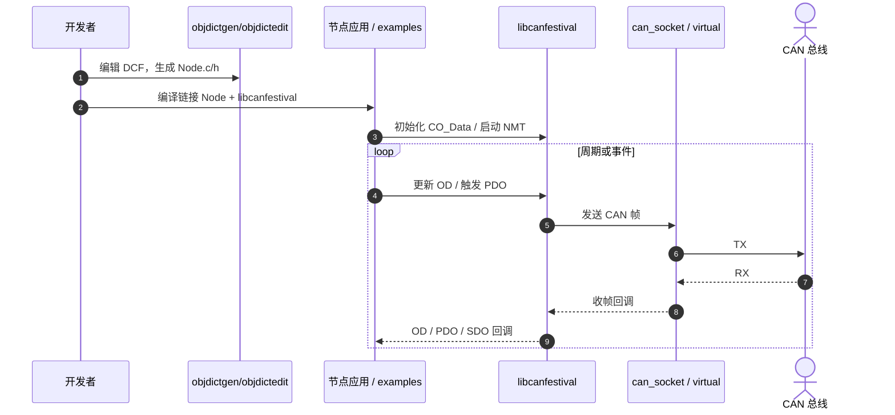

# CanFestival

**CanFestival** 是面向 PC、实时工控机与微控制器的 **开源 CANopen® 协议栈**：用 ANSI-C 实现可配置为 **NMT Master 或 Slave** 的节点，并配套对象字典编辑与 C 代码生成工具。项目站 [canfestival.org](https://canfestival.org/)；当前常用 Git/CMake 树为 [beremiz/canfestival](https://github.com/beremiz/canfestival)。

## 英文缩写速查

| 缩写 | 英文全称 | 简要说明 |
|------|----------|----------|
| CANopen | Controller Area Network open | 基于 CAN 的高层应用协议（对象字典、PDO/SDO、NMT） |
| PDO | Process Data Object | 周期/事件触发的过程数据交换 |
| SDO | Service Data Object | 配置与诊断用的服务数据访问 |
| NMT | Network Management | 节点状态机与网络管理 |
| OD | Object Dictionary | 设备参数与映射的标准化对象表 |
| DCF | Device Configuration File | 扩展 EDS 风格的设备配置文件（CanFestival 编辑器存储格式） |
| LSS | Layer Setting Services | 层设置服务（节点 ID / 波特率配置） |
| LGPL | Lesser General Public License | CanFestival 运行时库许可（可与专有代码链接） |

## 为什么重要

- 仓库已有 [CANopen 概念](../../sources/sites/cia_canopen_overview.md) 与 [底软协议选型总览](../overview/motor-drive-firmware-bus-protocols.md)，但缺少 **可编译链接的开源栈实体**；CanFestival 填补「工业套餐」里主站/从站实现侧。
- **许可清晰**：运行时 LGPL，便于嵌入商业固件；工具 GPL；**objdictgen 生成的节点 C 不受 GPL/LGPL 覆盖**（官网 Doc）——对关节模组/PLC 厂商友好。
- 与 [SimpleFOC](./simplefoc.md) 正交：SimpleFOC 管 **电流环算法**；CanFestival 管 **L2 CANopen 帧与对象字典**。与 EtherCAT 主站 [SOEM/IgH 指南](../queries/ethercat-master-optimization.md) 对照：前者是 CAN 上的 CANopen，后者是以太网上的 CoE。

## 核心原理

### 栈分层

- **输入：** 对象字典描述（DCF/OD）+ 应用对 OD 的读写；定时器与 CAN 驱动由平台层注入。
- **机制：** 标准 CANopen 通信对象（NMT、PDO、SDO、EMCY 等）；可选 LSS；驱动可静态链接或动态加载。
- **输出：** 总线上的 COB 帧；应用侧可见的 OD 变量（含 PDO 映射后的过程数据）。

### 工具链

| 工具 | 作用 |
|------|------|
| `objdictedit.py` | GUI 编辑 OD / 网络拓扑（Python 3 + wxPython 4） |
| `objdictgen.py` | CLI：`DCF/OD → .c/.h` |
| `CANOpenShell` | 命令行主/从调试 |

典型复现路径（beremiz CMake 仓）：`cmake` 选 `CF_CAN_DRIVER=socket` 或 `virtual` → 构建 `libcanfestival*.a` → 用 objdictgen 生成节点 → 链接应用或跑 `examples/`。

### 源码运行时序图

对齐 [beremiz/canfestival](https://github.com/beremiz/canfestival) README：`objdictgen` → 链接 `libcanfestival` → SocketCAN/`virtual` 收发。

## 工程实践

| 项 | 建议 |
|----|------|
| 选仓 | 官网 Code 列多源；Linux 新项目优先固定 [beremiz/canfestival](https://github.com/beremiz/canfestival) commit；勿混用互不兼容的历史 fork |
| 主站原型 | `CF_TARGET=unix` + `CF_CAN_DRIVER=socket`（SocketCAN）+ PREEMPT_RT/Xenomai 视实时需求 |
| 无硬件联调 | `CF_CAN_DRIVER=virtual` 或 `TestMasterSlave` 同进程主从 |
| 关节 402 | 栈提供 CANopen 通信；**CiA 402 状态机/模式对象需按设备 Profile 配进 OD**，不是「装了 CanFestival 就等于会控伺服」 |
| 许可检查 | 发布含工具链的产品时区分 LGPL 运行时与 GPL 编辑器；交付生成的 OD C 时保留官网许可说明 |

官网 Applications 案例：Beremiz/Smarteh PLC、Xenomai Micropral、LAAS 六轴 CANopen 伺服定位机（约 20 ms 时间精度需求）——说明栈更偏 **工业自动化 / 中等实时**，不是人形 kHz 全身环的默认答案。

## 局限与风险

- **分叉与文档陈旧：** 官网仍指向 Automforge PDF、Bitbucket 克隆；部分链接失效。以当前 Git README + 自测驱动矩阵为准。
- **Windows 厂商驱动：** beremiz README 标明 Peak/Kvaser/IXXAT 等 Windows 驱动相对新 CMake **过时未测**。
- **不等于 CiA 402 全家桶：** 需自行映射 6040/6041 等对象；商用伺服常带厂商 EDS，集成成本在字典与 PDO，不在「会不会发 CAN」。
- **带宽与同步：** 经典 CAN 载荷/速率上限仍在；多轴硬实时优先评估 [EtherCAT + CoE](../concepts/ethercat-protocol.md)，而非强行堆 CanFestival PDO。
- **社区形态：** 主通道为邮件列表；GitHub star 规模远小于现代机器人中间件，长期维护需自行跟 fork。

## 关联页面

- [电机驱动器底软通信协议总览](../overview/motor-drive-firmware-bus-protocols.md) — L2=CANopen 时的开源栈选项
- [CAN 总线（经典）](../concepts/can-bus-protocol.md)
- [CAN FD](../concepts/can-fd.md)
- [EtherCAT 协议基础](../concepts/ethercat-protocol.md) — CoE 与 CANopen 对象模型对照
- [CAN vs EtherCAT 关节总线选型](../comparisons/can-vs-ethercat-joint-bus.md)
- [EtherCAT 主站优化指南](../queries/ethercat-master-optimization.md) — 以太网侧主站对照
- [实时运控中间件配置指南](../queries/real-time-control-middleware-guide.md)
- [SimpleFOC](./simplefoc.md) — MCU 电流环层对照

## 参考来源

- [sources/sites/canfestival-org.md](../../sources/sites/canfestival-org.md)
- [sources/repos/canfestival.md](../../sources/repos/canfestival.md)
- [sources/sites/cia_canopen_overview.md](../../sources/sites/cia_canopen_overview.md)
- 官网：<https://canfestival.org/>
- 代码：<https://github.com/beremiz/canfestival>

## 推荐继续阅读

- CanFestival Documentation：<https://canfestival.org/doc>
- CiA：[CANopen](https://www.can-cia.org/can-knowledge/canopen/) / [CiA 402](https://www.can-cia.org/can-knowledge/canopen/cia-402/)
- Beremiz：<http://www.beremiz.org>
