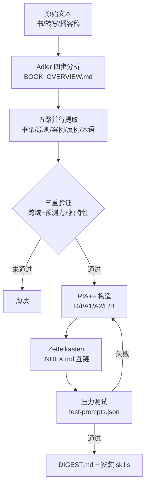

# Cangjie Skill

**Cangjie Skill** 是 [kangarooking/cangjie-skill](https://github.com/kangarooking/cangjie-skill) 仓库分发的 **元 skill**：把书籍、长视频字幕、播客文字稿、访谈与课程等 **系统性表达过的内容**，经 **RIA-TV++** 七阶段流水线，编译成一组带触发条件、边界与测试用例的 **`SKILL.md` 模块**（非单篇摘要）。

## 一句话定义

用 **三重验证筛选 + RIA++ 结构化 + Zettelkasten 互链 + 压力测试**，把高价值长内容 **编译成 agent 可执行的方法论技能包**，让「看过/听过」变成「在真实决策里可调用」。

## 英文缩写速查

| 缩写 | 英文全称 | 简要说明 |
|------|----------|----------|
| RIA | Reading / Interpretation / Appropriation | 赵周便签拆书法三要素；本流水线内容构造基础 |
| TV | Triple Verification | 跨域佐证、预测力、独特性三重筛选 |
| LLM | Large Language Model | 执行蒸馏与 skill 调用的推理核心 |
| Agent Skills | Agent Skills Standard | [agentskills.io](https://agentskills.io) 约定的 `SKILL.md` 可装载技能格式 |

## 为什么重要（对本知识库读者）

- **与 LLM Wiki 同构的另一条轴：** [Karpathy LLM Wiki](../references/llm-wiki-karpathy.md) 把论文/博客 **编译进 `wiki/`**；Cangjie 把书/长视频 **编译进 `skills/`**。二者都拒绝「只检索不积累」，但交付形态分别是 **持久知识页** 与 **可触发技能模块**。
- **生态位 — 人 / 书 / 进化：** [Nuwa Skill](nuwa-skill.md) 蒸馏 **人怎么想**；**Cangjie** 蒸馏 **书/长内容里的方法论**；[Darwin Skill](darwin-skill.md) 让任意 skill **持续进化**。维护 Robotics_Notebooks 时可对照：ingest 进 `sources/` + 升格 `wiki/` ≈ Cangjie 的「原文→结构化页」，而 Cangjie 额外强调 **触发场景与 test-prompts**。
- **对本站 ingest 的直接启发：** 三重验证（跨域、预测力、独特性）与 wiki 页「一句话定义 + 交叉引用 + 参考来源」质量门类似；RIA++ 的 **E（可执行步骤）/ B（边界）** 可对照 `schema/ingest-workflow.md` 的最低质量标准。

## 核心结构

| 层次 | 内容 |
|------|------|
| **元规范** | 根 `SKILL.md` + `methodology/` + `extractors/`（五路并行）+ `templates/` |
| **RIA-TV++ 七阶段** | Adler 总览 → 并行提取 → 三重验证 → RIA++ 构造 → Zettelkasten → 压力测试 → `DIGEST.md` + 安装 |
| **产出物** | `BOOK_OVERVIEW.md`、`INDEX.md`、`GLOSSARY.md`、多目录 `*/SKILL.md`、`test-prompts.json` |
| **输入** | 书、转写视频、播客、访谈、课程、长文；视频可先走 [video-downloader](https://github.com/kangarooking/kangarooking-skills/tree/main/video-downloader) |
| **已发布 packs** | 巴菲特信、穷查理宝典、影响力、吴恩达 AI for Everyone 等 20+ 独立仓库（见上游 README） |
| **平台** | OpenClaw、Claude Code、Cursor 等 |

### RIA-TV++ 流程总览

## 常见误区或局限

- **误区：Cangjie = 读书笔记生成器。** 产出是 **可独立触发的 skill 模块** 与测试用例，不是压缩摘要；未通过三重验证的候选会大量淘汰（通常仅 25–50% 通过）。
- **误区：可替代本站 ingest。** Cangjie 面向 **通用方法论技能**；本仓库还需 `make ci-preflight`、交叉引用统计、机器人领域 schema — 流程可借鉴，检查项不可省略。
- **误区：与 [Nuwa](nuwa-skill.md) 重复。** Nuwa 提取 **人物认知框架**；Cangjie 提取 **作者系统性输出的方法论**；二者互补（生态 README 明确咬合）。
- **局限：** 依赖高质量转写/原文；验证与压力测试成本随 skill 数量上升；中文生态与案例为主，英文 README 亦有但社区 packs 偏中文书目。

## 关联页面

- [Nuwa Skill](nuwa-skill.md) — **蒸馏人**（心智模型、表达 DNA）
- [Darwin Skill](darwin-skill.md) — **进化任意 skill**（棘轮优化）
- [autoresearch（karpathy）](karpathy-autoresearch.md) — 实验自动化灵感源（Darwin 侧映射）
- [Superpowers（obra）](superpowers-obra.md) — **编码交付流程** skill 库
- [Skills For Real Engineers（mattpocock）](mattpocock-skills.md) — **日常工程** 轻量技能
- [LLM Wiki（Karpathy 模式）](../references/llm-wiki-karpathy.md) — 本仓库知识编译范式
- [Ingest Workflow](../../schema/ingest-workflow.md) — ingest / query / lint 规范

## 参考来源

- [Cangjie Skill 仓库源归档（本站）](../../sources/repos/cangjie-skill.md)
- [kangarooking/cangjie-skill（GitHub）](https://github.com/kangarooking/cangjie-skill)
- [Agent Skills 规范](https://agentskills.io/)

## 推荐继续阅读

- [nuwa-skill](https://github.com/alchaincyf/nuwa-skill) — 人物蒸馏姊妹仓
- [darwin-skill](https://github.com/alchaincyf/darwin-skill) — skill 进化姊妹仓
- [buffett-letters-skill](https://github.com/kangarooking/buffett-letters-skill) — Cangjie 产出示例（20 skills）
