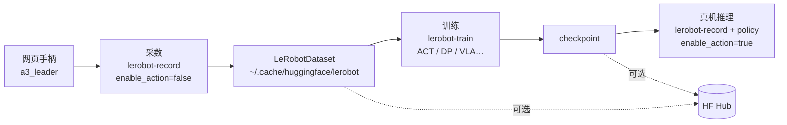
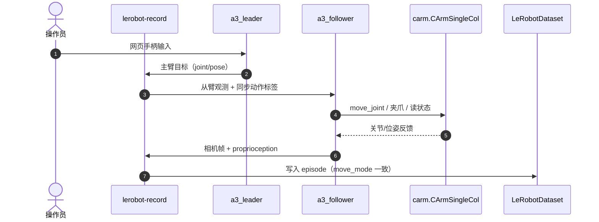

# carm-lerobot（CVTE CARM × LeRobot）

**carm-lerobot**（[`cvte-robotics/carm-lerobot`](https://github.com/cvte-robotics/carm-lerobot)）把 [LeRobot](./lerobot.md) **0.5.1** 接到视源 **CARM A3** 协作臂：内嵌完整 LeRobot 树，扩展 `a3_follower` / `a3_leader` 与 **D3** 机型驱动，README 以「lerobot revised MAXHUB」命名，面向 **采数 → 回放 → 训练 → 真机推理** 一条 CLI。

## 一句话定义

**视源 CARM 臂的官方 LeRobot 胶水仓——用网页手柄遥操作录示范，在同一 fork 里训 ACT/VLA 类策略并在 A3 上 `lerobot-record` 部署。**

## 英文缩写速查

| 缩写 | 英文全称 | 简要说明 |
|------|----------|----------|
| IL | Imitation Learning | README 主路径：ACT、Diffusion 等 |
| VLA | Vision-Language-Action | SmolVLA、π0.5、WALL-OSS 等语言/流式动作头 |
| CARM | CVTE Arm（产品系） | 视源协作臂；本页聚焦 A3 + LeRobot 集成 |
| HF Hub | Hugging Face Hub | 可选上传数据集与 checkpoint |
| SDK | Software Development Kit | `pip install carm`（[pycarm](https://github.com/cvte-robotics/pycarm)） |
| DP | Diffusion Policy | README 支持的扩散式动作策略之一 |

## 为什么重要

- **国内协作臂 + LeRobot 官方改版：** 与 [unitree_lerobot](./unitree-lerobot.md)、[LeTools](./letools.md) 同构——厂商把 Hub 数据格式接到自家本体，降低「有臂但不会接 LeRobot」的摩擦。
- **遥操作入口轻：** `a3_leader` 走 **网页端手柄**，不必先搭 ROS Leader 臂即可开录（仍要网络可达的臂 IP 与 `carm` SDK）。
- **策略覆盖宽：** 除经典 ACT / Diffusion 外，README 给出 **SmolVLA、π0.5、WALL-OSS（wall_x）** 训练与 `lerobot-record` 推理命令，便于与 [VLA](../methods/vla.md) 主线对照。
- **关节/位姿双模态：** `move_mode` 可选 `joint` / `pose` / `both`，适合对比「关节空间 IL」与「末端位姿 IL」；`both` 可用仓内脚本拆数据集。

## 流程总览



## 源码运行时序图

真机一次 **采数 episode** 的典型调用链（对齐 `src/lerobot/robots/carm_a3/` 与 `teleoperators/a3_leader/`）：



推理时 CLI 加载 `policy.pretrained_path`，`a3_follower` 在 `_inference_mode` 下按与数据集相同的 `move_mode` 执行；`move_mode=both` 的推理需改为 `joint` 或 `pose` 单列。

## 核心原理

| 组件 | 说明 |
|------|------|
| `a3_follower` | 从臂；`addr` JSON 映射单/双臂 IP；接 OpenCV 相机配置 |
| `a3_leader` | 手柄 Leader；`move_mode` 须与 follower 一致 |
| `carm` SDK | [`pycarm`](https://github.com/cvte-robotics/pycarm)；`CArmSingleCol.set_ready()` 与关节初始化 |
| `carm_d3` | 仓内 D3 机型驱动（与 A3 并列目录） |
| `examples/carm-mujoco` | A3 MJCF + tutorial 采数/推理（仿真对照） |

**关键 CLI 语义（README）：**

- 采数：`--robot.enable_action=false`；推理：true（默认）。
- 相机键名（`left` / `hand` / `right`）与训练集严格一致。
- 数据默认本地缓存；`--dataset.push_to_hub` 可选。

## 工程实践

| 项 | 内容 |
|----|------|
| 安装 | Miniforge + Python 3.12 → `pip install -e .`（本 fork）+ `pip install carm` + `conda install ffmpeg` |
| 采数示例 | `lerobot-record --robot.type=a3_follower --teleop.type=a3_leader --robot.move_mode=joint …` |
| 回放 | `lerobot-replay` 同 `move_mode` |
| 训练 | `lerobot-train --policy.type=act`（或 diffusion / smolvla / pi05 / wall_x） |
| 推理 | `lerobot-record` + `--policy.type` + `--policy.pretrained_path` |
| 仿真 | [`carm-mujoco`](https://github.com/cvte-robotics/carm-mujoco) 组织仓 + 本仓 `examples/carm-mujoco/` |
| 远程遥操作 | 组织仓 [`carm-remote`](https://github.com/cvte-robotics/carm-remote)（Quest3 等，非本仓必需） |

```bash
git clone https://github.com/cvte-robotics/carm-lerobot.git
cd carm-lerobot && pip install -e . && pip install carm tensorboard
# 按 README 配置 robot.addr 与相机后运行 lerobot-record / lerobot-train
```

## 局限与风险

- **Fork 维护：** 内嵌 **LeRobot 0.5.1** 全树，升级上游需自行 merge 并回归 A3 驱动。
- **硬件绑定：** 无 CARM 真机与 `carm` SDK 时，仅能跑 MuJoCo 示例或读代码；与 [reBot-DevArm](./rebot-devarm.md) 等「图纸开源臂」场景不同。
- **Hub 资产：** 官方未捆绑示范数据集/权重；π0.5 / WALL-OSS 依赖公开 Hub 基座与用户自备 GPU。
- **双臂与 both 模式：** 双臂 `addr` 配置错误会在初始化阶段失败；`move_mode=both` 增加存储与训练口径复杂度，拆集脚本需纳入 CI 习惯。
- **星标与社区：** 截至入库日组织仓较新、关注度低，Issue/Release 节奏需自行跟踪。

## 关联页面

- [LeRobot](./lerobot.md) — 上游框架与 Hub 生态
- [unitree_lerobot](./unitree-lerobot.md) — 人形 G1 官方改版（对照厂商 glue 模式）
- [LeTools](./letools.md) — Kuavo 侧 rosbag → LeRobot v3
- [reBot-DevArm](./rebot-devarm.md) — 桌面开源臂 + LeRobot 教程
- [Imitation Learning](../methods/imitation-learning.md)
- [Manipulation](../tasks/manipulation.md)
- [Teleoperation](../tasks/teleoperation.md)
- [LeRobotDataset v3.0](../concepts/lerobot-dataset-v3.md)

## 参考来源

- [sources/repos/carm_lerobot.md](../../sources/repos/carm_lerobot.md)
- [sources/repos/pycarm.md](../../sources/repos/pycarm.md)
- [sources/repos/cvte_robotics.md](../../sources/repos/cvte_robotics.md)
- 上游：<https://github.com/cvte-robotics/carm-lerobot>

## 推荐继续阅读

- 组织内 [carm-mujoco](https://github.com/cvte-robotics/carm-mujoco) — 无真机时的仿真 API
- [LeRobot 官方文档](https://huggingface.co/docs/lerobot/index) — CLI 通用参数与策略族说明
