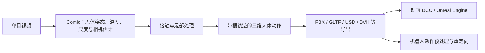
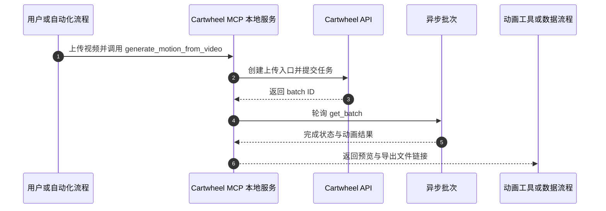

# Cartwheel Comic：单目视频三维人体动作捕捉

## 一句话定义

**Cartwheel Comic** 是 Cartwheel 的云端视觉动捕模型系列，可从普通单目视频提取带世界空间信息的人体动作，并支持将结果导入动画工具或作为后续机器人重定向的输入。

## 英文缩写速查

| 缩写 | 英文全称 | 简要说明 |
|------|----------|----------|
| MoCap | Motion Capture | 从视频或传感器恢复人体动作 |
| MCP | Model Context Protocol | 让 AI 客户端通过统一工具接口调用 Cartwheel API |
| API | Application Programming Interface | 程序提交视频动捕任务并读取结果的接口 |
| FBX | Filmbox | 常用的三维角色与动画交换格式 |
| USD | Universal Scene Description | 适合三维场景与动画交换的格式 |

## 为什么重要

传统高质量动捕往往依赖多机位、标记点或专用传感器。Comic 面向普通视频输入，产品能力覆盖多人、面部、手部、相机与地面接触估计，既服务游戏和影视动画，也可以把人类动作快速转成机器人模仿学习或参考轨迹的数据来源。它提供的是人体动作观测，不会直接输出机器人关节命令。

## 核心流程

Comic 官方说明其会从单目视频估计深度、人体姿态、尺度、相机位置与地面接触；Comic 4.2 发布说明进一步宣称改进脚部物理估计（落点精度、脚趾滚动与不同鞋型）。该精度数字属于发布方声明，使用时应在目标动作与下游场景中复核。

## 模型与数据接口

| 环节 | 当前资料可核实的能力 |
|------|----------------------|
| 输入 | 普通单目视频；产品规格列出 MP4/MOV/ZIP，API 可按批次提交 |
| 感知信息 | 深度、人体姿态、相机位置、人体尺度、地面接触；速度、加速度与关节角速度可作为派生量 |
| 人物与面部 | Comic 4 支持最多 4 人；可请求面部捕捉 |
| 接触处理 | API 的 __BT__footPlanting__BT__ 默认开启，对 Comic 4 输出应用接触感知的落地与滑步修正 |
| 输出 | 产品规格列出 FBX、GLTF、USD、BVH、MB 等动画交换格式 |
| 扩展 | 对象与环境捕捉在模型页标为 Research；不要假设当前产品已提供通用场景重建 |

官方 Comic 模型页的历史 EMDB 数据列出 Comic 4 foot-skate 为 **4.41 mm**，同时声明该组结果早于后续 MHR 审核修正。Comic 4.2 发布帖的“亚毫米落点”是另一版本的产品声明；两者版本与度量口径不同，不能直接互相证明或否定。

## 工程实践

浏览器端 Performance Capture 适合快速预览和少量片段处理，API/MCP 适合批量或流水线调用。官网规格列出最多 100 条片段批处理、每条视频不超过 250 MB；具体账号权限、计费和接口上限以当期产品计划与 API 文档为准。

对于机器人数据使用，可按以下步骤处理：

1. 检查输入视频是否有遮挡、快速运动模糊和相机视角变化；这些因素会影响单目三维恢复。
2. 先核对角色坐标系、根轨迹、采样频率、脚部滑动和接触事件，再导出到统一格式。
3. 通过 [Motion Retargeting](../concepts/motion-retargeting.md) 或 [GMR](../methods/motion-retargeting-gmr.md) 转为目标机器人参考，随后用仿真策略跟踪检查动力学可行性。

## MCP 调用时序图

官方 MCP 仓库只开放服务端接入与工作流代码；Comic 模型和推理仍由 Cartwheel API 提供。

仓库要求本地安装 Node.js 22+、MCP 客户端和 Cartwheel API key；动捕生成会消耗服务额度。详细入口见 [Cartwheel MCP 源码归档](../../sources/repos/cartwheel-mcp.md)。

## 局限与风险

- Comic 是商业云端模型，当前资料未显示可下载的模型权重或离线推理代码；MIT 许可只覆盖 MCP 接入仓库。
- 单目重建不可避免地依赖视频可见信息；快速动作、遮挡、镜头运动以及尺度歧义都需要用目标任务数据做检查。
- 足部接触修正改善动画参考的落地表现，但不等价于机器人受力、摩擦或动态平衡控制；仍需机器人专用重定向与仿真/真机验证。
- 官方插件页当前提供 Windows 版 Unreal Engine 5.6 下载；Maya、Unity 与 Blender 显示 “Notify me”。通用导出格式与正式插件状态应分开理解。
- 视频上传需确认肖像、授权和数据处理条件；插件条款称内容默认不用于训练模型，具体产品条款与企业协议仍应以当期文本为准。

## 关联页面

- [Motion Retargeting](../concepts/motion-retargeting.md)
- [GMR](../methods/motion-retargeting-gmr.md)
- [动捕、人类视频与交互动作规划](../overview/loco-manip-161-category-05-mocap-human-video.md)

## 参考来源

- [Cartwheel Comic 产品资料归档](../../sources/sites/cartwheel-comic.md)
- [Cartwheel MCP 源码归档](../../sources/repos/cartwheel-mcp.md)
- [Comic 官方模型页](https://getcartwheel.com/model/comic)
- [Comic 4.2 发布说明](https://x.com/getcartwheel/status/2084371281114443892)
- [API 视频动捕接口](https://api-docs.getcartwheel.com/api/motion-from-video/)
- [官方 3D 插件可用情况](https://getcartwheel.com/plugins)

## 推荐继续阅读

- [Cartwheel Comic 官方 API 文档](https://api-docs.getcartwheel.com/api/motion-from-video/)
- [Cartwheel MCP 开源仓库](https://github.com/Cartwhl/cartwheel-mcp)
