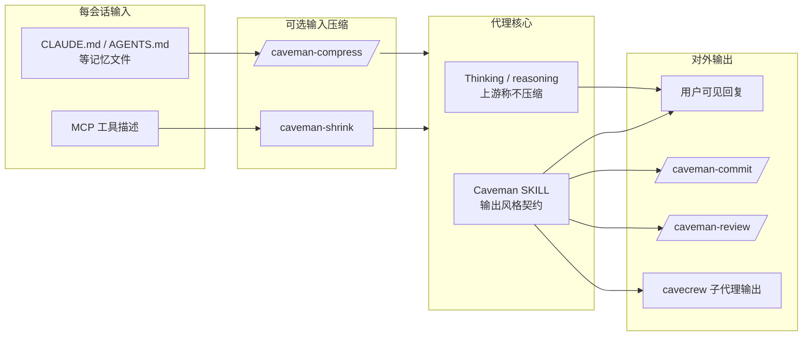

# Caveman

**Caveman** 是 [JuliusBrussee/caveman](https://github.com/JuliusBrussee/caveman) 仓库分发的 **编码代理输出压缩技能/插件**：通过可安装 `SKILL.md`、会话 hook 与可选记忆文件重写，让代理在 **不改变推理深度** 的前提下 **缩短自然语言外壳**，从而降低 API 账单、加快阅读，并（按上游基准与一篇 2026 论文叙述）在部分任务上可能因 brevity 约束而提升表述准确度。

## 一句话定义

用 **可版本化的「洞穴语」技能契约 + 可选 hook/记忆压缩**，把代理的 **mouth** 变小而 **brain** 不变，针对 **输出 token**（及可选 **每会话输入上下文**）做持续省钱。

## 为什么重要（对本知识库读者）

- **与 LLM Wiki 维护同轴、不同杠杆：** [Karpathy LLM Wiki](../references/llm-wiki-karpathy.md) 与 [Ingest Workflow](../../schema/ingest-workflow.md) 把知识 **编译进 `wiki/`**；本仓库每次 ingest 还伴随 `make ci-preflight`、长 `log.md` 与 `AGENTS.md`/`CLAUDE.md` 规约。Caveman 不替代 wiki 结构，但可降低 **代理在维护、评审、解释 diff 时的输出与记忆文件 token 开销**。
- **与 Superpowers / Hermes / Agent Reach 的分工：**
  - [Superpowers（obra）](superpowers-obra.md) — **怎么做对**（TDD、worktree、子代理评审流程）
  - [Hermes Agent](hermes-agent.md) — **怎么常驻跑**（网关、记忆/技能、cron、沙箱）
  - [Agent Reach](agent-reach.md) — **怎么读外网**（渠道脚手架）
  - **Caveman** — **怎么说更短**（输出与部分上下文压缩）
- **对机器人研发场景的间接价值：** 仿真/真机仓库的 agent 会话往往 **长上下文 + 多轮解释**；在仍依赖人类审阅的前提下，压缩 **状态汇报、PR 评论、commit message** 可减少噪音，与 Superpowers 的「证据优先」叙事相容（仍以团队规范为准）。

## 核心结构

| 组件 | 作用 |
|------|------|
| **技能本体** | `SKILL.md` 规则：去 filler、保留技术实质、片段化表达；档位 `lite` / `full` / `ultra` / `wenyan` |
| **安装器** | `install.sh` / `install.ps1`：扫描本机 harness，按需落盘技能与 `--with-init` 规则 |
| **Claude Code hook** | 每会话写 flag → 首条消息起自动洞穴语（无需手动 `/caveman`） |
| **子命令族** | `/caveman-commit`、`/caveman-review`、`/caveman-stats`、`/caveman-compress` |
| **caveman-shrink** | npm MCP 中间件：压缩 **工具描述** 文本 |
| **cavecrew-*** | 洞穴语子代理角色，延长主上下文可用长度（上游宣称 ~60% 子代理 token 降幅） |
| **生态扩展** | cavemem / cavekit / cavegemma / OpenClaw `SOUL.md` 注入（见上游 README） |

### 流程总览（token 路径）

## 常见误区或局限

- **误区：压缩 = 降智。** 上游强调主要削减 **输出** 自然语言；**reasoning/thinking token** 不在同一压缩路径。技术结论与代码块意图是保留对象。
- **误区：可替代 wiki ingest 规约。** Caveman 不生成 cross-reference、不跑 `make lint`；与本仓库 **schema + 派生文件同步** 正交，只能减少 **对话层** 成本。
- **局限：** 基准为作者提供的提示集；「65%」为 README 表均值，任务间方差大（22%–87%）。文言/洞穴风格可能影响 **非技术读者** 可读性；多 harness 行为以 `INSTALL.md` 矩阵为准。
- **局限：** `/caveman-compress` 改写记忆文件需人工 diff 审阅，避免规约语义被过度删减。

## 关联页面

- [Superpowers（obra）](superpowers-obra.md) — 交付流程技能（与「更短输出」互补）
- [Hermes Agent](hermes-agent.md) — 常驻代理运行时与技能/记忆系统
- [Agent Reach](agent-reach.md) — 外网读搜脚手架
- [LLM Wiki（Karpathy 模式）](../references/llm-wiki-karpathy.md) — 本仓库知识编译范式
- [Ingest Workflow](../../schema/ingest-workflow.md) — ingest / query / lint 操作规范

## 参考来源

- [Caveman 仓库源归档（本站）](../../sources/repos/caveman.md)
- [JuliusBrussee/caveman（GitHub）](https://github.com/JuliusBrussee/caveman)
- [INSTALL.md（上游）](https://github.com/JuliusBrussee/caveman/blob/main/INSTALL.md) — 全 harness 安装矩阵

## 推荐继续阅读

- Julius Brussee, *caveman* README [benchmarks/](https://github.com/JuliusBrussee/caveman/tree/main/benchmarks) — 可复现 token 对比数据
- [Brevity Constraints Reverse Performance Hierarchies in Language Models](https://arxiv.org/abs/2604.00025)（2026）— 简短约束与准确率关系的论文引用（README 归纳）
- [obra/superpowers](https://github.com/obra/superpowers) — 对照另一条「代理行为文件化」路线（流程而非措辞）
