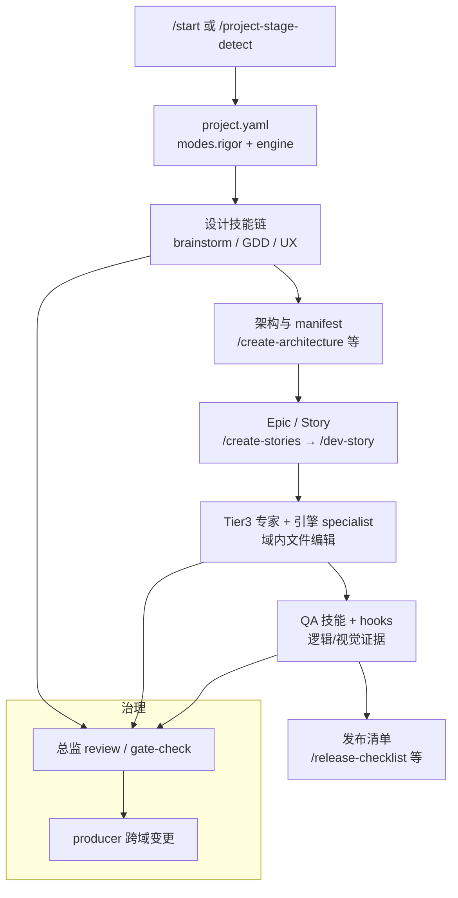

# Claude Code Game Studios（CCGS）

**Claude Code Game Studios**（[Donchitos/Claude-Code-Game-Studios](https://github.com/Donchitos/Claude-Code-Game-Studios)，MIT）把 **Claude Code** 单次会话组织成 **三层工作室编制**：总监 → 部门负责人 → 领域专家（含 **Godot 4 / Unity / Unreal Engine 5** 引擎 specialist 组），并配套 **74 个 slash skills**、**hooks**、**路径 scoped rules** 与 **GDD/ADR/冲刺** 等文档模板。根配置 **`project.yaml`** 用 **`modes.rigor`**（`minimal` / `standard` / `full`）统一调节流程与文档/QA 深度；README 明确这是 **协作结构化** 而非 **自动驾驶** 完成游戏。

## 一句话定义

用 **可版本化的代理编制 + 技能工作流 + 自动化 hooks**，在 Claude Code 里复刻 **真实游戏工作室的角色边界与质量门**，让人保留最终决策，同时减少「单会话乱改、无 QA、无设计对齐」的常见失败模式。

## 英文缩写速查

| 缩写 | 英文全称 | 简要说明 |
|------|----------|----------|
| CCGS | Claude Code Game Studios | 本仓库模板与社区常用简称 |
| GDD | Game Design Document | 游戏设计文档；rigor 越高必填节越多 |
| ADR | Architecture Decision Record | 架构决策记录；模板在 `.claude/docs/templates/` |
| QA | Quality Assurance | 质量保障；含 smoke/soak、视觉证据等技能 |
| UE | Unreal Engine | 虚幻引擎；仓内含 GAS/Blueprint 等专家代理 |
| UI | User Interface | 用户界面；视觉改动故事须留运行截图证据 |
| TDD | Test-Driven Development | 测试驱动开发；与 Superpowers 等通用 SE 技能可对照 |

## 为什么重要（对本知识库读者）

- **交互 3D / 仿真原型的「流程壳」：** 机器人侧常需 **Godot/Unity/UE** 做 **人机交互 demo、场景原型、可视化调试**（见 [CLI-Anything](cli-anything.md) 的 Godot harness、[image-blaster](image-blaster.md) 的 image-to-world 资产包、[Three.js Game Skills](threejs-game-skills.md) 的 Web 路线）。CCGS 提供的是 **同一 Claude Code 宿主上的编制化交付**，不是替代物理仿真或 RL 训练栈。
- **与 Superpowers 对照：** [Superpowers](superpowers-obra.md) 固化 **通用软件** 的 brainstorm→plan→TDD→review；CCGS 固化 **游戏域** 的 GDD→epic/story→引擎实现→平衡/性能/发布清单，并内置 **多角色子代理** 与 **域文件边界**。
- **Rigor 是可测的工程旋钮：** README 公开 **首行游戏代码前的文档成本** 与 **盲评游玩质量** 叙事——对「agent 写文档是否值得」给出 **可讨论的数据点**，与 [Agentic Coding 时代的软件工程基础](../concepts/agentic-coding-software-fundamentals.md) 的 **取舍语言** 同构：流程不是越重越好。
- **视觉 QA 与机器人可视化：** 要求 **跑起来并截图** 才关故事，与 sim/teleop 里「日志通过 ≠ 行为正确」的判断一致；适合作为 **agent 交付可观测性** 的参考模式（证据目录 `production/qa/evidence/`）。

## 核心结构

| 层次 | 内容 |
|------|------|
| **代理** | 49 个 `.claude/agents/` 定义（YAML frontmatter + 职责/升级路径）；三总监中部分指定 Opus/Sonnet，其余 **继承会话模型** |
| **技能** | 74 个 `/` 命令： onboarding（`/start`）、设计（`/brainstorm`、`/design-system`）、架构、故事/冲刺（`/dev-story`、`/story-done`）、评审、QA、发布、**团队编排**（`/team-combat` 等） |
| **配置** | `project.yaml` + 可选 `project.local.yaml`；`modes.rigor` 映射 workflow/docs/qa/review 等六旋钮 |
| **自动化** | 12 事件 hooks（commit/push/asset/skill 校验、session/agent 审计等）+ `settings.json` 权限 |
| **规则** | 13 条路径规则（gameplay、engine、AI、UI、network 等编辑时注入标准） |
| **目录约定** | `src/`（模板默认 Godot）、`design/`、`production/`、`tests/`、`prototypes/` 等与工作室职能对齐 |

### 流程总览（概念级）

### 代理协调（README 归纳）

1. **垂直委派** — 总监 → 负责人 → 专家  
2. **水平咨询** — 同级可咨询，不可跨域拍板  
3. **冲突升级** — 设计归 creative-director，技术归 technical-director  
4. **变更传播** — 跨部门由 producer 协调  
5. **域边界** — 无委派不得改域外文件  

## 工程实践

| 主题 | 要点 |
|------|------|
| **入门** | `git clone` → `claude` → `/start`（或已知阶段时 `/setup-engine godot 4.6` 等） |
| **默认 rigor** | `minimal`：一页 brief 即可进故事/实现；需要追溯性再 `/settings modes.rigor=standard\|full` |
| **引擎** | 三套 engine specialist；代码根目录 **因引擎而异**（Godot `src/`、Unity `Assets/`、UE `Source/<Module>/`） |
| **框架自测** | 改 skill/agent 后跑 `/skill-test`；与游戏 `tests/` 分离 |
| **升级** | 见仓内 `UPGRADING.md`（模板合并策略） |

## 常见误区或局限

- **误区：克隆即自动做游戏。** 协议要求 **逐步 Ask / Approve**；重 rigor 会增加文档与评审成本，README 称 **standard 档盲评游玩质量未必最佳**。
- **误区：替代 Isaac Lab / MuJoCo / ROS。** CCGS 面向 **游戏客户端与内容管线**；机器人 **控制与 sim2real** 仍走本库方法/任务页，仅可借其 **原型与可视化** 流程。
- **局限：** 强依赖 **Claude Code** 与 Bash/Python 工具链；Windows 需 Git Bash；大量子代理 **token 与协调成本** 需自行权衡。
- **局限：** 模板 **不随仓分发示例完整游戏**（避免 clutter）；证据以使用者项目为准。

## 关联页面

- [Superpowers（obra）](superpowers-obra.md) — 通用编码代理 **TDD + 评审** 技能栈；CCGS 是 **游戏域多角色** 扩展
- [CLI-Anything](cli-anything.md) — **Godot 等** 的 agent-native CLI harness；与 CCGS 的 **引擎内源码编辑** 互补
- [image-blaster](image-blaster.md) — Claude Code **image-to-world** 技能；可产出 Unity/UE/Godot 资产，再纳入 CCGS 故事流
- [Three.js Game Skills](threejs-game-skills.md) — **Web/Three.js** 游戏技能；CCGS 偏 **原生引擎** 工作室结构
- [Open Code Review](open-code-review.md) — **diff 级评审 CLI**；可与 CCGS `/code-review` 技能对照
- [Agentic Coding 时代的软件工程基础](../concepts/agentic-coding-software-fundamentals.md) — 流程加重仍须 **人掌握取舍**
- [LLM Wiki（Karpathy 模式）](../references/llm-wiki-karpathy.md) — 本库 **知识 wiki** 维护范式；与 CCGS **交付模板** 目标不同
- [开源赛车 / 漂移 RL 景观](../overview/racing-drift-rl-open-source-landscape.md) — 游戏栈横向索引；CCGS 不属 RL 训练后端

## 参考来源

- [Claude Code Game Studios 仓库源归档（本站）](../../sources/repos/claude_code_game_studios.md)
- [Donchitos/Claude-Code-Game-Studios（GitHub）](https://github.com/Donchitos/Claude-Code-Game-Studios)
- [Claude Code 文档](https://code.claude.com/docs)

## 推荐继续阅读

- 仓库 README「Does it produce games, or documents?」— rigor 与文档/质量测量叙事  
- 仓库 `.claude/docs/effects-map.md` — `project.yaml` 各字段对技能行为的映射（以克隆仓为准）
